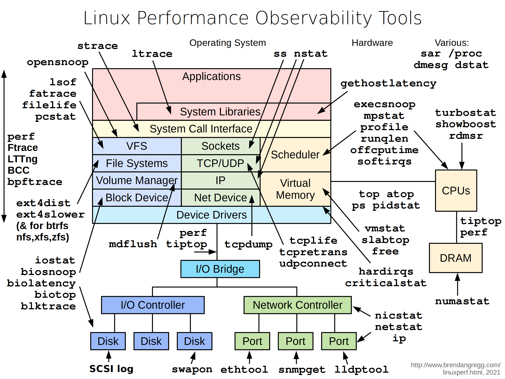
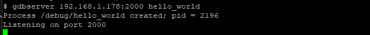
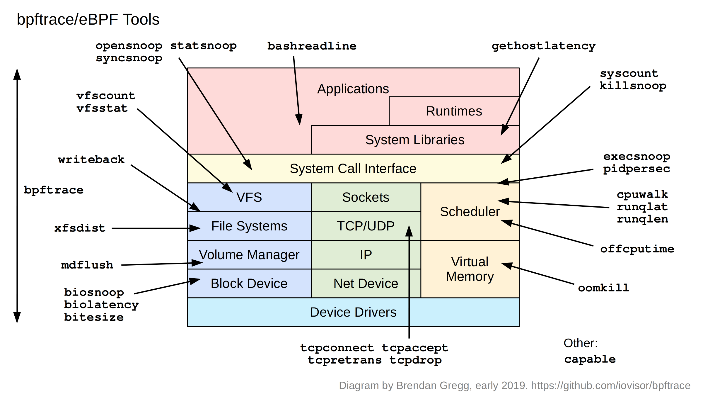
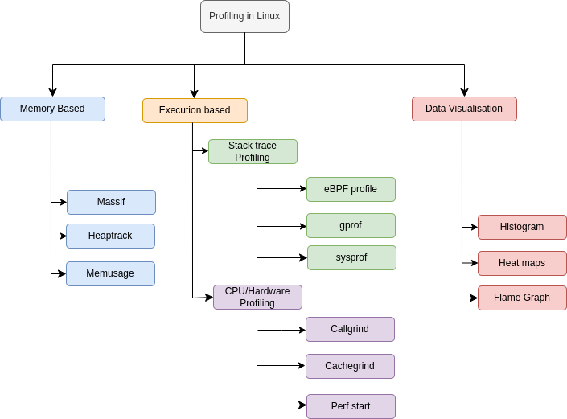
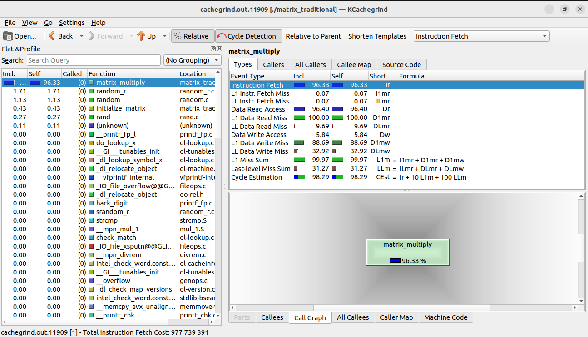

<style>
  section { background-image: url('../../Resources/png/background.png'); background-size: contain; font-family: 'Times New Roman', serif !important; background-color: #fff; text-align: left; top: 20; font-size: 26px;}
  h1 {   font-size: 50px;   color: #09c;   position: absolute; padding: 20px;   top: 0;   left: 0;   right:  0;  text-align: center;}
  h2 {   font-size: 52px;   color: #09c;   position: absolute; padding: 20px;   top: 20;   left: 0;   right:  0;  text-align: center;} 
  h3 {   font-size: 52px;   color: #09c;   position: relative; padding: 0px;   top: 0;   left: 0;   right:  0;  text-align: center;} 
  h5 {   font-size: 20px;   color: #09c;   position: absolute; padding: 10px;   top: 5;  left: 0;   right:  0; } 

footer {
  text-align: center;
  position: absolute;
  padding: 4px;
  bottom: 0;
  left: 0;
  right:  0;
  z-index: 5; 
  color: #09c;
  background: none;
  font-size: 14px;
  text-align: center;
}

section.no-footer footer {
    display: none;
}

ul {
  text-align: left;
  margin-left: 1.5em;
}

li {
    text-align: left;
  }

.left-align {
  text-align: left;
}

.baseline-container {
  display: flex;
  justify-content: center;
  align-items: flex-end;
  height: 100vh;
}

.container {
  display: flex;
}

.column {
  flex: 1;
  text-align: center;
  padding: 1rem;
}


.image-container-baseline {
  margin-bottom: 0rem;
}

.code-block {
  font-size: 16px;
}

.image-container {
  display: flex;
  justify-content: center;
  align-items: center;
  height: 100%;
  margin-bottom: 2rem;
}

.logo-container {
  position: absolute;
  top: 43%;
  left: 50%;
  transform: translate(-50%, -50%);
  display: flex;
  justify-content: center;
  align-items: center;
  height: auto;
  width: auto;
}

.large-logo-container {
  position: relative;
  padding: 0px;
  top: 10%;
  left: 50%;
  transform: translate(-50%, -50%);
  display: flex;
  justify-content: center;
  align-items: center;
  height: auto;
  width: auto;
}

.presenter-picture {
  width: 200px;
  height: 200px;
  border-radius: 50%;
  overflow: hidden;
  margin: 0 auto 1rem;
  border: 3px solid #09c;
  box-shadow: 0 4px 6px rgba(0, 0, 0, 0.1);
  }

.presenter-picture img {
  width: 100%;
  height: 100%;
  object-fit: cover;
}

.presenter-name {
  font-family: "Arial", sans-serif;
  font-size: 30px;
  font-weight: bold;
  color: #222;
  margin-top: 1rem;
}

.introduction {
  font-family: "Verdana", sans-serif;
  font-size: 16px;
  color: #444;
  margin-top: 0.5rem;
}
  
.bottom-container {
  position: absolute;
  bottom: 0;
  left: 0;
  width: 100%;
  padding: 10px 20px 30px;
  background-color: transparent;
  font-family: "Verdana", sans-serif;
  font-size: 16px;
  line-height: 1.6;
  text-align: center;
}

.bottom-container span {
  display: inline-block;
}

.two-row-container {
  display: flex;
  flex-direction: column;
  height: 100%;
  margin-top: 6rem; 
  justify-content: left;
}

.row {
  font-size: 20px;
  line-height: 2;
  margin: 0;
  padding: 0;
}

.two-column-container {
  display: flex;
}

.presenter-into-container {
  display: flex;
  justify-content: space-between; 
  align-items: flex-start; 
  height: 100%; 
  padding: 2rem;
}

.code-block-small {
  font-size: 12px;
}

.contact-container {
  display: flex; 
  gap: 60px; 
  justify-content: center;
  align-items: center;
  margin-top: 10px; 
}

.contact-link {
  color: #09c; 
  font-size: 16px;
  text-decoration: none;
  font-weight: bold;
}

.contact-link:hover {
  text-decoration: underline; 
  color: #0056b3; 
}

.course-outline-container {
  display: flex;
  flex-direction: column;
  justify-content: flex-start;
  align-items: flex-start;
  padding: 10px;
  margin: 50px 10px 50px 10px;
  height: 200vh; 
  line-height: 1.5;
  background-color: transparent; 
  font-family: "Arial", sans-serif;
  color: #333;
  overflow-y: auto;
  overflow-x: hidden;
  box-sizing: border-box;
}

.course-title {
  font-size: 38px;
  font-weight: bold;
  margin-bottom: 20px;
  color: #0056b3;
  text-align: center;
  width: 100%;
}

.course-title a {
  color: #0056b3;
  text-decoration: none;
  font-weight: bold;
}

.course-title a:hover {
  text-decoration: underline; 
  color: #003f80;
}

.module-list {
  list-style-type: none;
  padding: 0;
  margin: 10;
  width: 100%;
}

.module-item {
  font-size: 30px;
  margin-bottom: 10px;
  display: flex;
  align-items: center;
}

.module-item span {
  font-weight: bold;
  color: #0056b3;
  margin-right: 10px;
}

.module-item p {
  margin: 0;
  font-weight: bold;
  color: #444;
}

</style>


<!-- _class: no-footer -->

<h1> <br>Linux Debug Training </h1>

<div class="logo-container">

</div>

<div class="bottom-container">

<span> **Presenters**: [John O'Sullivan](https://www.linkedin.com/in/john-o-15b17a34/) and [Manas Marawaha](https://www.linkedin.com/in/manasmarwah/) </span>

<span>© Copyright 2024-2025, John O'Sullivan and Manas Marawaha
Licensed under [Creative Commons BY-SA 4.0](https://creativecommons.org/licenses/by-sa/4.0/)  (CC BY-SA 4.0)  </span>

<span> **Document source**: https://github.com/SpecialistLinuxTraining/linux-debug-training/tree/main/Slides </span>

<span> **Part-1 Demonstrations**: https://www.udemy.com/course/linux-debug-training-part-1/?referralCode=6534D858AEF9555AB23F </span>

<span> **Part-2 Demonstrations**: </span>
</div>

---
<h1>Presenters Introduction</h1>

<br>
<div class="presenter-into-container">
  <div class="column">
    <div class="presenter-picture">
      
    </div>
    <div class="presenter-name">John O'Sullivan</div>
    <div class="introduction">
      <p>John O'Sullivan is a software architect with over 30 years of experience, specializing in the development and optimization of Linux-based embedded systems. He has extensive hands-on expertise in hardware-software integration and product development across a wide range of industries. </p>
    </div>
  <div class="contact-container">
    <a href="mailto:johnos3747@gmail.com" class="contact-link">
      Email
    </a>
    <a href="https://www.linkedin.com/in/john-o-15b17a34/" target="_blank" class="contact-link">
      LinkedIn
    </a>
  </div>
  </div>

  <div class="column">
    <div class="presenter-picture">
      
    </div>
    <div class="presenter-name">Manas Marawaha</div>
    <div class="introduction">
      <p>Manas Marawaha is a Principal Engineer with over 13 years of experience in embedded Linux software development. With a strong understanding of Linux internals, kernel programming, and device drivers, he brings extensive hands-on expertise in product development across audio, video, and networking domains.
</p>
    </div>
  <div class="contact-container">
    <a href="mailto:manas.marwah@gmail.com" class="contact-link">
      Email
    </a>
    <a href="https://www.linkedin.com/in/manasmarwah/" target="_blank" class="contact-link">
      LinkedIn
    </a>
  </div>
</div>

---
# License Information
<span>© Copyright 2024-2025, John O'Sullivan and Manas Marawaha
Licensed under [Creative Commons BY-SA 4.0](https://creativecommons.org/licenses/by-sa/4.0/)  (CC BY-SA 4.0) 
https://creativecommons.org/licenses/by-sa/4.0/ </span>

<br>

**You are free to:**

- **Share** - copy and redistribute the material in any medium or format for any purpose, even commercially.

- **Adapt** - remix, transform, and build upon the material for any purpose, even commercially.

- The licensor cannot revoke these freedoms as long as you follow the license terms.

---
# License Information (Cont.)
**Under the following terms:**

- **Attribution** - You must give appropriate credit, provide a link to the license, and indicate if changes were made. You may do so in any reasonable manner, but not in any way that suggests the licensor endorses you or your use.

- **ShareAlike** - If you remix, transform, or build upon the material, you must distribute your contributions under the same license as the original.

- **No additional restrictions** - You may not apply legal terms or technological measures that legally restrict others from doing anything the license permits.
---
<h1>Course information</h1>
<br>
<br>

- Example code demonstrated in the course is available on the [GitHub repository](https://github.com/SpecialistLinuxTraining/linux-debug-training/tree/main/Examples).

- For document source, please refer to this [link](https://github.com/SpecialistLinuxTraining/linux-debug-training/tree/main/Slides).

- Demonstrations in this part of the course use Ubuntu (OS 22.04), Arch Linux ( 2025.08.01) and a Buildroot based installation on the Raspberry-Pi.

- Please review the [instructions](https://github.com/SpecialistLinuxTraining/linux-debug-training/blob/main/References/building_course_examples.md) for building the course examples before proceeding.

- We value your feedback and suggestions! Please share them via email at specialistlinuxtraining@gmail.com.

- For corrections on the training material, feel free to raise [issues](https://github.com/SpecialistLinuxTraining/linux-debug-training/issues) and [pull request](https://docs.github.com/en/pull-requests/collaborating-with-pull-requests/proposing-changes-to-your-work-with-pull-requests/creating-a-pull-request-from-a-fork) in the GitHub repository.

---
# Course Outline
<div class="course-outline-container">
<div class="course-title">
  <a href="https://www.udemy.com/course/linux-debug-training-part-1/?referralCode=6534D858AEF9555AB23F" target="_blank">Linux Debug Training (Part-1)</a>
</div>
  <ul class="module-list">
    <li class="module-item">
      <span>Module 1:</span>
      <p>Linux Operating System Architecture</p>
    </li>
    <li class="module-item">
      <span>Module 2:</span>
      <p>Basic Linux Analysis and Observability Tools</p>
    </li>
    <li class="module-item">
      <span>Module 3:</span>
      <p>Application Debugging</p>
    </li>
    <li class="module-item">
      <span>Module 4:</span>
      <p>Memory Issues in Linux Applications</p>
    </li>
    <div class="course-title"> Linux Debug Training (Part-2)</div>
    <li class="module-item">
      <span>Module 5:</span>
      <p>Tracing in Linux</p>
    </li>
    <li class="module-item">
      <span>Module 6:</span>
      <p>Profiling in Linux</p>
    </li>
    <li class="module-item">
      <span>Module 7:</span>
      <p>Linux Kernel Debugging</p>
    </li>
  </ul>
</div>

---
<h1>Part-1 Synopsis</h1>

- Module 1 began with the Linux OS system itself, discussing the fundamental architecture and structure of the Linux operating system.

- In the second module of this course, we explored the Basic Linux Analysis and Observability Tools. We demonstrated how these foundational tools served as the first level of debugging and how they provided insights into the system's state and behavior.

- The third module of this course looked at how we could dissect application binaries with tools like binutils and how we could employ powerful debugging applications like GDB for more in-depth analysis.

- The fourth module was dedicated to addressing common memory issues in user-space applications, along with exploring related tools such as valgrind and sanitizers which are designed to detect and resolve these issues before the code is deployed.

---
<h1>Part-2 Synopsis</h1>
<br>

- Module five takes a look at tracing in Linux. We cover userspace tools like strace, ltrace, uprobe and perf. We also look at kernel space tools like Kprobe, Perf, ftrace, eBPF, and LTTng.

- In the sixth module of this course, we will explore profiling in Linux looking at tools like massif, heaptrack and memusage to profile memory. We will investigate the use of callgrind, cachegrind and perf-stat for CPU and hardware profiling. We will also look at stacktrace profiling using eBPF profile, gprof and sysprof. And, we will look at how data visualization tools can complement our analysis.

- In the seventh and final module we take a comprehensive look at Kernel debugging, investigating Kernel OPPS, reviewing logging and SysRq, and using tools like KGDB. We will show Kernel recovery using Kexec and Kdump. And we will also examine many of the new tools that have emerged in recent years like: UBSAN, KCSAN and KASAN.

---
<!-- Module 1 - Linux Operating System Architecture -->


<h2> Module 1

Linux Operating System Architecture</h2>

---
# Linux OS Architecture

<div class="two-column-container">
  <div class="column">
  <br>
    <li style="text-align: left;">Linux OS architecture is divided into two main parts.</li>
    <li style="text-align: left; 1em; margin-left: 40px">User space</li>
    <li style="text-align: left; 1em; margin-left: 40px">Kernel space</li>
<li style="text-align: left; 1em;">User space is a protected virtual address space that hosts user application programs, system libraries and user level services.</li>
<li style="text-align: left; 1em;">Kernel space is a privileged mode reserved for kernel functionalities like reading and writing to the hardware, interrupt (IRQ) handling, managing memory and other low level services.</li>
  </div>
  <div class="column">
  <br>
    <div class="image-container">
          
    </div>
  </div>
</div>

---

# User Mode/Kernel Mode

- The difference between user mode and kernel mode comes from the privileges available in each mode of execution. 

- In kernel mode, the kernel is allowed to run all privileged operation such as interrupt handling, I/O, scheduling, process management. 

- In user mode, an application is only allowed to perform a set of basic operations.

- A user application can request services from the kernel through system calls; these system calls allow the user space program to request services and certain privileged operations. 

---
# 32-bit Linux Address Space

<br><br><br>
<div class="baseline-container">
      <div class="image-container-baseline">
          
      </div>
</div>

---

# 32-bit User Space Addressing

- In a 32 bit system each process has the access to the 3 GB virtual address space.

    - [task_struct](https://elixir.bootlin.com/linux/latest/source/include/linux/sched.h#L737) is a process descriptor and represents a process or a thread in the Linux kernel.The memory layout of a process, including its page tables and memory mapings are defined in [mm_struct](https://elixir.bootlin.com/linux/latest/source/include/linux/mm_types.h#L584).
- By default all user mappings are randomized to minimize the possibility of attack (Base of heap, stack, text, data etc.)
- Due to randomization multiple processes could have different address spaces. 
- The kernel ‘[norandmaps](https://www.kernel.org/doc/html/v4.14/admin-guide/kernel-parameters.html)’ command line option can be used to disable randomization.
    - This is the equivalent to:
     `echo 0 > /proc/sys/kernel/randomize_va_space`
---
# Virtual address mapping

<br>

<div class="baseline-container">
      <div class="image-container-baseline">
          
      </div>
</div>

---
# Virtual Memory Areas

- VMAs are the actual memory zones in a process which are setup by Kernel upon initialization of the process. 

    - [task_struct->mm-> chain of vm_area_struct](https://elixir.bootlin.com/linux/latest/source/include/linux/mm_types.h#L480)
- These zones are tagged by specific attribute (R/W/X).
- A segmentation fault can happen when a program tries to access non-existing VMA or existing VMA in a different way as defined by its attribute.
    - Execute data in non-executable segment

    - Write data in read only segment
- Per application maps is located in `/proc/{PID}/maps`.
---

# Kernel Logical Addressing

- Kernel Logical Addressing (KLA) - also called Low Mem -  is directly mapped to kernel space.

- [CONFIG_PAGE_OFFSET](https://elixir.bootlin.com/linux/latest/source/arch/x86/Kconfig#L1473) defines the offset for KLA. The logical address is calculated at a fixed offset from the physical address. 
    - Logical address 0xC0000000 (Page offset) => 0x00000000 Physical address

    - Conversion: The macros [__pa(x)](https://elixir.bootlin.com/linux/latest/source/arch/x86/include/asm/page.h#L41) and [__va(x)](https://elixir.bootlin.com/linux/latest/source/arch/x86/include/asm/page.h#L58) can be used to translate between physical and virtual addresses in each direction.
- The Kernel Logical Address range is in physically contiguous memory and suitable for allocating kernel per process stack space, memory for DMA and memory requested through kmalloc.

--- 

# Kernel Virtual Address

- Kernel Virtual Addresses (also called High Mem because it maps to memory beyond the 896 MB boundary), resides at the top of the Kernel Logical address space. High memory is a region of physical memory that is not directly mapped into the lower portion of a system's physical address space. Instead, it's accessed through various mechanisms, such as paging or memory-mapped I/O.

- These virtual address are suitable for large buffer allocation in the kernel, for example:
  - Memory mapped I/O (SOC IP Block)
  - Insmod
  - Ioremap, kmap
  - vmalloc
- Kernel Virtual Addresses are not physically contiguous, so these are not suitable for some operations like DMA.


---
# 64-bit Linux Address Space
<br>

<div class="baseline-container">
      <div class="image-container-baseline">
          
      </div>
</div>

---
# 64-bit User Space Address

- In a 64 bit system each process has access to 128 TB of virtual address space.

- The basic layout of memory sections such as heap, stack, text, data, shared libraries are same as in 32-bit system.
- The primary difference in user space layout between 32-bit and 64-bit addressing spaces is the significantly larger addressable range in 64-bit architectures. 
- This larger space provides more flexibility for memory allocation, mapping, and shared libraries, and it allows for more efficient memory management and utilization in modern systems.
- For x86 64 bit systems the kernel/user space split is at: 0x8000000000000000. For ARM64 it is at 0xFFFF880000000000.

---
# 64-bit User Space Address Example
<br>

The following dump represents the 64-bit user space virtual address map of [memory example](https://github.com/SpecialistLinuxTraining/linux-debug-training/tree/main/Examples/memory).

```
manas@sandbox:~/work$ cat /proc/324/maps

**<Address Start>-<AddressEnd>**
        |          |     **<mode>** 
        |          |       |    **<offset>** 
        |          |       |       |  **<Major ID:Minor ID>**
        |          |       |       |      |  **<inode id>**               **<file path>**
5645ad827000-5645ad828000 r--p 00000000 08:20 438673                     /home/manas/work/memory --> **Read Only, Private Segment (Contains Globals, Constants etc)**
5645ad828000-5645ad829000 r-xp 00001000 08:20 438673                     /home/manas/work/memory --> **Executable Code segment**
5645ad829000-5645ad82a000 r--p 00002000 08:20 438673                     /home/manas/work/memory
5645ad82a000-5645ad82b000 r--p 00002000 08:20 438673                     /home/manas/work/memory
5645ad82b000-5645ad82c000 rw-p 00003000 08:20 438673                     /home/manas/work/memory
5645af7e8000-5645af809000 rw-p 00000000 00:00 0                          [heap]                 --> **Heap section of process**
7f9014ef0000-7f9014ef3000 rw-p 00000000 00:00 0
7f9014ef3000-7f9014f1b000 r--p 00000000 08:20 6488                       /usr/lib/x86_64-linux-gnu/libc.so.6 -> **libc [Shared Lib] read only section**
7f9014f1b000-7f90150b0000 r-xp 00028000 08:20 6488                       /usr/lib/x86_64-linux-gnu/libc.so.6 -> **Libc executable section**
7f90150b0000-7f9015108000 r--p 001bd000 08:20 6488                       /usr/lib/x86_64-linux-gnu/libc.so.6
7f9015108000-7f901510c000 r--p 00214000 08:20 6488                       /usr/lib/x86_64-linux-gnu/libc.so.6
7f901510c000-7f901510e000 rw-p 00218000 08:20 6488                       /usr/lib/x86_64-linux-gnu/libc.so.6
7f901510e000-7f901511b000 rw-p 00000000 00:00 0
7f9015121000-7f9015123000 rw-p 00000000 00:00 0
7f9015123000-7f9015125000 r--p 00000000 08:20 6292                       /usr/lib/x86_64-linux-gnu/ld-linux-x86-64.so.2
7f9015125000-7f901514f000 r-xp 00002000 08:20 6292                       /usr/lib/x86_64-linux-gnu/ld-linux-x86-64.so.2
7f901514f000-7f901515a000 r--p 0002c000 08:20 6292                       /usr/lib/x86_64-linux-gnu/ld-linux-x86-64.so.2
7f901515b000-7f901515d000 r--p 00037000 08:20 6292                       /usr/lib/x86_64-linux-gnu/ld-linux-x86-64.so.2
7f901515d000-7f901515f000 rw-p 00039000 08:20 6292                       /usr/lib/x86_64-linux-gnu/ld-linux-x86-64.so.2
7ffde39a8000-7ffde39c9000 rw-p 00000000 00:00 0                          [stack]                  --> **Stack section of the process**
7ffde39d2000-7ffde39d6000 r--p 00000000 00:00 0                          [vvar]                   --> "Virtual VDSO Variable"
7ffde39d6000-7ffde39d8000 r-xp 00000000 00:00 0                          [vdso]                   --> "virtual Dynamic Shared Object".
                                                                          This is a small shared library which is exported by the kernel and mapped into user space.
```

---
# 64-bit Kernel Space Address
<br>

```
                                                            
                            Kernel-space virtual memory, shared between all processes
                                  48-bit virtual address (4 Level page table)
_______________________________________________________________________________________________________________________
                  |            |                  |         |
 ffff800000000000 | -128    TB | ffff87ffffffffff |    8 TB | ... guard hole, also reserved for hypervisor
 ffff880000000000 | -120    TB | ffff887fffffffff |  0.5 TB | LDT remap for PTI
 ffff888000000000 | -119.5  TB | ffffc87fffffffff |   64 TB | direct mapping of all physical memory (page_offset_base)
 ffffc88000000000 |  -55.5  TB | ffffc8ffffffffff |  0.5 TB | ... unused hole
 ffffc90000000000 |  -55    TB | ffffe8ffffffffff |   32 TB | vmalloc/ioremap space (vmalloc_base)
 ffffe90000000000 |  -23    TB | ffffe9ffffffffff |    1 TB | ... unused hole
 ffffea0000000000 |  -22    TB | ffffeaffffffffff |    1 TB | virtual memory map (vmemmap_base)
 ffffeb0000000000 |  -21    TB | ffffebffffffffff |    1 TB | ... unused hole
 ffffec0000000000 |  -20    TB | fffffbffffffffff |   16 TB | KASAN shadow memory
                  |            |                  |         |
 fffffc0000000000 |   -4    TB | fffffdffffffffff |    2 TB | ... unused hole
                  |            |                  |         | vaddr_end for KASLR
 fffffe0000000000 |   -2    TB | fffffe7fffffffff |  0.5 TB | cpu_entry_area mapping
 fffffe8000000000 |   -1.5  TB | fffffeffffffffff |  0.5 TB | ... unused hole
 ffffff0000000000 |   -1    TB | ffffff7fffffffff |  0.5 TB | %esp fixup stacks
 ffffff8000000000 | -512    GB | ffffffeeffffffff |  444 GB | ... unused hole
 ffffffef00000000 |  -68    GB | fffffffeffffffff |   64 GB | EFI region mapping space
 ffffffff00000000 |   -4    GB | ffffffff7fffffff |    2 GB | ... unused hole
 ffffffff80000000 |   -2    GB | ffffffff9fffffff |  512 MB | kernel text mapping, mapped to physical address 0
 ffffffff80000000 |-2048    MB |                  |         |
 ffffffffa0000000 |-1536    MB | fffffffffeffffff | 1520 MB | module mapping space
 ffffffffff000000 |  -16    MB |                  |         |
    FIXADDR_START | ~-11    MB | ffffffffff5fffff | ~0.5 MB | kernel-internal fixmap range, variable size and offset
 ffffffffff600000 |  -10    MB | ffffffffff600fff |    4 kB | legacy vsyscall ABI
 ffffffffffe00000 |   -2    MB | ffffffffffffffff |    2 MB | ... unused hole
__________________|____________|__________________|_________|___________________________________________________________

* https://www.kernel.org/doc/Documentation/x86/x86_64/mm.txt
```
---
# 64-bit Kernel Space Address
<br><br>

- **Direct Mapping of All Physical Memory (page_offset_base)**:
A region in the kernel space where the entire physical memory is directly mapped for efficient access, allowing kernel code to directly access physical addresses.

- **vmalloc/ioremap Space (vmalloc_base)**:
This region is used for dynamically allocated kernel data structures and for mapping memory-mapped I/O (MMIO) regions from device drivers.

- **Virtual Memory Map (vmemmap_base)**:
A mapping of the physical memory's page frames into kernel virtual space, used to access and manage physical memory. It allows the kernel to reference physical memory addresses as kernel virtual addresses.

- **cpu_entry_area Mapping**:
This area holds per-CPU data structures and is mapped for each CPU, providing a separate area for certain CPU-specific operations and data.

---
# 64-bit Kernel Space Address
<br>

- **%esp Fixup Stacks**:
Stacks used to handle exceptions during context switches and when the kernel starts execution. These stacks are used to ensure proper handling of CPU state during such operations.

- **Kernel Text Mapping, Mapped to Physical Address 0**:
The virtual memory mapping of the kernel's text section (code), which is mapped to the physical address 0 to enable direct access to kernel instructions.

- **Module Mapping Space**:
A region reserved for dynamically loaded kernel modules, allowing the kernel to load and manage modules separately from its main code.

- **Kernel-Internal Fixmap Range, Variable Size and Offset**:
A region with variable size and offset used for mapping kernel-internal data structures and hardware register addresses, ensuring efficient access.

---

# Summary of Virtual Addressing in Linux
<br>
<br>

- __User Virtual Addresses__: These are addresses used by user-level processes. They are an abstraction that allows each process to have its own dedicated virtual memory space which is mapped to physical memory by an MMU.

- __Kernel Logical Addresses__: Kernel logical addresses are a mapping from kernel-space virtual addresses to physical address (Low Mem on 32 bit systems). They use a constant offset that provides a linear, one-to-one mapping to a physical addresses. This memory, allocated with functions like kmalloc, is contiguous and cannot be swapped out. Because of this these allocations are suitable for operations like DMA.
- __Kernel Virtual Addresses__: Kernal virtual addresses map to the High Mem part of physical memory (memory beyond 896MB) on 32 bit systems. These are not physically contiguous but they are virtually contiguous. Memory is allocated with vmalloc and this area is suitable for insmod.
- __Note:__ When dealing with addresses in Linux we are __always__ dealing with virtual addresses.
---
# Memory Management/ MMU (part 1)

<div class="baseline-container">
      <div class="image-container-baseline">
          
      </div>
</div>

- An MMU facilitates the translation from virtual to physical addresses with the help of a Translation Lookaside Buffer (TLB).

---
# Memory Management/ MMU (part 2)

- A user space process runs in a virtual address space.

- The MMU facilitates the translation from virtual to physical addresses. 
- The Base unit of MMU is a ‘[page](https://elixir.bootlin.com/linux/latest/source/arch/x86/include/asm/page.h#L19)’ which is fixed in size and that size depends on the underlying architecture.
- The MMU hardware uses mappings in a page table (PT) for address translation. 
- In a multilevel page table, it is more efficient to have first and second level PTs in memory while other levels can reside on the disk. 

---

# Page Fault Handling (part 1)

<div class="baseline-container">
      <div class="image-container-topline">
          
      </div>
</div>

---
# Page Fault Handling (part 2)

- If a user application tries to access a virtual memory address which is not mapped to a physical address, the MMU triggers a page fault. 

- The Kernel on receiving the page fault interrupt performs following operations. 
  - Puts the user space process to sleep. 

  - Finds the mapping for offending address in the PT.
  - Selects and removes existing TLB entry and copies the frame from disk to RAM.
  - Creates a TLB entry for the page containing the address.
  - Finally it wakes up the user space process. 

---

# User Processes Mappings (part 1)
- Each process in user virtual address space has its own mapping, and this mapping is changed during a context switch.

- The memory map for a user process will have many mappings.
- Each mapping can cover multiple page frames in physical memory.
- The same virtual address can be mapped to different physical addresses for different processes.
- Because the TLB is a limited resource, far more mappings can be made that exist in the TLB at any one time, so the kernel must keep track of all mappings and it stores this is page tables in struct_mm and vm_area_struct.
- A mapping to a virtually contiguous space does not have to be physically contiguous for user space processes and this makes allocation easier.

---

# User Processes Mappings (part 2)
<div class="baseline-container">
      <div class="image-container-baseline">
          
      </div>
</div>

<br>

---

# User Processes Mappings (part 3)
<div class="baseline-container">
      <div class="image-container-baseline">
          
      </div>
</div>

<br>

---

# Shared memory in user space 

<div class="baseline-container">
      <div class="image-container-baseline">
          
      </div>
</div>


- Shared memory in user space refers to a technique used in operating systems to allow multiple processes to access a region of memory that is shared between them.
- MMU maps the same physical frame into two or more processes.
- The shared memory will have different virtual addresses in each process, but they will be mapped to the same physical memory location.  
- [mmap()](https://man7.org/linux/man-pages/man2/mmap.2.html) allows us to request specific virtual address to map the shared region. 
- Refer to the [Shared Memory code example](https://github.com/SpecialistLinuxTraining/linux-debug-training/tree/main/Examples/sharedmemory).

---
# Processes and Threads (part 1)

- A process is an instance of a running program that has its own memory space and system resources, such as file descriptors, network sockets, and environment variables.

- Each process is assigned a unique process ID (PID) and information related to a process can be accessed from `/proc/{PID}` file.
- The Kernel keep tracks of all the user space processes through a task vector which is an array of [task_struct](https://elixir.bootlin.com/linux/latest/source/include/linux/sched.h#L737) pointer.
  - The ‘[current](https://elixir.bootlin.com/linux/latest/source/arch/x86/include/asm/current.h#L39)’ pointer points to currently running process.
  - This can be accessed through [get_current()](https://elixir.bootlin.com/linux/latest/source/arch/x86/include/asm/current.h#L44) function.
 - Refer to the [Process Observer Example](https://github.com/SpecialistLinuxTraining/linux-debug-training/tree/main/Examples/ProcessAndThreads/ProcessObserver).
  
 
---
# Processes and Threads (part 2)
<br>
<br>
<br>

<div class="baseline-container">
      <div class="image-container-baseline">
           
      </div>
</div>

- A thread is a lightweight execution unit within a process.
- Threads share the same memory space and system resources as their parent process, but they have their own registers, stack and program counter.
- Threads can run concurrently and independently within the same process, allowing for parallel execution of code.
- A process is created using the [fork()](https://man7.org/linux/man-pages/man2/fork.2.html) system call whereas a thread is created using the [pthread_create()](https://man7.org/linux/man-pages/man3/pthread_create.3.html) function. Both of these use the [clone()](https://man7.org/linux/man-pages/man2/clone.2.html) system call internally. 
- Information related to threads in a process can be found in `/proc/{PID}/task`.
- Refer to the [Process and Threads](https://github.com/SpecialistLinuxTraining/linux-debug-training/tree/main/Examples/ProcessAndThreads) tutorial for an example.

<br>

---

# ELF - Executable Format

- ELF is a standard binary format, supported on various platforms including Linux.

- The same format is used by application binaries, shared libraries, Kernel modules, Kernel (vmlinux) and core dump files.
- The ELF file contains an ELF header along with program related segments
    - .text section: Code
    - .data section: Data
    - .rodata section: Read-only Data
    - .debug_info section: debug information 
- The kernel uses the run time information from the program header to create the process and map the segments into memory.

---
# ELF Format
<div class="baseline-container">
      <div class="image-container-baseline">
          
      </div>
</div>

---

# Shared Libraries (part 1)

- A Shared library (.so) file is a collections of pre-compiled code that can be shared among multiple programs at runtime. It binds with the application at runtime. 

- The kernel loads the application binary into user space virtual program space as defined in ELF file and parses the .interp section to find the dynamic linker.
    - ld-linux.so is the dynamic linker/loader for the Linux operating system. It is responsible for resolving dependencies between shared libraries and executable files at runtime.
---
<!-- .slide: style="text-align: left;" -->
# Shared Libraries (part 2)

Shared Libraries are searched in the following path:
<li style="text-align: left; 1em; margin-left: 40px">rpath (built into the binary)</li>
<li style="text-align: left; 1em; margin-left: 40px">LD_LIBRARY_PATH (an environment variable)</li>
<li style="text-align: left; 1em; margin-left: 40px">runpath</li>
<li style="text-align: left; 1em; margin-left: 40px">Directories listed in the file /etc/ld.so.conf</li>
<li style="text-align: left; 1em; margin-left: 40px">Default system libs (/lib, /usr/lib)</li>
 
---

<!-- .slide: class="left-align" -->
# Shared Library Example

- [Shared Library Example](https://github.com/SpecialistLinuxTraining/linux-debug-training/tree/main/Examples/helloworldsharedlibrary)

- [Executable using the shared library](https://github.com/SpecialistLinuxTraining/linux-debug-training/tree/main/Examples/linkingsharedlibrary)

- For more detailed information on Shared Libraries and how they are linked to an executable please refer to this [article](https://medium.com/@johnos3747/shared-libraries-in-c-programming-ab149e80be22).
---

# Scheduling (part 1)

- The scheduler is a core component of the Linux Kernel responsible for allocating CPU time to processes.

- It is responsible for deciding which process or thread gets to run on a CPU core at any given time.
- It does this by assigning a priority to each process based on various factors such as the amount of time it has already used, the amount of memory it is using, and its scheduling policy. 

--- 

# Scheduling (part 2)

- The scheduler in the Linux Kernel can be called by various events that require a change in the execution context.

    - Time quantum expiration: The process time slice expires.

    - Process blocking: A process becomes blocked waiting for an event, such as I/O completion, a signal, or a lock acquisition. This causes the scheduler to select another process to run.
    - Process termination: A process completes or is terminated.
    - Interrupts: A software or hardware interrupt occurs which causes the scheduler to run and possibly select a different process to run.
    - Fork and exec: When a process is forked or a new program is executed the scheduler may be called to select a new process based on priority.

---

# Scheduling (part 3)

- A process can also voluntarily yield the CPU by calling a scheduling function like [sched_yield()](https://man7.org/linux/man-pages/man2/sched_yield.2.html).

- A program can set its own scheduling policy with the [sched_setscheduler()](https://man7.org/linux/man-pages/man2/sched_setscheduler.2.html) call.
- We can query and set CPU scheduling paramaters with tools like [schedtool](https://manpages.ubuntu.com/manpages/lunar/en/man8/schedtool.8.html).
- We can set the CPU affinity of a process with [taskset](https://man7.org/linux/man-pages/man1/taskset.1.html).
- Refer to the [Scheduling](https://github.com/SpecialistLinuxTraining/linux-debug-training/tree/main/Examples/scheduling) tutorial.
---

# Context Switching (part 1)

- Context switching is a mechanism used by the operating system to switch between different execution contexts in order to allow multiple processes or threads to run concurrently on a single CPU. 

- The context of a process includes its CPU registers, program counter, stack pointer, and other relevant information.
- The scheduler selects next process from runqueue and updates its scheduling information.
- The current execution context of running process is saved on kernel stack (located in KLA).

---

# Context Switching (part 2)

<div class="baseline-container">
      <div class="image-container-baseline">
           
      </div>
</div>

- The scheduler restores execution context of selected process from task_struct data structure.
- The selected process's scheduling information is updated, such as priority and virtual runtime.
- The control is returned to restored process, allowing it to continue execution from where it left off.

---

# Scheduling Algorithms (part 1)

- The scheduler uses various scheduling policies and algorithms to make scheduling decisions based on the state of the system. 

- Completely Fair Scheduler (CFS): Uses a red-black tree to maintain a sorted list of processes, assigns virtual runtime to each process to calculate priority.
- Real-time scheduling: Provides strict timing guarantees, includes FIFO and Round Robin scheduling

--- 

# Scheduling Algorithms (part 2)

- Deadline scheduling: Provides soft real-time guarantees by ensuring processes meet their deadline

- Multi-Level Feedback Queue (MLFQ) scheduling: Divides runqueue into multiple priority queues, promotes or demotes processes between queues based on CPU usage
- Round Robin (RR): This scheduler assigns a time quantum to each process, and each process is scheduled to run for its allotted time quantum. Once the time quantum is exhausted, the process is preempted and moved to the back of the run queue.

--- 

# System Calls

- A system call is an interface which allows user space to request kernel services. 
    - [read](https://man7.org/linux/man-pages/man2/read.2.html), [write](https://man7.org/linux/man-pages/man2/write.2.html), [lseek](https://man7.org/linux/man-pages/man2/lseek.2.html) are some of the common system calls.

- On X86 systems a special instruction (0x80) is executed from the system call to generate an exception and switch the execution mode from the user mode to the kernel mode. 
- On Arm, executing a SVC (Supervisor Call) instruction generates an Supervisor Call exception, to fullfil a similar function.

- System calls are vectored and identified by their numbers (__NR_<SYSCall>).
    - Example:  __NR__read, defined as 63 in [unistd.h](https://elixir.bootlin.com/linux/latest/source/arch/arm64/include/asm/unistd32.h). 

---
# System call trace of [memory example](https://github.com/SpecialistLinuxTraining/linux-debug-training/tree/main/Examples/memory).
<br>
<br>
<br>
<div class="code-block-small">

```
manas@sandbox:~/work$ strace ./memory
execve("./memory", ["./memory"], 0x7fff4b71fb60 /* 25 vars */) = 0
brk(NULL)                               = 0x55b563f57000
arch_prctl(0x3001 /* ARCH_??? */, 0x7ffdf84bf1b0) = -1 EINVAL (Invalid argument)
mmap(NULL, 8192, PROT_READ|PROT_WRITE, MAP_PRIVATE|MAP_ANONYMOUS, -1, 0) = 0x7f0b12010000
access("/etc/ld.so.preload", R_OK)      = -1 ENOENT (No such file or directory)
openat(AT_FDCWD, "/etc/ld.so.cache", O_RDONLY|O_CLOEXEC) = 3
newfstatat(3, "", {st_mode=S_IFREG|0644, st_size=24535, ...}, AT_EMPTY_PATH) = 0
mmap(NULL, 24535, PROT_READ, MAP_PRIVATE, 3, 0) = 0x7f0b1200a000
close(3)                                = 0
openat(AT_FDCWD, "/lib/x86_64-linux-gnu/libc.so.6", O_RDONLY|O_CLOEXEC) = 3
read(3, "\177ELF\2\1\1\3\0\0\0\0\0\0\0\0\3\0>\0\1\0\0\0P\237\2\0\0\0\0\0"..., 832) = 832
pread64(3, "\6\0\0\0\4\0\0\0@\0\0\0\0\0\0\0@\0\0\0\0\0\0\0@\0\0\0\0\0\0\0"..., 784, 64) = 784
pread64(3, "\4\0\0\0 \0\0\0\5\0\0\0GNU\0\2\0\0\300\4\0\0\0\3\0\0\0\0\0\0\0"..., 48, 848) = 48
pread64(3, "\4\0\0\0\24\0\0\0\3\0\0\0GNU\0i8\235HZ\227\223\333\350s\360\352,\223\340."..., 68, 896) = 68
newfstatat(3, "", {st_mode=S_IFREG|0644, st_size=2216304, ...}, AT_EMPTY_PATH) = 0
pread64(3, "\6\0\0\0\4\0\0\0@\0\0\0\0\0\0\0@\0\0\0\0\0\0\0@\0\0\0\0\0\0\0"..., 784, 64) = 784
mmap(NULL, 2260560, PROT_READ, MAP_PRIVATE|MAP_DENYWRITE, 3, 0) = 0x7f0b11de2000
mmap(0x7f0b11e0a000, 1658880, PROT_READ|PROT_EXEC, MAP_PRIVATE|MAP_FIXED|MAP_DENYWRITE, 3, 0x28000) = 0x7f0b11e0a000
mmap(0x7f0b11f9f000, 360448, PROT_READ, MAP_PRIVATE|MAP_FIXED|MAP_DENYWRITE, 3, 0x1bd000) = 0x7f0b11f9f000
mmap(0x7f0b11ff7000, 24576, PROT_READ|PROT_WRITE, MAP_PRIVATE|MAP_FIXED|MAP_DENYWRITE, 3, 0x214000) = 0x7f0b11ff7000
mmap(0x7f0b11ffd000, 52816, PROT_READ|PROT_WRITE, MAP_PRIVATE|MAP_FIXED|MAP_ANONYMOUS, -1, 0) = 0x7f0b11ffd000
close(3)                                = 0
mmap(NULL, 12288, PROT_READ|PROT_WRITE, MAP_PRIVATE|MAP_ANONYMOUS, -1, 0) = 0x7f0b11ddf000
arch_prctl(ARCH_SET_FS, 0x7f0b11ddf740) = 0
set_tid_address(0x7f0b11ddfa10)         = 25953
set_robust_list(0x7f0b11ddfa20, 24)     = 0
rseq(0x7f0b11de00e0, 0x20, 0, 0x53053053) = 0
mprotect(0x7f0b11ff7000, 16384, PROT_READ) = 0
mprotect(0x55b562e42000, 4096, PROT_READ) = 0
mprotect(0x7f0b1204a000, 8192, PROT_READ) = 0
prlimit64(0, RLIMIT_STACK, NULL, {rlim_cur=8192*1024, rlim_max=RLIM64_INFINITY}) = 0
munmap(0x7f0b1200a000, 24535)           = 0
newfstatat(1, "", {st_mode=S_IFCHR|0620, st_rdev=makedev(0x88, 0x9), ...}, AT_EMPTY_PATH) = 0
getrandom("\x4d\xe1\x24\xc2\x9b\x00\xc1\x30", 8, GRND_NONBLOCK) = 8
brk(NULL)                               = 0x55b563f57000
brk(0x55b563f78000)                     = 0x55b563f78000
write(1, "The address of the main function"..., 51The address of the main function is 0x55b562e40169
) = 51
write(1, "The address of the first functio"..., 52The address of the first function is 0x55b562e40292
) = 52
write(1, "The address of the second functi"..., 53The address of the second function is 0x55b562e402c6
) = 53
write(1, "The address of the first local v"..., 58The address of the first local variable is 0x7ffdf84bf250
) = 58
write(1, "The address of the second local "..., 59The address of the second local variable is 0x7ffdf84bf254
) = 59
write(1, "The address of the first global "..., 59The address of the first global variable is 0x55b562e43010
) = 59
write(1, "The address of the second global"..., 60The address of the second global variable is 0x55b562e43014
) = 60
```
</div>

---

# Exception

- Exceptions are events that occur within the processor itself that require the attention of the operating system or kernel.

- Examples of software exceptions include invalid memory access, divide-by-zero errors, syscall execution,and other errors that occur as a direct result of the currently executing instruction.
- When an exception occurs, the processor stops executing the current task and transfers control to the kernel, which can then handle the exception appropriately.

---

# Interrupts

- Interrupts are external events that can happen anytime, like data received from a network card or a key pressed on the keyboard.

- Interrupts are asynchronous and can happen anytime, irrespective of what the processor is doing.
- When an interrupt happens, the processor stops the current task and hands over control to the kernel to execute the corresponding ISR.
- The kernel handles interrupts by saving the current task's state, services the interrupt, and then returns to the interrupted task.
- Linux provides information on interrupts through `/proc/interrupts` interface.

---


# Interrupt Context

<div class="two-row-container">
  <div class="row">
    <li>The interrupt handler runs in "interrupt context", which is a restricted execution context.</li>  
    <li>In interrupt context, certain operations like blocking or sleeping are not allowed because these operations could lead to deadlocks or other issues.</li>
   <li>Interrupt handlers usually run quickly and perform only the essential operations necessary to service the interrupt.</li>
   <li>Nested IRQs are not supported.</li>
  </div>
  <div class="row">
      <div class="image-container">
          
    </div>

  </div>
</div>

---

# Deferred Interrupts

- Deferred interrupt handling is a technique used to handle interrupts that cannot be serviced immediately by the interrupt handler.

- It allows the processor to return to executing the interrupted task as quickly as possible while still ensuring that the interrupt is eventually serviced.
- The mechanisms provided in the kernel to handle deferred interrupt handling include:
    - Work Queues
    - Softirqs
    - Tasklets

---

# Kernel Thread

- Kernel threads in the Linux kernel are lightweight processes that operate independently of user space processes.

- Kernel threads can be created using [kthread_create()](https://elixir.bootlin.com/linux/latest/source/include/linux/kthread.h#L27), which clones the thread from kthread process.
    - task_struct->mm = NULL
- Kernel threads can perform blocking I/O operations without affecting other processes or threads.
- Examples of kernel threads in the Linux kernel include kworker, ksoftirqd, and kswapd.

---

# Work Queue

<br>
<br>
<div class="image-container">
  
</div>

- Work queues in Linux kernel execute non-time-critical tasks asynchronously via a dedicated kernel thread called a worker thread.
    - They run in process context and blocking calls (sleep) are allowed.
    - Interrupts are enabled in workqueues.
- A work item, on the other hand, is a unit of work that is submitted to a work queue.     
- Work items are represented by a [struct work_struct](https://elixir.bootlin.com/linux/latest/source/include/linux/workqueue.h#L97) and contain a callback function pointer.
- Execution of work items is queued and managed by the kernel thread.

---

# Soft IRQs

- SoftIRQ (software interrupt) is a mechanism in the Linux kernel used for handling deferred interrupt processing.

- SoftIRQs run in interrupt context and sleep is not allowed.
- Interrupts are enabled while running softIRQ.
- SoftIRQ are statically defined at compile time and cannot be changed dynamically. 
- [NR_SOFTIRQS](https://elixir.bootlin.com/linux/latest/source/include/linux/interrupt.h#L561) is a constant in the Linux kernel that defines the total number of software interrupts (softirqs) available in the system.
- Soft IRQs are reserved for most time critical task such as networking and block devices.

---

# Tasklets
<br>

- Tasklets are a type of SoftIRQ handler used in the Linux kernel for handling __non-time-critical__ tasks. They run in a Soft IRQ context. 

- Tasklets are implemented on top of SoftIRQs.
- [HI_SOFTIRQ](https://elixir.bootlin.com/linux/latest/source/include/linux/interrupt.h#L550): HI_SOFTIRQ is a high-priority softirq in the Linux kernel that runs on every CPU when it is scheduled. It is designed for high-priority work (like tasklets) that needs to be done as soon as possible.
- When a tasklet is scheduled, it is executed in the [TASKLET_SOFTIRQ](https://elixir.bootlin.com/linux/latest/source/include/linux/interrupt.h#L556) context, which is a type of softirq designed specifically for handling tasklets.
- Tasklets can be dynamically allocated and initialized at runtime using the [tasklet_init()](https://elixir.bootlin.com/linux/latest/source/kernel/softirq.c#L838) function.
- Tasklets of the __same type__ are always serialized: in other words, the __same type__ of tasklet cannot be executed by two CPUs at the same time. However, tasklets of __different types__ can be executed concurrently on several CPUs.

---

# References

- Introduction to memory management in Linux, Matt porter, Konsulko Group

  - Video: https://www.konsulko.com/portfolio-item/introduction-to-memory-management-in-linux-matt-porter-video
  - Slides: https://www.konsulko.com/portfolio-item/intro-to-memory-management
- Processes in Linux: https://tldp.org/LDP/tlk/kernel/processes.html
- Linux memory management: https://tldp.org/LDP/tlk/mm/memory.html
- Debugging Shared Libraries
  - https://medium.com/@johnos3747/shared-libraries-in-c-programming-ab149e80be22
  - https://amir.rachum.com/shared-libraries/

---
<!-- Module 2 - Basic Linux Analysis and Observability Tools -->

<h2>
Module 2

Basic Linux Analysis and Observability Tools</h2>

---

# Pseudo file system
- Also known as a virtual filesystem.

- It provides an interface for accessing kernel data structure and system information.
- Some common example of pseudo file systems in Linux includes:
  - /proc
  - /sys
  - /dev
  - /tmp
  - debugfs
---
# /proc Filesystem
- It provides an virtual interface to access process and system related information.

- Each process is represented as a directory under /proc, with a unique process ID (PID).
- Within each process directory, there are various files containing information about the process, such as command-line arguments, environment variables, and status.
- /proc exposes system-wide information, including CPU and memory usage, loaded modules, interrupts, and file system statistics.
- /proc is used by system utilities, diagnostic tools, and monitoring applications to gather information about the system's current state.
---
# /proc Filesystem
Important files and directories in /proc

- `/proc/cpuinfo`: CPU information
- `/proc/meminfo`: Memory information
- `/proc/loadavg`: Average system load
- `/proc/version`: Linux kernel version.
- `/proc/filesystems`: Filesystems supported by the kernel.
- `/proc/cmdline`: Kernel Command-line arguments.
- `/proc/<PID>/` : Process information.
  - `/proc/<pid>/status` process information
  - `/proc/<pid>/maps` process memory mappings
- Please refer to [man proc(5)](https://man7.org/linux/man-pages/man5/proc.5.html) for the list of files and description. 
---
# /sys Filesystem
- /sys filesystem provides a view of the system's hardware, devices, drivers, and kernel modules.

- It is organized hierarchically, with each device and driver represented as a directory.
- It exposes information about devices, such as their attributes, status, and configuration parameters.
- Refer to [man sysfs(5)](https://man7.org/linux/man-pages/man5/sysfs.5.html) for the list of files and description. 

---
# /dev Filesystem
- The dev filesystem also known as the device file system, is a pseudo file system in Linux that provides a way to access devices as if they were regular files.

- It acts as an interface between user-space applications and kernel device drivers.
- It allows processes to interact with devices using standard file operations such as reading, writing, and seeking.
- The /dev file system is typically managed by a combination of the udev daemon and the devtmpfs file system. 
- Please refer to [man udev(7)](https://man7.org/linux/man-pages/man5/sysfs.5.html) for information on udev.

---
# Debug Filesystem
- DebugFS provides a mechanism for kernel developers to expose debugging and tracing information to user-space.

- Typically mounted on the /sys/kernel/debug mount point.
  - Pre-requisite: [CONFIG_DEBUG_FS=y](https://elixir.bootlin.com/linux/latest/K/ident/CONFIG_DEBUG_FS)
  - `mount -t debugfs none /sys/kernel/debug`
- Commonly used by perf, ftrace (tracefs), dynamic debugging, kernel debuggers
  - Dynamic debug: `/sys/kernel/debug/dynamic_debug`
  - Ftrace: `/sys/kernel/tracing`
---
# Linux Monitoring Tools
Linux Provides several monitoring tools available that can help monitor system performance, resource utilization, network activity, and various other aspects.
<br>
**Commonly used Linux monitoring tools:**
- Process Monitoring: ps, top, htop, pstree.
- Memory Monitoring: free, vmstat, pmap.
- Disk i/o Monitoring: iostat, iotop
- Scheduler: mpstat
- Networking: netstat, tcpdump, ethtool
---

# Linux Performance Observability Tools
<div class="baseline-container">
      <div class="image-container-baseline">
          
          <figcaption>Image credits: https://www.brendangregg.com/linuxperf.html</figcaption>
      </div>
</div>

---
# Memory representation

- VSS (Virtual Set Size): Total virtual memory usage of a process, including shared and private memory.

- RSS (Resident Set Size): Total physical memory held in physical RAM including shared library.
- USS (Unique Set Size): Physical memory held in physical RAM excluding shared library.
- PSS (Proportional Set Size): Estimate of physical memory of process including proportionate shared memory. PSS divides the shared memory equally among the processes sharing it.
- VSS >= RSS >= PSS >= USS

---
<h2>Process Tools</h2>

---

# Process status (ps) command
- `ps` is a command-line utility used to display active processes and their attributes [(man ps(1))](https://man7.org/linux/man-pages/man1/ps.1.html).

- It is one of the most commonly used commands and is essential for process management and troubleshooting.
- ps displays process IDs (PIDs), parent process IDs (PPIDs), CPU, memory usage, process status etc.
```
manas@manas-sandbox:~$ ps aux
USER       PID %CPU %MEM    VSZ   RSS TTY      STAT START   TIME COMMAND
root         1  0.0  0.1 225508  9252 ?        Ss   08:02   0:01 /sbin/init splash
root         2  0.0  0.0      0     0 ?        S    08:02   0:00 [kthreadd]
root         8  0.0  0.0      0     0 ?        I<   08:02   0:00 [mm_percpu_wq]
root         9  0.0  0.0      0     0 ?        S    08:02   0:00 [ksoftirqd/0]
root       937  0.0  0.1 360600  9568 ?        Ssl  08:02   0:00 /usr/sbin/ModemManager --filter-policy=strict
manas     2213  0.0  0.0 281244  7704 ?        Sl   08:52   0:00 /usr/bin/gnome-keyring-daemon --daemonize --login
manas     2246  0.0  0.1 551960 14172 tty2     Sl+  08:52   0:00 /usr/lib/gnome-session/gnome-session-binary --session=ubuntu
manas     2895  1.7  2.3 1277124 185528 tty2   SLl+ 08:53   0:02 /usr/bin/gnome-software --gapplication-service
root      2923  0.2  0.9 681036 73732 ?        Ssl  08:53   0:00 /usr/lib/fwupd/fwupd
manas     2989  2.3  2.1 998600 175284 tty2    SNl+ 08:53   0:04 /usr/bin/python3 /usr/bin/update-manager --no-update --no-focus-on-map
manas     3078  0.0  0.4 797220 34280 tty2     Sl+  08:54   0:00 /usr/lib/deja-dup/deja-dup-monitor
```
---
# Table of processes (Top) command

- `top` is a command-line utility that provides real-time monitoring of system processes, CPU usage, and memory usage. [(man top(1))](https://man7.org/linux/man-pages/man1/top.1.html)

```
manas@manas-sandbox:~$ top -d1
top - 09:26:33 up  1:24,  2 users,  load average: 0.07, 0.06, 0.02
Tasks: 324 total,   1 running, 259 sleeping,   0 stopped,   0 zombie
%Cpu(s):  0.1 us,  0.1 sy,  0.0 ni, 99.8 id,  0.0 wa,  0.0 hi,  0.0 si,  0.0 st
KiB Mem :  8063456 total,  4599568 free,  1324504 used,  2139384 buff/cache
KiB Swap:  2097148 total,  2097148 free,        0 used.  6362964 avail Mem

  PID USER      PR  NI    VIRT    RES    SHR S  %CPU %MEM     TIME+ COMMAND
 3252 manas     20   0   44372   4108   3324 R   6.2  0.1   0:00.01 top
    1 root      20   0  225508   9252   6596 S   0.0  0.1   0:01.73 systemd
    2 root      20   0       0      0      0 S   0.0  0.0   0:00.00 kthreadd
...
   40 root     -51   0       0      0      0 S   0.0  0.0   0:00.00 idle_inject/5
   41 root      rt   0       0      0      0 S   0.0  0.0   0:00.09 migration/5

```
---
# Process tree (pstree)

- `pstree` is a command-line utility that displays a tree-like representation of running processes, showing their parent-child relationships [(man pstree(1))](https://man7.org/linux/man-pages/man1/pstree.1.html).

- The tree is rooted at PID (if mentioned) or it is rooted at `init` if PID is omitted.

```
manas@manas-sandbox:~$ pstree -p 3072
sshd(3072)───bash(3077)───sudo(3273)───sudo(3290)───su(3291)───bash(3292)───pstree(3460)

```

---
<h2>Memory Tools</h2>

---
# free
- `free` is a command-line utility that provides information about system memory usage, including total, used, and free memory [(man free(1))](https://man7.org/linux/man-pages/man1/free.1.html).

  - Uses `/proc/meminfo` file to get the memory information.

```
manas@manas-sandbox:~$ free -h
               total        used        free      shared  buff/cache   available
Mem:            15Gi       684Mi        13Gi       614Mi       1.5Gi        13Gi
Swap:             0B          0B          0B
```
---
# Virtual Memory Stats (vmstat)
- `vmstat` is a command-line utility used to display virtual memory statistics including information about system memory, processes, paging, block I/O, CPU usage, and more [(man vmstat(8))](https://man7.org/linux/man-pages/man8/vmstat.8.html).

```
manas@manas-sandbox:~$ vmstat 1 6
procs -----------memory---------- ---swap-- -----io---- -system-- ------cpu-----
 r  b   swpd   free   buff  cache   si   so    bi    bo   in   cs us sy id wa st
 0  0   2328 5286684 269072 1901760    0    0     0     5    4    5  1  0 99  0  0
 0  0   2328 5286740 269072 1901760    0    0     0     0   11   79  0  0 100  0  0
 0  0   2328 5286740 269072 1901760    0    0     0     0   13   91  0  0 100  0  0
 0  0   2328 5286740 269072 1901760    0    0     0     0    9   71  0  0 100  0  0
 0  0   2328 5286740 269072 1901760    0    0     0     0    9   71  0  0 100  0  0
 0  0   2328 5286740 269072 1901760    0    0     0     0   14   95  0  0 100  0  0

```
---
# Process map (pmap)
<br>

- `pmap` is a command-line utility that provides detailed information about the memory mappings of a process [(man pmap(1))](https://man7.org/linux/man-pages/man1/pmap.1.html).
- Uses `/proc/{PID}/maps` file.

```
ubuntu@sandbox:~/work/Examples/memory$ pmap -x `pidof memory`
8219:   ./memory
Address           Kbytes     RSS   Dirty Mode  Mapping
000055b7d159c000       4       4       0 r---- memory [Read Only, Private Segment (Contains Constants etc)]
000055b7d159d000       4       4       0 r-x-- memory [Executable Code segment]
000055b7d15a0000       4       4       4 rw--- memory
000055b7d1d6a000     132       4       4 rw---   [ anon ] [Heap section of process]
00007f5e59400000     160     160       0 r---- libc.so.6 [libc (Shared Lib) read only section]
00007f5e59428000    1620    1036       0 r-x-- libc.so.6 [Libc executable section]
00007f5e59619000       8       8       8 rw--- libc.so.6
00007f5e5961b000      52      20      20 rw---   [ anon ]
00007f5e596ba000       8       8       0 r---- ld-linux-x86-64.so.2
00007f5e596bc000     168     168       0 r-x-- ld-linux-x86-64.so.2
00007f5e596f4000       8       8       8 rw--- ld-linux-x86-64.so.2
00007ffe1782b000     132      16      16 rw---   [ stack ] [Stack section of the process]
00007ffe179a5000       8       4       0 r-x--   [ anon ]
ffffffffff600000       4       0       0 --x--   [ anon ]
---------------- ------- ------- ------- 
total kB            2776    1592     100
            2776K
```
---
<h2>CPU and I/O Related</h2>

---
# I/O Statistics (iostat)
- Monitor and report I/O statistics of disk, disk controller, and filesystem performance [(man iostat(1))](https://man7.org/linux/man-pages/man1/iostat.1.html).

- Useful to understand system wide I/O load using metrics like disk utilization, I/O rates, throughput, and response times.
```
manas@sandbox:~$ iostat
Linux 5.19.0-42-generic (manas-sandbox)    20/06/23        _x86_64_        (8 CPU)

avg-cpu:  %user   %nice %system %iowait  %steal   %idle
           0.16    0.03    0.22    0.04    0.00   99.55

Device             tps    kB_read/s    kB_wrtn/s    kB_dscd/s    kB_read    kB_wrtn    kB_dscd
loop0             0.01         0.01         0.00         0.00         17          0          0
loop1             0.02         0.13         0.00         0.00        346          0          0
loop2             0.02         0.13         0.00         0.00        364          0          0
loop3             0.02         0.39         0.00         0.00       1095          0          0
nvme0n1          10.56       336.19       152.87         0.00     926703     421397          0
```

---
# iotop
- `iotop` is used to monitor real time I/O statistics on a per-process basis [(man iotop(8))](https://man7.org/linux/man-pages/man8/iotop.8.html).

- Helps identify processes generating high I/O load and causing performance issues.
- Metrics includes total I/O, read and write rates, and I/O priorities.
```
Total DISK READ:         0.00 B/s | Total DISK WRITE:         0.00 B/s
Current DISK READ:       0.00 B/s | Current DISK WRITE:       0.00 B/s
    TID  PRIO  USER     DISK READ  DISK WRITE  SWAPIN     IO>    COMMAND
      1 be/4 root        0.00 B/s    0.00 B/s  ?unavailable?  init splash
      2 be/4 root        0.00 B/s    0.00 B/s  ?unavailable?  [kthreadd]
      3 be/0 root        0.00 B/s    0.00 B/s  ?unavailable?  [rcu_gp]
      4 be/0 root        0.00 B/s    0.00 B/s  ?unavailable?  [rcu_par_gp]
      5 be/0 root        0.00 B/s    0.00 B/s  ?unavailable?  [slub_flushwq]
      ...
```
---
# Multi Processor Statistic (mpstat)

- Helps in monitoring individual CPU core usage using metrics like user, system, and idle time, as well as other statistics like interrupts and context switches [(man mpstat(1))](https://man7.org/linux/man-pages/man1/mpstat.1.html).

- Useful in identifying CPU bottlenecks, load imbalances, and overall CPU performance.
```
manas@sandbox:~$ mpstat -P ALL
Linux 5.19.0-42-generic (manas-sandbox)    20/06/23        _x86_64_        (8 CPU)

08:14:27     CPU    %usr   %nice    %sys %iowait    %irq   %soft  %steal  %guest  %gnice   %idle
08:14:27     all    0.23    0.01    0.23    0.03    0.00    0.00    0.00    0.00    0.00   99.50
08:14:27       0    0.31    0.01    0.41    0.02    0.00    0.01    0.00    0.00    0.00   99.24
08:14:27       1    0.36    0.01    0.21    0.02    0.00    0.01    0.00    0.00    0.00   99.39
08:14:27       2    0.20    0.04    0.27    0.04    0.00    0.01    0.00    0.00    0.00   99.44
08:14:27       3    0.21    0.01    0.21    0.03    0.00    0.01    0.00    0.00    0.00   99.54
08:14:27       4    0.18    0.02    0.15    0.02    0.00    0.00    0.00    0.00    0.00   99.63
08:14:27       5    0.26    0.01    0.27    0.02    0.00    0.00    0.00    0.00    0.00   99.44
```
---
<h2>Network Related</h2>

---
# Network statistics (netstat)
- Netstat is used to display network connections and routing tables. [(man netstat(8))](https://linux.die.net/man/8/netstat).

  - Active network connections, listening ports, and established connections.
  - Statistics related to network protocols, such as TCP, UDP, and ICMP.
  - Multicast group information.
- Utilize `/proc/net` interfaces to provide the network information. 
- Helpful in troubleshooting network connectivity issues, monitoring network activity, and analyzing network performance.
---
# ethtool
- Focuses on querying and controlling network interface settings and statistics [(man ethtool(8))](https://man7.org/linux/man-pages/man8/ethtool.8.html).

- Provides detailed information about Ethernet devices, such as link status, speed, duplex mode, and driver information.
- Gathers statistics on network interface performance, such as packet counts and error statistics.
- Allows configuration of features like Wake-on-LAN, offloading capabilities, and flow control settings.
---
# tcpdump
- It is a packet capture tool used to capture and analyze network traffic [(man tcpdump(1))](https://www.tcpdump.org/manpages/tcpdump.1.html).

- It can filter the packets based on various criteria such as:
  - hostname filter: `tcpdump host 192.168.1.100`
  - Port filter: `tcpdump port 80`
  - Protocol filter: `tcpdump icmp`
  - Source filter: `tcpdump src 192.168.1.100`
  - Destination filer: `tcpdump dst 192.168.1.100`
  - Protocol flag filter: `tcpdump 'tcp[13] & 1 != 0` (captures TCP packets with the SYN flag set)
  - Logical operators: `tcpdump host 192.168.1.100 and port 80`

---
# References

- Proc filesystem
  - https://docs.kernel.org/filesystems/proc.html
- Sys filesystem
  - https://docs.kernel.org/filesystems/sysfs.html
- Dev filesystem
  - https://tldp.org/LDP/Linux-Filesystem-Hierarchy/html/dev.html
- Debug filesystem
  - https://docs.kernel.org/filesystems/debugfs.html

- Brendan Gregg's post about Linux performance and observability tools.
  - https://www.brendangregg.com/linuxperf.html

- TCPDUMP tutorial
  - https://danielmiessler.com/p/tcpdump/

---
<!-- Module 3 - Application Debugging< -->
<h2>Module 3

Application Debugging</h2>

---
# binutils

- binutils are a collection of tools that we can use to work with object files, program binaries and libraries.
- The most commonly used binutil tools are mentioned below.

  - readelf
  - objdump
  - objcopy
  - nm
  - addr2line
---
# readelf

- [readelf](https://man7.org/linux/man-pages/man1/readelf.1.html) is a command-line utility that displays information about the contents of binary files, such as object files, shared libraries, and executables.

- readelf is typically used to examine the contents and organization of binary files (specifically [ELF](https://en.wikipedia.org/wiki/Executable_and_Linkable_Format) files).
- It can display information such as the sections and segments in the file, the symbols defined in the file, the dynamic relocations and dependencies of the file, program header information and version information.

- Please refer to this comprehensive [explanation](https://medium.com/@johnos3747/understanding-program-memory-layout-in-linux-systems-a13412c8727b) of how a process and its associated resources are mapped into memory. 

---

# readelf example

<br>
<br>
<div class="code-block">

```
readelf -l /bin/ls
Elf file type is DYN (Position-Independent Executable file)
Entry point 0x6ab0
There are 13 program headers, starting at offset 64
Program Headers:
  Type           Offset             VirtAddr           PhysAddr
                 FileSiz            MemSiz              Flags  Align
  PHDR           0x0000000000000040 0x0000000000000040 0x0000000000000040
                 0x00000000000002d8 0x00000000000002d8  R      0x8
  INTERP         0x0000000000000318 0x0000000000000318 0x0000000000000318
                 0x000000000000001c 0x000000000000001c  R      0x1
  LOAD           0x0000000000000000 0x0000000000000000 0x0000000000000000
                 0x0000000000003428 0x0000000000003428  R      0x1000
  LOAD           0x0000000000004000 0x0000000000004000 0x0000000000004000
                 0x0000000000013146 0x0000000000013146  R E    0x1000
  LOAD           0x0000000000018000 0x0000000000018000 0x0000000000018000
                 0x0000000000007458 0x0000000000007458  R      0x1000
  LOAD           0x0000000000020000 0x0000000000021000 0x0000000000021000
                 0x0000000000001278 0x0000000000002540  RW     0x1000
  DYNAMIC        0x0000000000020a98 0x0000000000021a98 0x0000000000021a98
                 0x00000000000001c0 0x00000000000001c0  RW     0x8
  NOTE           0x0000000000000338 0x0000000000000338 0x0000000000000338
                 0x0000000000000030 0x0000000000000030  R      0x8
  NOTE           0x0000000000000368 0x0000000000000368 0x0000000000000368
                 0x0000000000000044 0x0000000000000044  R      0x4
  GNU_PROPERTY   0x0000000000000338 0x0000000000000338 0x0000000000000338
                 0x0000000000000030 0x0000000000000030  R      0x8
  GNU_EH_FRAME   0x000000000001cdcc 0x000000000001cdcc 0x000000000001cdcc
                 0x000000000000056c 0x000000000000056c  R      0x4
  GNU_STACK      0x0000000000000000 0x0000000000000000 0x0000000000000000
                 0x0000000000000000 0x0000000000000000  RW     0x10
  GNU_RELRO      0x0000000000020000 0x0000000000021000 0x0000000000021000
                 0x0000000000001000 0x0000000000001000  R      0x1
...
```

__Note__: Position Independent Executable Code is an executable binary file format that is designed to be loaded at any memory address without modification. This property is particularly useful for security features such as Address Space Layout Randomization (ASLR).
</div>

---
# objdump
- [objdump](https://man7.org/linux/man-pages/man1/objdump.1.html) provides detailed information about content and structure of object files, executable file and shared libraries. 

  - Displays disassembled machine code instructions, assembly instructions, addresses and opcode.

  - Displays symbol table (functions, variables).
  - Shows the relocation and linking information.
```
manas@sandbox:~/work$ objdump -f memory
memory:     file format elf64-x86-64
architecture: i386:x86-64, flags 0x00000150:
HAS_SYMS, DYNAMIC, D_PAGED
start address 0x0000000000001080
```
---
# nm and addr2line
- [nm](https://linux.die.net/man/1/nm) is used to list the symbols from object files, executables, and shared libraries and their associated memory addresses.
```
manas@sandbox:~/work$ nm memory | grep first_function
0000000000001292 T first_function
```
- [addr2line](https://linux.die.net/man/1/addr2line) translates addresses into file names and line numbers in source code files.
```
manas@sandbox:~/work$ addr2line -f -e memory 0000000000001292
first_function
/home/manas/work/memory.c:30
```
- These tools are primarily used to debug Kernel OOPS. 
---
# ldd
- [ldd](https://man7.org/linux/man-pages/man1/ldd.1.html) is used to display the shared library dependencies of an executable or shared library
```
manas@sandbox:~/work$ ldd /bin/ls
        linux-vdso.so.1 (0x00007ffeea151000)
        libselinux.so.1 => /lib/x86_64-linux-gnu/libselinux.so.1 (0x00007f38f92fe000)
        libc.so.6 => /lib/x86_64-linux-gnu/libc.so.6 (0x00007f38f90d6000)
        libpcre2-8.so.0 => /lib/x86_64-linux-gnu/libpcre2-8.so.0 (0x00007f38f903f000)
        /lib64/ld-linux-x86-64.so.2 (0x00007f38f9363000)
```
---
# GNU Debugger (GDB)
- [GDB](https://www.sourceware.org/gdb/) is a GNU debugger that supports languages like Ada, C/C++, Assembly, D, Fortran, Go, and Rust.

- It is mainly used to debug:
  - a process by starting it with GDB.
  - core dumps.
- GDB utilizes the debug information present in the ELF file.
- [DWARF](https://dwarfstd.org/) is the debugging file format used in Linux, which allows us to embed debug information in an ELF file.
- [LLVM LLDB](https://lldb.llvm.org/) is an alternative to GDB.

---
# Debugging file format

<br>

```
manas@manas-sandbox:~$ gcc -g -o helloworld helloworld.c

manas@manas-sandbox:~$ objdump -h helloworld
...
 27 .debug_aranges 00000030  0000000000000000  0000000000000000  00003045  2**0
                  CONTENTS, READONLY, DEBUGGING, OCTETS
 28 .debug_info   0000017b  0000000000000000  0000000000000000  00003075  2**0
                  CONTENTS, READONLY, DEBUGGING, OCTETS
 29 .debug_abbrev 000000de  0000000000000000  0000000000000000  000031f0  2**0
                  CONTENTS, READONLY, DEBUGGING, OCTETS
 30 .debug_line   0000008d  0000000000000000  0000000000000000  000032ce  2**0
                  CONTENTS, READONLY, DEBUGGING, OCTETS
 31 .debug_str    00000165  0000000000000000  0000000000000000  0000335b  2**0
                  CONTENTS, READONLY, DEBUGGING, OCTETS
 32 .debug_line_str 00000038  0000000000000000  0000000000000000  000034c0  2**0
                  CONTENTS, READONLY, DEBUGGING, OCTETS
```
Debug sections are separated from the .text section in the executable, allowing a non-debug binary to run on the target system while using the same ELF for debugging tools on the host system.

---
# GDB Debugging Options

- We can use the following command to check if debug symbols are present in the binary: `readelf --debug-dump=decodedline <application binary>`

- We can look at the debug sections of the ELF section with `readelf -w <application binary>`.
- Compilation options available for adding debugging symbols.
    - g0: Provides no debug information.
    - g1: Produces minimal information, enough for producing back traces, but no information on variables or line numbers.
    - g2: Default debug level (same as -g). Produces symbols and line numbers required for debugging.
    - g3: Provides extra debug information, including macro definitions.
    - ggdb3: This is like g3, but generates debug information that has been tailored specifically for the GDB debugger.

---
# Debugging & Optimization options

<br>
<br>

In order to accurately trace source code in GDB, we should disable code optimization. Following are some recommendations:
- Using `-O0` compiler optimization flag.
- Enable only GDB compatible optimization flag `-Og`.
- Use `-g` Debug flag.
- We can annotate a specific function with the [compiler attribute](https://gcc.gnu.org/onlinedocs/gcc-4.5.3/gcc/Function-Attributes.html) `__attribute__((optimize("O0")))`.
- Removing the __Static__ qualifier from a function can prevent the compiler from inlining the function for the purpose of optimization.
- We can use the __volatile__ keyword to ensure that a variable is not optimized out.
- We can also set these equivalents in CMake using the CMake Flags directive. Please refer to the [optimization](https://github.com/SpecialistLinuxTraining/linux-debug-training/tree/main/Examples/optimization) example.
```
- # Set Debug configuration flags
set(CMAKE_CXX_FLAGS_DEBUG "${CMAKE_CXX_FLAGS_DEBUG} -O0 -g -Wall")
```
---
# GDB command line options

- Execute program with GDB.
  `gdb <program_binary_to_debug>`

- SYSROOT: Directory containing supporting files such as header files, static libraries, shared libraries etc. In GDB sysroot should point the to the location where GDB can find debug info. 
`set sysroot <Toolchain sysroot>`

- Attach GDB to running processes using the program PID.
  `gdb -p <pid_of_program_binary_to_debug>`

- When using GDB to start a program, the program needs to be run with.
`(gdb) run`

---
# GDB command line options


#### Breakpoints

- A breakpoint is a debugging feature that allows a programmer to pause the execution of a program at a specific point.

- Software breakpoint: A Trap instruction is added in the software where a break point is defined. `b <line number>` or `b <function name>`
- Temporary breakpoint: Stop once and remove the break point automatically. `tbreak <lineno>`
- Hardware breakpoint: For flash based execution, software breakpoint is not ideal. Use hardware breakpoints (CPU architecture-dependent). `hbreak <lineno>`

---

# GDB command line options

#### Watchpoints
- Watchpoints break the program when a selected variable's value changes.
  - watch  ```<symbol>```, watch the specified symbol.

  - watch -l ```<address>```, example: `watch -l *(int *) 0x555555558014`.
  - info watchpoints, list current watchpoints
  - To disable a watchpoint:  disable```<watchpoint_number>```.
  - To delete a watchpoint:  delete ```<watchpoint_number>```.
  - rwatch ```<symbol>```, Stops if the address or symbol is read.
  - awatch ```<symbol>```, Stops if the address or symbol is accessed (similar to watch).
  
---
# GDB command line options
<br>

#### File command

- GDB provides an option of loading the program and files through `file <filename>` command from GDB prompt.

- This can be useful in many instances, for example, to load a core dump, or a symbols file or another binary that your program interacts with.
  - Load the program using file command.
  - Provide the arguments using `set args` command.
  - Check the argument using `show args` command.
  - run it using `run` command.
- If GDB is attached to a running process using `gdb -p <PID>`, we can load the executable (with -g compiled) and symbol table using file command to debug the attached process.

---
<!-- .slide: style="background-image: url('../../Resources/png/background_plain.png'); background-size: contain;" -->
# GDB command cheat-sheet
<br>
<br>

<div class="baseline-container">
      <div class="image-container-baseline">
           
      </div>
</div>

---
# GDB command cheat-sheet (Continued)

<div class="baseline-container">
      <div class="image-container-baseline">
           
      </div>
</div>

---
# Remote debugging
<br>
<br>
<br>

- Remote debugging lets developers debug code on a remote system from their local machine.
- Used when development and target systems are physically separated (e.g., embedded or remote servers).
- Application runs under a GDB server on target is debugged using a GDB debugger on host PC over ethernet or serial port.
- [DWARF](https://dwarfstd.org/) specification enables debugging on an embedded target through a host PC.
- GDB server uses [ptrace()](https://man7.org/linux/man-pages/man2/ptrace.2.html) to control application execution.
<div class="baseline-container">
      <div class="image-container-baseline">
          
      </div>
</div>        
        
---
# Remote debugging
<br>
<br>

#### Target side
- Execute the program using GDB server
Over Network: `gdbserver localhost:[PORT] [executable] [args]`
Over Serial: `gdbserver /dev/ttyS0 [executable] [args]`


#### Host side
- Execute application with GDB `gdb-multiarch -tui [executable]`
- Connect to remote gdb server
```
gdb> target extended-remote [IP]:[PORT] (Networking)
gdb> target remote /dev/ttyUSB0 (Serial)
```
- Point to shared libraries using SYSROOT `gdb> set sysroot [SYSROOT PATH]`

---
# Remote debugging with VSCode 

- Please refer to this [link](https://medium.com/@johnos3747/embedded-debugging-with-vscode-4b928ba1e323) for instructions on configuring VSCode for debugging.

#### Target side
- Execute the program using GDB server on the target
`gdbserver 192.168.1.178:2000 hello_world`


    <div class="image-container">
        
    </div>
- gdbserver starts listening on port 2000 for a connection from the host side.

---
# Remote debugging with VSCode

<br>
<br>
<br>

#### Host side


  <div class="image-container">
      
  </div>

- We configure VSCode by adding a debug configuration in Run->Add Configuration.

<div class="code-block-medium">

```json
{
  "version": "0.2.0",
  "configurations": [
    {
      "type": "gdb",
      "request": "attach",
      "name": "Attach to gdbserver",
      "executable": "/debug/hello_world",
      "target": "192.168.1.178:2000",
      "remote": true,
      "cwd": "${workspaceRoot}",
      "gdbpath": "/usr/bin/gdb-multiarch",
      "autorun": [
        "set sysroot /media/username/buildroot/buildroot-2023.02.8/output/staging"
      ]
    }
  ]
}
```
</div>

---
# Extending GDB with python 

- Python code can be run directly inside the GDB process. This provides a powerful scripting environment for debugging.

- Standard Python libraries can be imported and these can be used to further manipulate the debug environment.


```
gdb main
GNU gdb (Ubuntu 12.1-0ubuntu1~22.04) 12.1
Copyright (C) 2022 Free Software Foundation, Inc.
License GPLv3+: GNU GPL version 3 or later <http://gnu.org/licenses/gpl.html>
...
For help, type "help".
Type "apropos word" to search for commands related to "word"...
Reading symbols from main...
(gdb) python
>import os
>print(f"The PID of this process is {os.getpid()}")
>end
The PID of this process is 696028
(gdb) 
```
---
# Extending GDB with python (continued)

- Python has a gdb module which is specifically designed to aid debugging. We can import this into gdb with:

```python
python import gdb
```  
- The execute command allows us launch the application under python control

```
gdb PythonGDBExample 
GNU gdb (Ubuntu 12.1-0ubuntu1~22.04) 12.1
...

For help, type "help".
Type "apropos word" to search for commands related to "word"...
Reading symbols from PythonGDBExample...
(gdb) python import gdb
(gdb) python gdb.execute('start')
Temporary breakpoint 1 at 0x1171: file /home/johnos/LinuxProgramming/GeneralLinuxDebugging/Examples/PythonAndGDB/PythonGDBExample.c, line 7.
[Thread debugging using libthread_db enabled]
Using host libthread_db library "/lib/x86_64-linux-gnu/libthread_db.so.1".

Temporary breakpoint 1, main () at /home/johnos/LinuxProgramming/GeneralLinuxDebugging/Examples/PythonAndGDB/PythonGDBExample.c:7
7	    print_python_gdb_example("Example");
(gdb) 

```
---
# Extending GDB with python (continued)
<br>
<br>

- The python gdb module also allows us set a breakpoint.

```
(gdb) python bp = gdb.Breakpoint('PythonGDBExample.c:12')
Breakpoint 2 at 0x555555555193: file ../Examples/PythonAndGDB/PythonGDBExample.c, line 12.
```
- We can enable or disable this breakpoint programmatically

```
(gdb) python bp.enabled = False
<gdb.Breakpoint object at 0x7fbec3f4efa0>
(gdb) python print(bp.enabled)
False
(gdb) 
```
- The gdb module allows us dynamically manipulate the debug environment. Refer to the [Python GDB](https://github.com/SpecialistLinuxTraining/linux-debug-training/tree/main/Examples/PythonAndGDB) example.

```
(gdb) python bp.enabled = True
(gdb) run
Breakpoint 2, print_python_gdb_example (message=0x555555556008 "Example") at ../Examples/PythonAndGDB/PythonGDBExample.c:12
12	    printf("\nWelcome to the Use of Python in GDB %s!\n", message);
(gdb) 
```
---

# Extending GDB with python (Resources)

You can find additional information and examples here: 
- https://sourceware.org/gdb/current/onlinedocs/gdb.html/Python-API.html
- https://interrupt.memfault.com/blog/automate-debugging-with-gdb-python-api
- https://undo.io/resources/gdb-watchpoint/how-write-user-defined-gdb-commands-python
- https://www.lse.epita.fr/lse-winter-day-2013/slides/gdb-python.pdf

---
# Shared Library Debugging (1)
<br>

- We will use [shared library](https://github.com/SpecialistLinuxTraining/linux-debug-training/tree/main/Examples/SharedLibGDB) example to demonstrate shared library debugging using GDB. 
- For the purpose of debugging, the library has a explicit segfault condition.
- We can use the `LD_TRACE_LOADED_OBJECTS` environment variable to trace the dynamically loaded objects (equivalent to ldd command).
```
manas@sandbox:~/work/SharedLibGDB$ LD_TRACE_LOADED_OBJECTS=1 LD_LIBRARY_PATH=. ./main
        linux-vdso.so.1 (0x00007ffc5216f000)
        libmylib.so => ./libmylib.so (0x00007fe8f9117000)
        libc.so.6 => /lib/x86_64-linux-gnu/libc.so.6 (0x00007fe8f8edc000)
        /lib64/ld-linux-x86-64.so.2 (0x00007fe8f911e000)
```
- As GDB points out, we are using non-debug version of application and library.
```
manas@sandbox:~/work/SharedLibGDB$ gdb main
...
(No debugging symbols found in main)
....
```
---
# Shared Library Debugging (2)
<br>
<br>

- Point the LD_LIBRARY_PATH env variable to current directory. 
```
(gdb) set env LD_LIBRARY_PATH=.
```
- Set up break point at main and execute the program.
```
(gdb) b main
Breakpoint 1 at 0x1171
(gdb) r
Starting program: /home/manas/work/SharedLibGDB/main
...
Breakpoint 1, 0x0000555555555171 in main ()
```
- Display loaded shared libraries along with its mapping. 
```
(gdb) info shared
From                To                  Syms Read   Shared Object Library
0x00007ffff7fc5090  0x00007ffff7fee335  Yes         /lib64/ld-linux-x86-64.so.2
0x00007ffff7fb7040  0x00007ffff7fb7113  Yes (*)     ./libmylib.so
0x00007ffff7da3700  0x00007ffff7f35abd  Yes         /lib/x86_64-linux-gnu/libc.so.6
(*): Shared library is missing debugging information.
```
---
# Shared Library Debugging (3)

<br>

- Load the debug version of shared library at the same start address where non-debug version of library is loaded. 
```
(gdb) add-symbol-file /home/manas/work/SharedLibGDB/symbols/libmylib.so.debug 0x00007ffff7fb7040
add symbol table from file "/home/manas/work/SharedLibGDB/symbols/libmylib.so.debug" at
        .text_addr = 0x7ffff7fb7040
(y or n) y
Reading symbols from /home/manas/work/SharedLibGDB/symbols/libmylib.so.debug..
```
- The program crashes due to a segfault in the shared library. Because GDB has access to debugging symbols, it can point out the crash location in the code. 
```
(gdb) c
Continuing.
Starting program...
Program received signal SIGSEGV, Segmentation fault.
0x00007ffff7fb710d in causeSegfault () at mylib.c:7
7         *ptr = 'A'; // This will cause a segfault
(gdb) bt
#0  0x00007ffff7fb710d in causeSegfault () at mylib.c:7
#1  0x000055555555518a in main ()
```
---
# LD_PRELOAD

- [LD_PRELOAD](https://linux.die.net/man/8/ld.so) is an environment variable in Linux that allows you to specify shared libraries that should be loaded before all other libraries when a program starts.

- Preload libraries can override or intercept calls to specific functions in other libraries or programs.
- Useful for adding custom behavior, debugging, or profiling without modifying the original code.
- LD_PRELOAD can be used to inject debugging code into a program to trace its behavior or troubleshoot issues.

```
LD_PRELOAD=/usr/lib/x86_64-linux-gnu/libSegFault.so ./<PROGRAM BINARY>
```
---
# libsegfault
<br>

- libsegfault.so is a debugging library provided by glibc.

- It automatically dumps the backtrace and memory map when a program crashes with SEGFAULT.
- The library is activated at runtime via preload, without function overriding.
- It registers a signal handler before program execution, which prints the backtrace when a signal is delivered.
- libsegault.so looks at SEGFAULT_SIGNALS environment variable for the list of accepted signal (default SIGSEGV).
- The library is part of glibc-tools package. The location of the library varies depending on your Linux distribution.


```
SEGFAULT_SIGNALS=all LD_PRELOAD=/usr/lib/x86_64-linux-gnu/libSegFault.so ./<PROGRAM BINARY>
```

---
# Crash Report

<br>
<br>

```
manas@sandbox:~/work/segfault$ LD_PRELOAD=/usr/lib/x86_64-linux-gnu/libSegFault.so ./segfault
*** signal 11
Register dump:
 RAX: 0000000000000000   RBX: 0000000000000000   RCX: 000055922a34adc0
 RDX: 00007ffdc719ae98   RSI: 00007ffdc719ae88   RDI: 0000000000000001
 RBP: 00007ffdc719ad60   R8 : 00007fbd84c60f10   R9 : 00007fbd84c90040
 R10: 00007fbd84c8a908   R11: 00007fbd84ca5680   R12: 00007ffdc719ae88
 R13: 000055922a348182   R14: 000055922a34adc0   R15: 00007fbd84cc4040
 RSP: 00007ffdc719ad50
 RIP: 000055922a348161   EFLAGS: 00010206
 CS: 0033   FS: 0000   GS: 0000
 Trap: 0000000e   Error: 00000004   OldMask: 00000000   CR2: 00000000
 FPUCW: 0000037f   FPUSW: 00000000   TAG: 00000000
 RIP: 00000000   RDP: 00000000
 ST(0) 0000 0000000000000000   ST(1) 0000 0000000000000000
 ST(2) 0000 0000000000000000   ST(3) 0000 0000000000000000
 ST(4) 0000 0000000000000000   ST(5) 0000 0000000000000000
 ST(6) 0000 0000000000000000   ST(7) 0000 0000000000000000
 mxcsr: 1f80
 XMM0:  00000000000000000000000000000000 XMM1:  00000000000000000000000000000000
 XMM2:  00000000000000000000000000000000 XMM3:  00000000000000000000000000000000
 XMM4:  00000000000000000000000000000000 XMM5:  00000000000000000000000000000000
 XMM6:  00000000000000000000000000000000 XMM7:  00000000000000000000000000000000
 XMM8:  00000000000000000000000000000000 XMM9:  00000000000000000000000000000000
 XMM10: 00000000000000000000000000000000 XMM11: 00000000000000000000000000000000
 XMM12: 00000000000000000000000000000000 XMM13: 00000000000000000000000000000000
 XMM14: 00000000000000000000000000000000 XMM15: 00000000000000000000000000000000
Backtrace:
./segfault(causeSegmentationFault+0x18)[0x55922a348161]
./segfault(main+0x12)[0x55922a348194]
/lib/x86_64-linux-gnu/libc.so.6(+0x29d90)[0x7fbd84a6fd90]
/lib/x86_64-linux-gnu/libc.so.6(__libc_start_main+0x80)[0x7fbd84a6fe40]
./segfault(_start+0x25)[0x55922a348085]
Memory map:
55922a347000-55922a348000 r--p 00000000 08:20 968310                     /home/manas/work/segfault/segfault
55922a348000-55922a349000 r-xp 00001000 08:20 968310                     /home/manas/work/segfault/segfault
55922a349000-55922a34a000 r--p 00002000 08:20 968310                     /home/manas/work/segfault/segfault
55922a34a000-55922a34b000 r--p 00002000 08:20 968310                     /home/manas/work/segfault/segfault
55922a34b000-55922a34c000 rw-p 00003000 08:20 968310                     /home/manas/work/segfault/segfault
55922c234000-55922c255000 rw-p 00000000 00:00 0                          [heap]
7fbd84a23000-7fbd84a26000 r--p 00000000 08:20 6556                       /usr/lib/x86_64-linux-gnu/libgcc_s.so.1
.....
7fbd84c61000-7fbd84c6e000 rw-p 00000000 00:00 0
7fbd84c81000-7fbd84c82000 r--p 00000000 08:20 989591                     /usr/lib/x86_64-linux-gnu/libSegFault.so
7fbd84c82000-7fbd84c85000 r-xp 00001000 08:20 989591                     /usr/lib/x86_64-linux-gnu/libSegFault.so
7fbd84c85000-7fbd84c86000 r--p 00004000 08:20 989591                     /usr/lib/x86_64-linux-gnu/libSegFault.so
7fbd84c86000-7fbd84c87000 r--p 00005000 08:20 989591                     /usr/lib/x86_64-linux-gnu/libSegFault.so
7fbd84c87000-7fbd84c88000 rw-p 00006000 08:20 989591                     /usr/lib/x86_64-linux-gnu/libSegFault.so
Segmentation fault
```
---
# Backtrace analysis
<br>

- The given backtrace is from [segfault](https://github.com/SpecialistLinuxTraining/linux-debug-training/tree/main/Examples/segfault) example.  

- Using nm we can get the absolute address of _causeSegmentationFault()_ call.
```
manas@sandbox:~/work/segfault$ nm segfault
...
0000000000001149 T causeSegmentationFault
...
```
- Adding 0x1149 + 0x18 (offset in backtrace) gives us an absolute address (0x1161) of crash location in the binary.
- Using addr2line we can point to the code which is causing the crash. 
```
manas@sandbox:~/work/segfault$ addr2line -e segfault  0x1161
/home/manas/work/segfault/segfault.c:7
```
---

# Core dump
- Kernel has the ability to save a program's memory snapshot in a core file when it encounters a critical error (segmentation fault) or crashes during execution.

- Core dumps are essential for post-mortem debugging, containing memory snapshots, variable values, call stack, and CPU registers at the time of the crash.
- To enable core dumps set RLIMIT_CORE to unlimited.
`ulimit -c unlimited`
- Naming convention of coredump file can be modified by writing to:
```
echo "/corefile/%e-%p" > /proc/sys/kernel/core_pattern

/corefile -> Directory to dump core file
%e -> Executable name
%p -> Process ID
```
---
# Core Dump analysis with GDB
- Execute the [segmentation fault](https://github.com/SpecialistLinuxTraining/linux-debug-training/tree/main/Examples/segfault) example, which will generate a core dump file upon encountering a SIGSEGV signal.
```
manas@sandbox:~/work/segfault$ ./segfault
Segmentation fault (core dumped)
manas@sandbox:~/work/segfault$ ls /home/manas/work/corefile/
segfault-2771
```
- Investigate the core dump using GDB. 

```
manas@sandbox:~/work/segfault$ gdb segfault -c /home/manas/work/corefile/segfault-2771

Reading symbols from segfault...
Core was generated by `./segfault'.
Program terminated with signal SIGSEGV, Segmentation fault.
#0  0x0000562441f39161 in causeSegmentationFault () at /home/manas/work/segfault/segfault.c:7
7         int value = *ptr;
(gdb) bt
#0  0x0000562441f39161 in causeSegmentationFault () at /home/manas/work/segfault/segfault.c:7
#1  0x0000562441f39194 in main () at /home/manas/work/segfault/segfault.c:15
```
---
# References
<br>
<br>

- Debugging Embedded Devices using GDB, Chris Simmonds
  - Slides: https://elinux.org/images/0/01/Debugging-with-gdb-csimmonds-elce-2020.pdf
  - Video: https://www.youtube.com/watch?v=JGhAgd2a_Ck
- Debugging Embedded Devices Using GDB, Mike Anderson
  - https://www.youtube.com/watch?v=FnfuxDVFcWE
- Brendan Gregg's GDB tutorial: https://www.brendangregg.com/blog/2016-08-09/gdb-example-ncurses.html
- Extending GDB using python: https://sourceware.org/gdb/current/onlinedocs/gdb.html/Python.html
- Debugging shared library
  - https://medium.com/@johnos3747/shared-libraries-in-c-programming-ab149e80be22
  - https://amir.rachum.com/shared-libraries/
- Enable coredump on Ubuntu OS
  - https://www.baeldung.com/linux/core-dumps-path-set

---
<!-- Module 4 - Memory Issues in Linux Applications -->

<h2>Module 4

Memory Issues in Linux Applications</h2>

---
# Memory management
- Memory management is crucial in programming as it ensures efficient use of system resources, stability, and performance.

- Application programming mostly involves allocation and deallocation of memory resources.

- Proper memory management ensures optimal utilization and helps prevent common memory issues.
---
# Impact of memory issue in application

<br>
<br>


- **Performance Degradation**: Inefficient memory usage can slow down applications, leading to sluggish user experiences.

- **System Instability and Crashes**: Memory-related errors, like segmentation faults, can cause application crashes or even system-wide instability.

- **Security Vulnerabilities**: Memory vulnerabilities, such as buffer overflows, can be exploited by attackers to compromise system security.

- Common Memory issue
  - Segmentation faults (segfaults)
  - Memory leaks
  - Buffer overflow
  - Use after free (dangling pointer dereference)


- To address concerns stemming from the memory-unsafe nature of C/C++, CISA [recommends](https://www.cisa.gov/news-events/news/urgent-need-memory-safety-software-products) developers transition to memory-safe programming languages like Rust.

---
# Segmentation faults (segfaults)
- A segmentation fault can happen when a program tries to access a non-existing virtual memory segment or existing virtual memory segment in a different way as defined by its attribute.

  - Execute data in non-executable segment.
  - Write data in read only segment.
- As a consequence, the kernel delivers the SIGSEGV signal to the offending process, and it usually results in the termination of the process.
```
int *example_ptr = NULL; //Point example pointer to NULL (Invalid Memory)
*example_ptr = 5; //(Trying to store '5' in invalid memory location)
```
- Refer [segfault](https://github.com/SpecialistLinuxTraining/linux-debug-training/tree/main/Examples/segfault) example.
---

# Memory Leaks
<br>
<br>

- A memory leak is a condition that occurs when a program fails to release memory that is no longer needed.

- Memory leaks gradually consume available memory resources over time, potentially causing performance degradation and eventual program crashes.

- Common causes of memory leaks include not deallocating dynamically allocated memory, losing references to memory blocks, and failing to release resources properly.

```
int main() {
    // Allocate memory for an integer array
    int *arr = (int *)malloc(5 * sizeof(int));
    // Initialize the array
    for (int i = 0; i < 5; i++) {
        arr[i] = i;
    }
    // No explicit free() call to deallocate the memory.
    return 0;
}
```
---
# Buffer overflow
<br>

- A buffer overflow is a type of software vulnerability that occurs when a program writes more data to a buffer (a temporary storage area) than it can hold, causing the excess data to overflow into adjacent memory locations.

- Two common types of buffer overflows are stack-based and heap-based, depending on where the buffer is located in memory.

- It can lead to memory corruption, program crashes, or unauthorized access to a system, making it a significant security risk.
```
// Create an integer array with a size of 5 elements
int buffer[5]

// Writing to the 6th location of buffer will result in a buffer overflow.
buffer[5] = 15;

// Print the content of 'buffer[5]' (this may produce unexpected output)
printf("Buffer[%d]: %d\n", 5, buffer[5]);
```

---
# Memory Debugging Tools
- Detecting and resolving memory issues is crucial for software development and system management.

- Various powerful tools are available to identify, diagnose, and address memory-related problems.

- This section explores these tools and techniques to enhance application and system stability and performance.

---
# Static analysis tools (clang analyzer)
<br>
<br>

- A static analyzer is a software analysis tool that examines source code or compiled code without executing it.

- A static analyzer performs a comprehensive examination of code, including analysis of code patterns, control flow, and data flow, to identify potential issues, including memory-related problems and vulnerabilities.

- Static analyzers help catch memory issues early in the development process, reducing the likelihood of costly and disruptive issues later.

<div class="baseline-container">
      <div class="image-container-baseline">
          
      </div>
</div>

---
# Valgrind
<br>

- [Valgrind](https://valgrind.org/) is an instrumentation framework for building dynamic analysis tools.

- It includes a suite of tools for memory debugging, memory leak detection, and profiling.
  - **Memcheck**: Memory error detector (default tool)
  - **Cachegrind**: Cache profiler
  - **Callgrind**: Call graph profiler
  - **Helgrind**: Thread error detector
  - **Massif**: Heap profiler
<br>
- Valgrind operates by running the program in a virtual machine ("valgrind environment") that monitors and analyzes memory and CPU usage.
- Because of the instrumentation added by Valgrind, the execution speed significantly slows down, making it suitable only for a debugging environment. 

---
# Valgrind memcheck tool

<br>

[Memcheck](https://valgrind.org/info/tools.html#memcheck) is the default and most widely used tool in Valgrind. All reads and writes of memory are checked, and calls to malloc/new/free/delete are intercepted. It detects various memory-related errors such as:

 - Memory leaks: Identifying memory blocks that were allocated but not freed.

 - Uninitialized memory use: Detecting the use of uninitialized values.

- Invalid memory access: Finding out-of-bounds array access and invalid pointer dereferencing. 

- Bad frees of heap blocks (double frees, mismatched frees).
- Overlapping source and destination pointers in memcpy and related functions.

`manas@sandbox:~$ valgrind --tool=memcheck --leak-check=full <program>`

---
# Valgrind memcheck report

<br>
<br>

```
manas@sandbox:~/work/Examples/memory_leak$ valgrind --tool=memcheck --leak-check=full -s ./mem_leak
==23087== Memcheck, a memory error detector
==23087== Copyright (C) 2002-2017, and GNU GPL'd, by Julian Seward et al.
==23087== Using Valgrind-3.18.1 and LibVEX; rerun with -h for copyright info
==23087== Command: ./mem_leak
==23087==
Dynamic array allocated with 5 elements
==23087==
==23087== HEAP SUMMARY:
==23087==     in use at exit: 20 bytes in 1 blocks
==23087==   total heap usage: 2 allocs, 1 frees, 1,044 bytes allocated
==23087==
==23087== 20 bytes in 1 blocks are definitely lost in loss record 1 of 1
==23087==    at 0x4848899: malloc (in /usr/libexec/valgrind/vgpreload_memcheck-amd64-linux.so)
==23087==    by 0x10917E: main (main.c:5)
==23087==
==23087== LEAK SUMMARY:
==23087==    definitely lost: 20 bytes in 1 blocks
==23087==    indirectly lost: 0 bytes in 0 blocks
==23087==      possibly lost: 0 bytes in 0 blocks
==23087==    still reachable: 0 bytes in 0 blocks
==23087==         suppressed: 0 bytes in 0 blocks
==23087==
==23087== ERROR SUMMARY: 1 errors from 1 contexts (suppressed: 0 from 0)
```
The snapshot of this memcheck report is taken from the [memory leak](https://github.com/SpecialistLinuxTraining/linux-debug-training/tree/main/Examples/memory_leak) example.

---

# Valgrind with GDB
<br>
<br>
Valgrind uses a synthetic CPU, not the host CPU, making direct debugging impossible. GDB interacts with Valgrind's gdbserver for full debugging within Valgrind.

- If you want to debug a program with GDB when using the Memcheck tool, start Valgrind like this:

  `valgrind --vgdb=yes --vgdb-error=0 prog`

- Start GDB in another shell.
`gdb prog`

- Attach the GDB with valgrind gdbserver.
`(gdb) target remote | vgdb`

You can now debug your program e.g. by inserting a breakpoint and then using the GDB continue command.

Reference: https://valgrind.org/docs/manual/manual-core-adv.html.

---
# Sanitizer

- The [Sanitizer suite](https://github.com/google/sanitizers) is a set of runtime analysis tools that helps find common programming mistakes. It can detect issues like memory errors, undefined behaviors, race conditions, and similar bugs.

- Each sanitizer relies on **compiler instrumentation** and **shadow memory** or similar techniques to find issues related to memory, threading, and undefined behaviors in code.

- A range of sanitizers are available for analysing both user-space code and kernel code.

- Major compilers, such as GCC and Clang, provide support for various sanitizers.
  - GCC: https://gcc.gnu.org/onlinedocs/gcc/Instrumentation-Options.html
  - Clang: https://clang.llvm.org/docs/UsersManual.html#id47

---
# Address Sanitizer (ASan)
<br>

- [AddressSanitizer](https://github.com/google/sanitizers/wiki/AddressSanitizer) (ASan) is a runtime memory error detector for C/C++. 

- While compiling the program ASan inserts runtime checks into the code to detect memory errors.

- ASan helps identify memory-related issues such as:
  - Use after free (dangling pointer dereference)
  - Heap buffer overflow
  - Stack buffer overflow
  - Global buffer overflow
  - Use after return
  - Use after scope
  - Initialization order bugs
  - Memory leaks

---
# Address Sanitizer usage
<br>
<br>

- Compile the code with `-fsanitize=address` flag. 

```
gcc -fsanitize=address -fno-omit-frame-pointer -g -O1 -o memleak main.c
```
- When a memory error is detected during runtime, ASan will print an error message and a stack trace, indicating where the issue occurred.
```
manas@sandbox:~/work/Examples/memory_leak$ ./memleak
Dynamic array allocated with 5 elements
=================================================================
==23352==ERROR: LeakSanitizer: detected memory leaks

Direct leak of 20 byte(s) in 1 object(s) allocated from:
    #0 0x7f0835dd5867 in __interceptor_malloc ../../../../src/libsanitizer/asan/asan_malloc_linux.cpp:145
    #1 0x56461c79f1fe in main (/home/manas/work/Examples/memory_leak/memleak+0x11fe)
    #2 0x7f0835b22d8f in __libc_start_call_main ../sysdeps/nptl/libc_start_call_main.h:58
SUMMARY: AddressSanitizer: 20 byte(s) leaked in 1 allocation(s).
```
- Use ASan during development and testing and disable it in production builds for optimal performance.

---
# Memory Sanitizer (MSan)

<br>

- [MemorySanitizer](https://github.com/google/sanitizers/wiki/memorysanitizer) (MSan) is a runtime uninitialized memory reads detector for C/C++ programs.

- MSan tracks memory initialization using shadow memory, where each byte is mapped to indicate if it is initialized or uninitialized.

- Compiler instrumentation inserts checks before memory accesses to detect and report the following cases.
  - Uninitialized value was used in a conditional branch.
  - Uninitialized pointer was used for memory accesses.
  - Uninitialized value was passed or returned from a function call.
  - Uninitialized data was passed into some libc calls.

- MSan support is only present in Clang compiler. 
```
clang -fsanitize=memory -fsanitize-memory-track-origins -fPIE -pie -fno-omit-frame-pointer -g -O2 <Program File>
``` 

---
# Thread Sanitizer (TSan)

- [ThreadSanitizer](https://github.com/google/sanitizers/wiki/threadsanitizercppmanual) is a tool that detects data races in C/C++ program using pthread library. 

- A data race occurs when two threads access the same variable concurrently and at least one of the accesses is write.

- Use `-fsanitize=thread` to add compiler instrumentation for TSan.

```
gcc -fsanitize=thread -fno-omit-frame-pointer -g -O1 -o memleak main.c
```

- Upon finding a data race condition, TSan will print the error report. 
---
# Undefined Behavior Sanitizer (UBSan)

<br>

- [UBSAN](https://clang.llvm.org/docs/UndefinedBehaviorSanitizer.html) is a runtime error detection tool that identifies undefined behavior.
  - Signed integer overflow.
  - Invalid Shift operations for example, shifting by a negative or too large number.
  - Dereferencing misaligned or null pointers.
  - Type mismatch or invalid casts between different types.
  - Refer to the exhaustive list of undefined behaviors in this [document](https://clang.llvm.org/docs/UndefinedBehaviorSanitizer.html#ubsan-checks).

- UBSAN instruments the code at compile-time by adding checks to detect undefined behavior at runtime.

- Enable it by using `-fsanitize=undefined` compiler option. Refer to the [GCC](https://gcc.gnu.org/onlinedocs/gcc/Instrumentation-Options.html) or [Clang](https://clang.llvm.org/docs/UndefinedBehaviorSanitizer.html) documentation to choose from different "undefined behavior" compiler option.

- When an issue is detected, it logs a detailed message with the type of undefined behavior, source code location, and a backtrace.

---
# libefence
<br>

- [libefence](https://linux.die.net/man/3/libefence) is a lightweight library that helps to catch buffer overflow in dynamically allocated buffer and use-after-free memory errors.

- libefence allocates extra memory pages around dynamic memory blocks, marking them as unreadable. It triggers a segmentation fault if the program accesses memory beyond its allocated bounds.

- It can either be linked statically in the program or preloaded using `LD_PRELOAD` environment variable.
```
manas@sandbox:~/work/Examples/memory_leak$ sudo apt-get install electric-fence
manas@sandbox:~/work/Examples/memory_leak$ ulimit -c unlimited
manas@sandbox:~/work/Examples/memory_leak$ LD_PRELOAD=libefence.so.0.0 ./mem_leak
  Electric Fence 2.2 Copyright (C) 1987-1999 Bruce Perens <bruce@perens.com>
Dynamic array allocated with 5 elements
Segmentation fault (core dumped)
```
- A coredump is generated upon a segfault. This coredump can be opened with GDB, pinpointing the exact location of the error.

---
# Best Practices for Memory Management
<br>
<br>

**Allocate Memory Dynamically When Needed**: Only allocate memory dynamically (e.g., using malloc or new) when necessary. Use stack memory for small, short-lived variables.

**Deallocate Memory Properly**: Always release dynamically allocated memory using free or delete when you're done with it to prevent memory leaks.

**Avoid Manual Memory Management**: Use higher-level abstractions and smart pointers (in C++), whenever possible, to manage memory automatically. This reduces the risk of memory leaks and other errors.

**Check for Null Pointers**: Before dereferencing a pointer, ensure it's not null (i.e., check for null pointer exceptions) to avoid crashes.

**Bounds Checking**: When working with arrays, use library functions or language features to check bounds (e.g., in C++ use std::vector, in C use strncpy, snprintf, etc.).


---
# Best Practices for Memory Management

<br>

**Avoid Memory Leaks**: Regularly inspect and analyze your code for memory leaks using tools like Valgrind or AddressSanitizer.

**Understand Ownership**: Clearly define ownership of objects and memory. Understand who is responsible for allocating and deallocating memory and follow ownership patterns consistently. 

**Defensive Programming**: Practice defensive programming by validating input parameters, checking return values from memory allocation functions, and handling errors gracefully.

**Code Reviews**: Conduct code reviews to catch memory management issues early, as they can be challenging to debug once they occur.

**Move to memory-safe programming**: Consider prioritizing memory-safe programming languages like Rust over C and C++ for all future development efforts. 

---

# References

- Refer to these [instructions](https://www.baeldung.com/linux/core-dumps-path-set) for enabling coredump.

- Clang Static Analyzer.
  -  https://clang-analyzer.llvm.org/

- Valgrind with GDB.

  - https://valgrind.org/docs/manual/manual-core-adv.html.

- Address Sanitizer flags.
  - https://github.com/google/sanitizers/wiki/addresssanitizerflags

---

<!-- Module 5 - Tracing in Linux -->


<h2>Module 5<br>Tracing in Linux: Using Trace Tools to analyze Userspace and Kernel Activity</h2>

---

# Introduction

- Tracing involves monitoring and recording the behavior and execution flow of software by capturing relevant data points for analysis.
<br>
- Tracing helps gain insights into both userspace and kernel activities, making it indispensable for system administrators, developers, and security professionals.
<br>
- Tracing assists in Debugging, Performance analysis and Security auditing.

---
# What can we do with trace?
<br>
<br>
Trace allows us analyze many things:

- Library calls
- System calls (eg: open/read/write)
- Linux kernel function calls (eg: TCP/UDP path, kernel_clone)
- Userspace function calls (eg: malloc)
- Custom “events” that you’ve defined either in userspace or in the kernel.

<br>

<div class="two-column-container">
  <div class="column">
    <b>User space Tracing tools</b>
    <li> Strace </li>
    <li> Ltrace </li>
    <li> Uprobe </li>
    <li> Perf </li>
  </div>
  <div class="column">
   <b> Kernel Space Tracing tools </b>
    <li> Kprobe </li>
    <li> Perf </li>
    <li> ftrace </li>
    <li> eBPF </li>
    <li> LTTng </li>
    <li> Systemtap </li>
  </div>
</div>

---
# Tracing landscape in Linux
<div class="baseline-container">
      <div class="image-container-baseline">
          
      </div>
</div>

Linux tracing tools classification based on Julia Evans [blog post](https://jvns.ca/blog/2017/07/05/linux-tracing-systems/).

---

## Userspace application tracing
---
# Strace
- [strace](https://strace.io/) is a widely used tracing tool used for tracing system calls and signals made by a process.

- It provides insights into how a program interacts with the kernel.

<B>Usage</B>
- Stracing a Program: `strace <Program Name>`
- Stracing a Running Process: `strace -p <pid>`
- Counting System Calls: `strace -c <Program Name>`
- Filtering System Calls: `strace -e trace=<System Call> <Program Name>`
- Using Time Format: `strace -T <Program Name>`
- Tracing Child Processes: `strace -f <Program Name>`

---
# Strace example
<br>
<br>

```bash
manas@sandbox:~/work/Examples/helloworld$ strace ./hello_world
execve("./hello_world", ["./hello_world"], 0x7ffc6b5b8250 /* 26 vars */) = 0
brk(NULL)                               = 0x55f3833c5000
arch_prctl(0x3001 /* ARCH_??? */, 0x7ffd5a367550) = -1 EINVAL (Invalid argument)
mmap(NULL, 8192, PROT_READ|PROT_WRITE, MAP_PRIVATE|MAP_ANONYMOUS, -1, 0) = 0x7feeed160000
access("/etc/ld.so.preload", R_OK)      = -1 ENOENT (No such file or directory)
openat(AT_FDCWD, "/etc/ld.so.cache", O_RDONLY|O_CLOEXEC) = 3
newfstatat(3, "", {st_mode=S_IFREG|0644, st_size=77851, ...}, AT_EMPTY_PATH) = 0
mmap(NULL, 77851, PROT_READ, MAP_PRIVATE, 3, 0) = 0x7feeed14c000
close(3)                                = 0
openat(AT_FDCWD, "/lib/x86_64-linux-gnu/libc.so.6", O_RDONLY|O_CLOEXEC) = 3
read(3, "\177ELF\2\1\1\3\0\0\0\0\0\0\0\0\3\0>\0\1\0\0\0P\237\2\0\0\0\0\0"..., 832) = 832
pread64(3, "\6\0\0\0\4\0\0\0@\0\0\0\0\0\0\0@\0\0\0\0\0\0\0@\0\0\0\0\0\0\0"..., 784, 64) = 784
pread64(3, "\4\0\0\0 \0\0\0\5\0\0\0GNU\0\2\0\0\300\4\0\0\0\3\0\0\0\0\0\0\0"..., 48, 848) = 48
pread64(3, "\4\0\0\0\24\0\0\0\3\0\0\0GNU\0i8\235HZ\227\223\333\350s\360\352,\223\340."..., 68, 896) = 68
newfstatat(3, "", {st_mode=S_IFREG|0644, st_size=2216304, ...}, AT_EMPTY_PATH) = 0
pread64(3, "\6\0\0\0\4\0\0\0@\0\0\0\0\0\0\0@\0\0\0\0\0\0\0@\0\0\0\0\0\0\0"..., 784, 64) = 784
mmap(NULL, 2260560, PROT_READ, MAP_PRIVATE|MAP_DENYWRITE, 3, 0) = 0x7feeecf24000
mmap(0x7feeecf4c000, 1658880, PROT_READ|PROT_EXEC, MAP_PRIVATE|MAP_FIXED|MAP_DENYWRITE, 3, 0x28000) = 0x7feeecf4c000
mmap(0x7feeed0e1000, 360448, PROT_READ, MAP_PRIVATE|MAP_FIXED|MAP_DENYWRITE, 3, 0x1bd000) = 0x7feeed0e1000
mmap(0x7feeed139000, 24576, PROT_READ|PROT_WRITE, MAP_PRIVATE|MAP_FIXED|MAP_DENYWRITE, 3, 0x214000) = 0x7feeed139000
mmap(0x7feeed13f000, 52816, PROT_READ|PROT_WRITE, MAP_PRIVATE|MAP_FIXED|MAP_ANONYMOUS, -1, 0) = 0x7feeed13f000
close(3)                                = 0
mmap(NULL, 12288, PROT_READ|PROT_WRITE, MAP_PRIVATE|MAP_ANONYMOUS, -1, 0) = 0x7feeecf21000
arch_prctl(ARCH_SET_FS, 0x7feeecf21740) = 0
set_tid_address(0x7feeecf21a10)         = 24136
set_robust_list(0x7feeecf21a20, 24)     = 0
rseq(0x7feeecf220e0, 0x20, 0, 0x53053053) = 0
mprotect(0x7feeed139000, 16384, PROT_READ) = 0
mprotect(0x55f383339000, 4096, PROT_READ) = 0
mprotect(0x7feeed19a000, 8192, PROT_READ) = 0
prlimit64(0, RLIMIT_STACK, NULL, {rlim_cur=8192*1024, rlim_max=RLIM64_INFINITY}) = 0
munmap(0x7feeed14c000, 77851)           = 0
newfstatat(1, "", {st_mode=S_IFCHR|0620, st_rdev=makedev(0x88, 0x3), ...}, AT_EMPTY_PATH) = 0
getrandom("\xe0\x0b\xb0\xa4\xdd\x35\x74\x16", 8, GRND_NONBLOCK) = 8
brk(NULL)                               = 0x55f3833c5000
brk(0x55f3833e6000)                     = 0x55f3833e6000
write(1, "\n", 1
)                       = 1
write(1, "Hello world!\n", 13Hello world!
)          = 13
exit_group(0)                           = ?
+++ exited with 0 +++

```
---

# ltrace

- [ltrace](https://ltrace.org/) is a tracing tool used in Linux to trace library calls made by a program.

- It intercepts and displays the dynamic library calls (e.g., function calls from shared libraries) made during program execution.

<B>Usage</B>
- Tracing Specific Libraries: `ltrace -l <library> command`
- Filtering Functions: `ltrace -e <function> command`
- Counting Calls: `ltrace -c command`
- Tracing a Running Process: `ltrace -p <pid>`

- Please refer to the following [code](https://github.com/SpecialistLinuxTraining/linux-debug-training/tree/main/Examples/linkingsharedlibrary), which was used in the ltrace demonstration.

---
# User-Level probe (uprobe)
- Uprobe is a dynamic tracing feature that allows the attachment of probes to user-level processes.

  - A probe is inserted into the executable binary (.text section), and the instruction at the specified offset is copied and replaced by a breakpoint.

  - When the breakpoint is encountered by a running process, the displaced instruction is executed, and control returns to the instruction following the breakpoint.

- Uprobes are typically employed for debugging, profiling, and performance monitoring of user-level applications.
- Uprobe serves as a data source and is frequently utilized by other tools like perf, ftrace, and bcc.
- Refer to uprobe [documentation](https://docs.kernel.org/trace/uprobetracer.html) for more details. 

---
# Uprobe example
<br>
<br>

- Utilize the `nm` command to locate the memory offset of "first_function" function in [memory](https://github.com/SpecialistLinuxTraining/linux-debug-training/tree/main/Examples/memory) example. 

```bash
root@sandbox:/home/ubuntu/Examples/memory# nm memory | grep -i first_function
0000000000001292 T first_function
```

- Add and enable uprobe to address 0x1292, which corresponds to "first_function". (You may need to be root _sudo su_)
```
root@sandbox:/sys/kernel/debug/tracing# echo 'p /home/ubuntu/Examples/memory/memory:0x1292' > /sys/kernel/tracing/uprobe_events
root@sandbox:/sys/kernel/debug/tracing# echo 1 > /sys/kernel/tracing/events/uprobes/p_memory_0x1292/enable 
```
- Activate tracing, and then run the program.
```
root@sandbox:/sys/kernel/debug/tracing# echo 1 > /sys/kernel/tracing/tracing_on 
root@sandbox:/sys/kernel/debug/tracing# /home/ubuntu/Examples/memory/memory
The address of the main function is 0x56272af8c169
...
...
root@sandbox:/sys/kernel/debug/tracing# echo 0 > tracing_on 
```

---
# Uprobe example 

- Confirm the uprobe hit in the trace file.

```
root@sandbox:/sys/kernel/debug/tracing# cat /sys/kernel/debug/tracing/trace
# tracer: nop
#
# entries-in-buffer/entries-written: 3/3   #P:4
#
#                                _-----=> irqs-off/BH-disabled
#                               / _----=> need-resched
#                              | / _---=> hardirq/softirq
#                              || / _--=> preempt-depth
#                              ||| / _-=> migrate-disable
#                              |||| /     delay
#           TASK-PID     CPU#  |||||  TIMESTAMP  FUNCTION
#              | |         |   |||||     |         |
          memory-5595    [003] DNZff  2526.215701: p_memory_0x1292: (0x5566d246c292)
          memory-5599    [002] DNZff  2558.753812: p_memory_0x1292: (0x564a1490a292)
          memory-5600    [000] DNZff  2561.100325: p_memory_0x1292: (0x56272af8c292)
```

```
Disable the probe
echo 0 > /sys/kernel/debug/tracing/events/uprobes/p_memory_0x1292/enable
```
---
# perf tool
<br>
<br>

- [perf](https://perf.wiki.kernel.org/index.php/Main_Page) is a powerful performance analysis and tracing tool for Linux systems.
- It is a part of Linux kernel and provides deep insights into various aspects of system performance. 
- The standard Linux perf tool package offers basic support. Following these [instructions](https://medium.com/@manas.marwah/building-perf-tool-fc838f084f71),  building your own version is recommended.

**Key Capabilities**:

- **Profiler**: Gather detailed performance data for CPU, memory, and more.

- **Tracing**: Trace system calls, interrupts, and events for in-depth analysis.

- **Hardware Performance Monitoring**: Utilize hardware counters for low-level performance metrics.

- **Event-based Profiling**: Customize profiling with specific events of interest.

- **Call-graph Profiling**: Generate call-graphs to identify function-level performance bottlenecks.

---
# perf_event (event tracing)
<br>

**Hardware Events**: Monitoring CPU performance counters for metrics like cycles, cache hits, and branch instructions.

**Software Events**: Tracing low-level events based on kernel counters, such as CPU migrations, minor and major faults.

**Kernel Tracepoint Events**: Utilizing static kernel-level instrumentation points strategically placed in the kernel code.

**User Statically-Defined Tracing (USDT)**:Defining static tracepoints for user-level programs and applications.

**Dynamic Tracing**: Dynamically instrumenting software using frameworks like kprobes for the kernel and uprobes for user-level software.

**Timed Profiling**: Collecting snapshots at a specified frequency, often used for CPU usage profiling, employing custom timed interrupt events with perf record -FHz.

---
# User-level tracing using perf
<br>


- With dynamic tracing feature, we can trace user-level applications by adding tracepoints using the `perf probe` command. ([Demonstration code](https://github.com/SpecialistLinuxTraining/linux-debug-training/tree/main/Examples/perf_example)) 

```
# Add a tracepoint for the user-level malloc() function from libc:
perf probe -x /usr/lib/x86_64-linux-gnu/libc.so.6 --add malloc

# Add a tracepoint for the user-level malloc() function with argument to determine allocation size on an x86_64 system. 
perf probe -x /usr/lib/x86_64-linux-gnu/libc.so.6 --add='malloc allocated=%di:u64'

# Add a tracepoint for myfunc() return, and include the retval as a string:
perf probe 'myfunc%return +0($retval):string'

# Add a return probe to my_func(). On X86_64 register rax is used for return value. 
perf probe -x app my_func%return ret=%ax

# Add a probe on my_variable defined in my_func.
perf probe -x app my_func:3 my_var
```
- `perf record` command captures performance events specified by the user, collecting data for later analysis with tools like `perf report`.
```
# Tracing malloc event system-wide.
perf record -e probe_libc:malloc -a
```
---
# User-level tracing using perf
<br>

- Analyze the perf.data using `perf report` command.
```
root@sandbox:/home/ubuntu# perf report -n

Samples: 20K of event 'probe_libc:malloc', Event count (approx.): 20091
Overhead       Samples  Command          Shared Object  Symbol
  46.22%          9286  gjs              libc.so.6      [.] malloc             ◆
  13.23%          2659  gdbus            libc.so.6      [.] malloc             ▒
   7.65%          1536  teamviewerd      libc.so.6      [.] malloc             ▒
   7.59%          1524  tracker-miner-f  libc.so.6      [.] malloc             ▒
   4.92%           989  tracker-extract  libc.so.6      [.] malloc             ▒
   4.81%           967  pool-tracker-mi  libc.so.6      [.] malloc             ▒
   4.56%           917  gnome-shell      libc.so.6      [.] malloc             ▒
   2.55%           512  gnome-terminal-  libc.so.6      [.] malloc             ▒
   2.45%           492  systemd-oomd     libc.so.6      [.] malloc             ▒
   2.25%           453  dbus-daemon      libc.so.6      [.] malloc             ▒
   1.12%           226  ibus-daemon      libc.so.6      [.] malloc             ▒
   0.71%           143  Qt bearer threa  libc.so.6      [.] malloc             ▒
   0.50%           100  ibus-engine-sim  libc.so.6      [.] malloc             ▒
   0.44%            89  systemd-resolve  libc.so.6      [.] malloc             ▒
   0.28%            57  Monitor thread   libc.so.6      [.] malloc             ▒
   0.26%            53  irqbalance       libc.so.6      [.] malloc             ▒
   0.24%            49  thermald         libc.so.6      [.] malloc             ▒
   0.14%            28  gmain            libc.so.6      [.] malloc             ▒
   0.05%            11  pool-tracker-ex  libc.so.6      [.] malloc                                            
```

---
 ## Kernel space tracing
---
# Kernel Probes
<br>
<br>

- Kprobes enables you to dynamically break into any kernel routine and collect debugging and performance information non-disruptively.

- Two type of Kprobes:
  - kprobes: A kprobe can be inserted on virtually any instruction in the kernel.
  - kretprobes: Also called return probes, fires when a specified function returns.
- Th following Kernel config option should be enabled. 
  - [CONFIG_KPROBES](https://elixir.bootlin.com/linux/latest/K/ident/CONFIG_KPROBES)
  - [CONFIG_MODULES](https://elixir.bootlin.com/linux/latest/K/ident/CONFIG_MODULES)
  - [CONFIG_MODULE_UNLOAD](https://elixir.bootlin.com/linux/latest/K/ident/CONFIG_MODULE_UNLOAD)
  - [CONFIG_KALLSYMS](https://elixir.bootlin.com/linux/latest/K/ident/CONFIG_KALLSYMS)
  - [CONFIG_DEBUG_INFO](https://elixir.bootlin.com/linux/latest/K/ident/CONFIG_DEBUG_INFO)
- Refer to [Krpobe documentation](https://www.kernel.org/doc/html/latest/trace/kprobes.html) for more details.  

---
# Registering kprobe and Kretprobe
<br>
<br>

- Dynamic registration of kprobes and kretprobes involves loading a kernel module.
- For kprobe, register a struct kprobe with [register_kprobe()](https://elixir.bootlin.com/linux/latest/A/ident/register_kprobe). The probe should be unregistered at module exit using [unregister_kprobe()](https://elixir.bootlin.com/linux/latest/A/ident/unregister_kprobe).

```
struct kprobe kp = {
.symbol_name = "kernel_clone",
.pre_handler = pre_handler;
.post_handler = post_handler;
};
```
- For kretprobe, register a struct kretprobe with [register_kretprobe()](https://elixir.bootlin.com/linux/latest/A/ident/register_kretprobe). The probe should be unregistered at module exit using [unregister_kretprobe()](https://elixir.bootlin.com/linux/latest/A/ident/unregister_kretprobe). 
```
struct kretprobe probe = {
.kp.symbol_name = "kernel_clone",
.entry_handler = kret_entry;
.handler = kret_exit;
};
```
- Refer to the [samples/kprobes/](https://github.com/torvalds/linux/tree/master/samples/kprobes) sub-directory for kprobe examples.

---

# Kprobe events
<br>


- [Kprobe event-based mechanism](https://docs.kernel.org/trace/kprobetrace.html) allows for dynamic tracing of the Linux kernel without the need for recompiling or reloading kernel modules.

- The provided example registers a custom kprobe and kretprobe on the "[kernel_clone](https://elixir.bootlin.com/linux/latest/A/ident/kernel_clone)" symbol. 
```
echo 'p:kernelclone kernel_clone' >> /sys/kernel/debug/tracing/kprobe_events
echo 'r:cloneretprobe kernel_clone $retval' >> /sys/kernel/debug/tracing/kprobe_events
```

- Enable the custom kprobe events
```
echo 1 > /sys/kernel/debug/tracing/events/kprobes/kernelclone/enable
echo 1 > /sys/kernel/debug/tracing/events/kprobes/cloneretprobe/enable 
```
- Verify the successful registration of the kprobe event. 
```
root@sandbox:/sys/kernel/debug/tracing# cat set_event
kprobes:cloneretprobe
kprobes:kernelclone
```

---
# Kprobe events
<br>
<br>

- Trace the kprobe event whenever there is a new process executed.
 
```
root@sandbox:/sys/kernel/tracing# cat trace
#           TASK-PID     CPU#  |||||  TIMESTAMP  FUNCTION
            bash-4976    [003] .....  1019.951644: kernelclone: (kernel_clone+0x0/0x3e0)
            bash-4976    [003] .....  1019.952073: cloneretprobe: (__do_sys_clone+0x66/0xa0 <- kernel_clone) arg1=0x14aa
            bash-4976    [003] .....  1024.671996: kernelclone: (kernel_clone+0x0/0x3e0)
            bash-4976    [003] .....  1024.672413: cloneretprobe: (__do_sys_clone+0x66/0xa0 <- kernel_clone) arg1=0x14ab
            bash-5002    [003] .....  1030.818426: kernelclone: (kernel_clone+0x0/0x3e0)
            bash-5002    [003] .....  1030.818836: cloneretprobe: (__do_sys_clone+0x66/0xa0 <- kernel_clone) arg1=0x14ac
            bash-4976    [002] .....  1034.867396: kernelclone: (kernel_clone+0x0/0x3e0)
            bash-4976    [002] .....  1034.867795: cloneretprobe: (__do_sys_clone+0x66/0xa0 <- kernel_clone) arg1=0x14ad
```
- In the above example, arg1 of kretprobe signifies the return value, which is the pid in the [kernel_clone()](https://elixir.bootlin.com/linux/latest/A/ident/kernel_clone) call. 

- Specify function names, and the kernel dynamically resolves their addresses, accommodating changes like Kernel Address Space Layout Randomization (KASLR).
- `/proc/kallsyms` provides all the kernel symbols.

- Please refer to the following [code](https://github.com/SpecialistLinuxTraining/linux-debug-training/tree/main/Examples/kprobe), used in the kprobe demonstration.
---
# Perf Events Tracing

- In the kernel space, perf supports both static and dynamic tracing.

- Static tracing involves pre-defined tracepoints in the Linux kernel.

- `perf list` provides the list of events and tracepoints available in the kernel. 
  - `perf list hw cache`: Hardware events.
  - `perf list sw`: Software events.
  - `perf list tracepoint`: All Static tracepoints. 
  - `perf list 'sched:*'`: Static tracepoints related to schedule class.
  - `perf list 'syscalls:*'`: Static tracepoints related to sysclass. 
<br>
- Dynamic tracing includes tracepoints created using kprobes, allowing on-the-fly instrumentation of functions for detailed analysis.


---
# Perf Events Tracing

- Dynamic tracing relies on kernel probes (kprobes) and therefore requires [CONFIG_KPROBE](https://elixir.bootlin.com/linux/latest/K/ident/CONFIG_KPROBES) to be enabled in the kernel for probe insertion.     

- Without debug info, perf enables dynamic creation of tracepoints on all symbols and registers.

- For tracing functions and recording variable content by name, perf requires a kernel compiled with [CONFIG_DEBUG_INFO](https://elixir.bootlin.com/linux/latest/K/ident/CONFIG_DEBUG_INFO).

- In perf, the vmlinux file is essential for symbol resolution, call stack unwinding, dynamic probing, and accurate flame graph generation. Users can specify the vmlinux path using the `-k <vmlinux_file>` option.

- Please refer to these [instructions](https://github.com/SpecialistLinuxTraining/linux-debug-training/blob/main/References/vmlinux-ubuntu-22.04.md) to download vmlinux file on the Ubuntu 22.04 Operating System.  


---
# Perf Events Source
<div class="baseline-container">
      <div class="image-container-baseline">
          
      </div>
</div>

---
# Perf Static Tracepoints
<br>

- The following examples demonstrate static tracing with perf.

  - `perf record -e sched:sched_process_exec -a`: Trace new processes, until ctrl+c.
  - `perf record -e block:block_rq_issue -ag`: Trace disk I/O with call graph, until ctrl+c.
  - `perf record -e page-faults -ag`: Sample page faults with stack traces, until ctrl+c.
  - `perf record -e syscalls:sys_enter_openat md5sum /bin/ls`: Record all syscalls:sys_enter_openat events for md5sum command.
<br>
- Brendan Gregg's post on perf, available [here](https://www.brendangregg.com/perf.html), offers extensive insights into the usage of perf.

---
# Perf Static Tracepoint Example
<br>

- `perf record` captures and records performance events, system calls, or custom probes for later analysis into a file named perf.data.

- Trace new processes, until ctrl+c is pressed.
```
 root@sandbox:/home/ubuntu/work/linux-kernel/linux-6.2/tools/perf# ./perf record -e sched:sched_process_exec -a
```

- The above command will record the instances of `sched:sched_process_exec` into perf.data file.

- Display the collected samples using `perf script` command
```
 root@sandbox:/home/ubuntu/work/linux-kernel/linux-6.2/tools/perf# ./perf script
              ls  5377 [000]  1295.514952: sched:sched_process_exec: filename=/usr/bin/ls pid=5377 old_pid=5377
              cp  5378 [001]  1298.221744: sched:sched_process_exec: filename=/usr/bin/cp pid=5378 old_pid=5378
              mv  5379 [002]  1301.121680: sched:sched_process_exec: filename=/usr/bin/mv pid=5379 old_pid=5379
           touch  5381 [001]  1309.541083: sched:sched_process_exec: filename=/usr/bin/touch pid=5381 old_pid=5381
             cat  5382 [002]  1315.407542: sched:sched_process_exec: filename=/usr/bin/cat pid=5382 old_pid=5382
```
---
# Perf Dynamic Tracepoint
- `perf probe` enables dynamic tracing in the Linux kernel by setting up probes on specified functions.

- `perf probe --funcs` lists all the kernel symbols that can be probed.

- The following examples demonstrate dynamic tracing with perf.

  - `perf probe tcp_sendmsg`: Add a tracepoint for the kernel [tcp_sendmsg()](https://elixir.bootlin.com/linux/latest/A/ident/tcp_sendmsg) function entry 
  - `perf probe 'tcp_sendmsg%return $retval'`: Add a tracepoint for tcp_sendmsg() return, and capture the return value.
  - `perf probe -V do_sys_open`: Show available variables for [do_sys_open()](https://elixir.bootlin.com/linux/latest/A/ident/do_sys_open).
  - `perf probe 'do_sys_open filename:string'` : Add a tracepoint for do_sys_open() with the filename as a string.
   
  
---
# Perf Dynamic Tracepoint
- ` perf probe -l` lists all the available dynamic probes in the Linux Kernel. 
```
root@sandbox:/home/ubuntu/work/linux-kernel/linux-6.2/tools/perf# ./perf probe -l
...
  probe:do_sys_open    (on do_sys_open@linux-hwe-6.2-6.2.0/fs/open.c with filename_string)
  probe:tcp_sendmsg    (on tcp_sendmsg@net/ipv4/tcp.c)
  probe:tcp_sendmsg__return (on tcp_sendmsg%return@net/ipv4/tcp.c with arg1)
```

- Probe entries are available in `/sys/kernel/debug/tracing/events/probe` directory.
```
root@sandbox:/sys/kernel/debug/tracing/events/probe# ls
do_sys_open  enable  filter  tcp_sendmsg  tcp_sendmsg__return
```

- Use `perf probe -d` to delete an existing probe. 

```
perf probe -d probe:tcp_sendmsg
```
---
# Perf Dynamic Trace Example
- Add a new tracepoint on do_sys_open() with filename as a variable to print. 
`perf probe 'do_sys_open filename:string'`

- Capture the tracepoint using perf record.  
`perf record -e probe:do_sys_open -aR`

- Display recorded tracepoint using perf script. 
```
root@sandbox:/home/ubuntu/work/linux-kernel/linux-6.2/tools/perf# ./perf script
     teamviewerd  1940 [001]  8778.753234: probe:do_sys_open: (ffffffffaa07aba9) filename_string="/dev/fb0"
     systemd-oomd   795 [001]  8778.792533: probe:do_sys_open: (ffffffffaa07aba9) filename_string="/proc/meminfo"
     vim  7724 [003]  8785.669457: probe:do_sys_open: (ffffffffaa07aba9) filename_string="/home/ubuntu/.viminfo"
     vim  7724 [003]  8785.670449: probe:do_sys_open: (ffffffffaa07aba9) filename_string="/etc/passwd"
     vim  7724 [003]  8785.670654: probe:do_sys_open: (ffffffffaa07aba9) filename_string="manas"
...
``` 
---
# Perf Trace
<br>

- `perf trace` provides a real-time trace of system events, including system calls, signals, and other kernel or user-space events.

- Example 1: Trace all [sys_enter_openat()](https://elixir.bootlin.com/linux/latest/A/ident/sys_enter_openat) events during the execution of the command `sha1sum perf.data`.

```
./perf trace -e 'syscalls:sys_enter_openat' sha1sum perf.data
     0.000 sha1sum/8460 syscalls:sys_enter_openat(dfd: CWD, filename: "", flags: RDONLY|CLOEXEC)
     0.046 sha1sum/8460 syscalls:sys_enter_openat(dfd: CWD, filename: "", flags: RDONLY|CLOEXEC)
     0.317 sha1sum/8460 syscalls:sys_enter_openat(dfd: CWD, filename: "", flags: RDONLY|CLOEXEC)
     0.400 sha1sum/8460 syscalls:sys_enter_openat(dfd: CWD, filename: "")
41b46b3efadab5256723e7bd6ad0c0fe1f632cdd  perf.data
```
- Example 2: Trace all network events while using the `ping` command.
 
```
./perf trace -e "net:*" ping -c 1 192.168.1.1
PING 192.168.1.1 (192.168.1.1) 56(84) bytes of data.
     0.000 ping/8497 net:net_dev_queue(skbaddr: 0xffff90d9726a5600, len: 98, name: "wlp2s0")
     0.011 ping/8497 net:net_dev_start_xmit(name: "wlp2s0", skbaddr: 0xffff90d9726a5600, protocol: 2048, len: 98, network_offset: 14, transport_offset_valid: 1, transport_offset: 34)
     0.035 ping/8497 net:net_dev_xmit(skbaddr: 0xffff90d9726a5600, len: 98, name: "wlp2s0")
64 bytes from 192.168.1.1: icmp_seq=1 ttl=64 time=2.11 ms

--- 192.168.1.1 ping statistics ---
1 packets transmitted, 1 received, 0% packet loss, time 0ms
rtt min/avg/max/mdev = 2.108/2.108/2.108/0.000 ms
```
---
# ftrace

- [ftrace](https://www.kernel.org/doc/html/v4.17/trace/ftrace.html) is a built-in Linux kernel tracing framework designed for performance analysis, tracing and  debugging. 

- It provides a wide range of tracing features, including function tracing, function graph tracing, event tracing, and more.

- ftrace uses tracefs filesystem and allows configuration and control through simple file system operations.
  - `mount -t tracefs nodev /sys/kernel/tracing`

- ftrace utilizes a ring buffer mechanism for efficient data storage.

- [trace-cmd](https://man7.org/linux/man-pages/man1/trace-cmd.1.html) CLI and the [Kernelshark](https://kernelshark.org/Documentation.html) GUI facilitates a more streamlined process for recording and visualizing tracing data.

- Please refer to the following [code](https://github.com/SpecialistLinuxTraining/linux-debug-training/tree/main/Examples/ftracescripts), used in the ftrace demonstration.
---
# ftrace controls 
<br>
<br>

- ftrace output and its controls are accessible through files in `/sys/kernel/tracing`. Access to these files requires root user access.

  -  available_tracers: Lists the tracers compiled into the kernel.

  - current_tracer: Currently active tracer. 

  - tracing_enabled: Represents the status of tracing (enable/disable).

  - trace: Displays the acquired trace data.

  - set_ftrace_filter: Tracing on selected functions with a tailored filter.

  - set_graph_function: Graph only the specified functions.

  - trace_pipe: Same as trace. Every read from trace_pipe is consumed. This means that subsequent reads will be different. The trace is live.
  - trace_entries: Number of trace entries available or being used

---
# ftrace tracers
<br>

- Tracers in ftrace offers diverse methods to capture, analyze, and visualize kernel events.
  - nop: Disables tracing, temporary suspension of tracing operations.

  - function: Traces function calls, useful in tracing the execution flow.

  - function_graph: Graphically represents function call relationships for a detailed execution overview.

  - latency: Specialized tracer for measuring system and task latencies.

  - hwlat: Monitors hardware latency.

  - mmiotrace: Traces memory-mapped I/O operations, aiding in analyzing interactions between the kernel and hardware devices.

  - irqsoff: Captures events with interrupts disabled in the kernel.

- Please refer to the [trace/ftrace](https://www.kernel.org/doc/Documentation/trace/ftrace.txt) kernel documentation for more details.

---
# function and function_graph tracer
<br>

- function tracer captures function call events in the kernel. It provides a straightforward trace of executed functions.

- function_graph tracer graphically depicts hierarchical relationships among function calls, providing a visual representation of the execution flow in the Linux kernel.
```
# tracer: function_graph
# CPU  DURATION                  FUNCTION CALLS
# |     |   |                     |   |   |   |

 0)               |  sys_open() {
 0)               |    do_sys_open() {
 0)               |      getname() {
 0)               |        kmem_cache_alloc() {
 0)   1.382 us    |          __might_sleep();
 0)   2.478 us    |        }
 0)               |        strncpy_from_user() {
 0)               |          might_fault() {
 0)   1.389 us    |            __might_sleep();
 0)   2.553 us    |          }
 0)   3.807 us    |        }
 0)   7.876 us    |      }
```
---
# irqsoff tracer

- The irqsoff tracer tracks the time for which interrupts are disabled.

- It is crucial for identifying and pinpointing potential bottlenecks related to latency-sensitive issues arising when interrupts are disabled in the Linux kernel.

- `IRQSOFF_TRACER` is necessary to enable the irqsoff tracer.

- Refer to the [trace/ftrace](https://www.kernel.org/doc/Documentation/trace/ftrace.txt) kernel documentation for detailed information on available tracer.

---
# irqsoff tracer example
<br>

```console
 # cat trace
# tracer: irqsoff
#
# irqsoff latency trace v1.1.5 on 3.8.0-test+
# --------------------------------------------------------------------
# latency: 16 us, #4/4, CPU#0 | (M:preempt VP:0, KP:0, SP:0 HP:0 #P:4)
#    -----------------
#    | task: swapper/0-0 (uid:0 nice:0 policy:0 rt_prio:0)
#    -----------------
#  => started at: run_timer_softirq
#  => ended at:   run_timer_softirq
#
#
#                  _------=> CPU#            
#                 / _-----=> irqs-off        
#                | / _----=> need-resched    
#                || / _---=> hardirq/softirq 
#                ||| / _--=> preempt-depth   
#                |||| /     delay             
#  cmd     pid   ||||| time  |   caller      
#     \   /      |||||  \    |   /           
  <idle>-0       0d.s2    0us+: _raw_spin_lock_irq <-run_timer_softirq
  <idle>-0       0dNs3   17us : _raw_spin_unlock_irq <-run_timer_softirq
  <idle>-0       0dNs3   17us+: trace_hardirqs_on <-run_timer_softirq
  <idle>-0       0dNs3   25us : <stack trace>
...
```
---
# trace-cmd

- ftrace controls can be accessed through the files available in `/sys/kernel/tracing`.

- [trace-cmd](https://man7.org/linux/man-pages/man1/trace-cmd.1.html) is an another alternative command line method to interact with ftrace infrastructure.
- trace-cmd enhances usability with higher-level commands for simplified interaction with Ftrace features.
- It offers a command-line interface for recording, extracting, and analyzing trace data.
- It can be installed on Ubuntu 22.04 using the following command. 
```sudo apt-get install trace-cmd```
---
# trace-cmd usage
<br>
<br>

- List available tracer: `trace-cmd list -t`
```
root@sandbox:~# trace-cmd list -t
timerlat osnoise hwlat blk mmiotrace function_graph wakeup_dl wakeup_rt wakeup function nop
```
- List available function to trace: `trace-cmd list -f`
```
root@sandbox:~# trace-cmd list -f
__traceiter_initcall_level
__traceiter_initcall_start
...
root@sandbox:~# trace-cmd list -f | wc -l
76608
```
- List available events to trace: `trace-cmd list -e`
```
root@sandbox:~# trace-cmd list -e
...
syscalls:sys_exit_sysinfo
syscalls:sys_enter_sysinfo
...
```
---
# trace-cmd usage
- Trace all functions using function tracer.
`trace-cmd start -p function`

- Trace all functions using function_graph tracer.
`trace-cmd start -p function_graph`

- Trace using the function_graph tracer with a maximum function depth of 4.
`trace-cmd start -p function_graph --max-graph-depth 4`

- Trace a specific function (for example: kfree()).
`trace-cmd record -l kfree -p function_graph`

- Trace a specific PID.
`trace-cmd record -P {PID} -p function_graph`

- Trace specified command.
`trace-cmd record -p function_graph sha256sum ~/.bashrc`

---
# trace-cmd usage

- To remove all tracers and reset ftrace buffers. 
`trace-cmd reset`

- To display the trace contents we can extract them to a file and then display them in human readable form.
`
trace-cmd extract -o trace.dat
`
`
trace-cmd report -i trace.dat
`

- Or to directly display the contents of the kernel tracing buffer
`trace-cmd show`

- To record a specific trace event
`trace-cmd record -e sched:sched_switch`
---
# Kernelshark 
<br>

- [Kernelshark](https://kernelshark.org/Documentation.html) is a GUI tool for visualizing and analyzing trace data captured by ftrace.

- It provides an interactive timeline view of trace events for easy navigation.

- Allows users to filter, search, and zoom into specific events for detailed analysis.

- Displays information about function calls, latencies, and other kernel activities.

- KernelShark can analyse trace data files generated by trace-cmd; however, one must use a version of trace-cmd that is compatible with Kernelshark. We would recommend trace-cmd-stable-v2.9 and Kernelshark 2.3.1. The required versions can be downloaded from the links below:

```
https://git.kernel.org/pub/scm/utils/trace-cmd/trace-cmd.git/
https://git.kernel.org/pub/scm/utils/trace-cmd/kernel-shark.git/
```
---
# Kernelshark GUI
<div class="baseline-container">
      <div class="image-container-baseline">
          
      </div>
</div>

---
# trace_printk()
<br>

- [trace_printk()](https://elixir.bootlin.com/linux/latest/A/ident/trace_printk) is a kernel facility for printing debug messages in the trace buffer without causing deadlocks.

- It is a part of the dynamic debugging infrastructure, allowing dynamic control over printed messages.

- trace_prink() uses format specifiers similar to printk for customizable output.
```C
#include <linux/ftrace.h>
void foofunc()
{
  trace_printk("I am a comment!\n");
}
```
- The trace buffer outputs the following when using the function_graph tracer.
```bash
 1)               |             foofunc() {
 1)               |                /* I am a comment! */
 1)   1.345 us    |             }
```

---
# eBPF (Extended Berkeley Packet Filter)

- [eBPF](https://ebpf.io/) is a framework in Linux kernel which enables the execution of sandboxed programs within the kernel's privileged context.

- It allows the secure and efficient extension of kernel capabilities without the need to modify kernel source code or load kernel modules.

- eBPF programs are event-driven and are run when the kernel or an application passes a certain hook point including system calls, function entry/exit, kernel tracepoints, network events.

- eBPF programs can also be attached with kprobe, uprobe or tracepoints.

- Widely used in high-performance networking, load-balancing, helping application developers trace applications, providing insights for performance troubleshooting and much more.

---

# eBPF overview
<div class="baseline-container">
      <div class="image-container-baseline">
          
           <figcaption>Image Credit: https://ebpf.io/</figcaption>
      </div>
</div>

---
# eBPF mechanism
<br>

- The eBPF program can be loaded into the kernel using the [bpf](https://docs.kernel.org/userspace-api/ebpf/syscall.html) system call.

- Before attaching the program to the hook, the eBPF verifier in the Linux kernel verifies it for the following.
  - The process loading the eBPF program holds the required privileges.
  - The program does not crash.
  - The program always runs to completion (doesn't loop forever).

-  JIT compilation optimizes eBPF programs for efficient execution, translating bytecode into machine-specific instructions, akin to natively compiled kernel code or loaded kernel modules.

- eBPF programs utilize eBPF maps to share and store data, enabling interaction with a variety of data structures such as Hash tables, Arrays, Ring Buffer, Stack Trace which is accessible between user space, kernel space and eBPF programs.

---
# eBPF usage
<br>
<br>
<br>
Primary eBPF frontends, listed in order of increasing complexity.

#### BCC Tool
- [BCC tools](https://github.com/iovisor/bcc) is a toolbox of ready-to-use tools written in BPF. It consists of both a single purpose and a generic tool which simplify monitoring, analysis, and troubleshooting on Linux systems.
#### bpftrace
- [bpftrace](https://github.com/iovisor/bpftrace) is more dynamic and useful for running custom one-liners and short scripts.
#### BCC programming 
- Writing your own custom eBPF program using supported [infrastructure](https://ebpf.io/infrastructure/).
---
# BCC (BPF Compiler Collection) Tools
<br>

- [BCC tools](https://github.com/iovisor/bcc) is a recommeded frontend for eBPF tracing. 

- It offers over 70 ready-to-use tools written in BPF, catering to various purposes such as performance monitoring, debugging, and network analysis. 

- To install BCC tools on Ubuntu, execute `sudo apt-get install bpfcc-tools`

- Below mentioned is a generic checklist of BCC tools for performance investigations.

<div class="two-column-container">
      <div class="column">
        <li> execsnoop </li>
        <li> opensnoop </li>
        <li> ext4slower (or btrfs*, xfs*, zfs*) </li>
        <li> biolatency </li>
        <li> biosnoop </li>
        <li> cachestat </li>
      </div>
      <div class="column">
        <li> tcpconnect </li>
        <li> tcpaccept </li>
        <li> tcpretrans </li>
        <li> runqlat </li>
        <li> profile </li>
      </div>
</div>

---
# BCC tools
<div class="baseline-container">
      <div class="image-container-baseline">
          
           <figcaption>Image Credit: https://ebpf.io/</figcaption>
      </div>
</div>

---
# BCC tools example
<br>

- opensnoop: opensnoop prints one line of output for each [open()](https://man7.org/linux/man-pages/man2/open.2.html) syscall, including details.

```bash
root@sandbox:~$ opensnoop-bpfcc 
PID    COMM               FD ERR PATH
752    systemd-oomd        7   0 /sys/fs/cgroup/user.slice/user-1000.slice/user@1000.service/memory.pressure
1      systemd            41   0 /proc/330/cgroup
330    systemd-udevd      -1   2 /run/udev/queue
1668   upowerd            1668   upowerd            10   0 /sys/devices/LNXSYSTM:00/LNXSYBUS:00/PNP0C0A:00/power_supply/BAT0/present
```

- tcpconnect: It prints one line of output for every active TCP connection (eg, via [connect()](https://man7.org/linux/man-pages/man2/connect.2.html)), with details including source and destination addresses.
```bash
root@sandbox:~# tcpconnect-bpfcc
Tracing connect ... Hit Ctrl-C to end
PID    COMM         IP SADDR            DADDR            DPORT 
19464  ssh          4  192.168.1.109    192.168.1.109    22     
19465  wget         6  2401:4900:1c74:7031:738d:9ef7:dc1b:22d7 2404:6800:4002:819::200e 80     
19465  wget         6  2401:4900:1c74:7031:738d:9ef7:dc1b:22d7 2404:6800:4002:80e::2004 80
```

- Please refer to the BCC tool [tutorial](https://github.com/iovisor/bcc/blob/master/docs/tutorial.md) for more insights.

---
# bpftrace

- [bpftrace](https://github.com/iovisor/bpftrace) is a high-level front-end for BPF tracing, which uses libraries from bcc.

- bpftrace is best suited for spontaneous instrumentation through powerful custom one-liners and short scripts, whereas bcc is more suitable for developing complex tools and daemons.

- To install bpftrace tools on Ubuntu, execute `sudo apt-get install bpftrace`.

- Please refer to the bpftrace [documentation](https://github.com/bpftrace/bpftrace/blob/master/man/adoc/bpftrace.adoc) for details on syntax and usage.
---

# bpftrace tool
<div class="baseline-container">
      <div class="image-container-baseline">
          
           <figcaption>Image Credit: https://ebpf.io/</figcaption>
      </div>
</div>

---
# bpftrace examples
<br>

- Tracing open files:
```bash
# bpftrace -e 'tracepoint:syscalls:sys_enter_openat { printf("%s %s\n", comm, str(args->filename)); }'
```
- Counting syscalls by process name:
```bash
# bpftrace -e 'tracepoint:raw_syscalls:sys_enter { @[comm] = count(); }'
```

- Distribution of read bytes:
```bash
# bpftrace -e 'tracepoint:syscalls:sys_exit_read /pid == 18644/ { @bytes = hist(args->ret); }'
```
- Counting process level events:
```bash
# bpftrace -e 'tracepoint:sched:sched* { @[probe] = count(); } interval:s:5 { exit(); }'
```
- Please refer to the bpftrace [tutorial](https://github.com/bpftrace/bpftrace/blob/master/docs/tutorial_one_liners.md) for more examples and insight. 

---
# eBPF development infrastrucutre
<br>

- [eBPF development infrastructure](https://ebpf.io/infrastructure/) supports variety of libraries and compilers to aid in developing custom eBPF program. 

- The [LLVM compiler](https://github.com/llvm/llvm-project/) infrastructure contains the eBPF backend required to translate programs written in a C-like syntax to eBPF instructions. 

- Support for writing eBPF Programs:
  - C: [libbpf](https://github.com/libbpf/libbpf) is a C/C++ based library which is maintained as part of the upstream Linux kernel.

  - Go: [libbpfgo](https://github.com/aquasecurity/libbpfgo) is a Go wrapper around libbpf. It supports BPF CO-RE and its goal is to be a complete implementation of libbpf APIs.
  - Rust: [libbpf-rs](https://github.com/libbpf/libbpf-rs) is a safe, idiomatic, and opinionated wrapper API around libbpf written in Rust.

---
# eBPF development infrastructure
<br>
<br>

- [libbpf-bootstrap](https://github.com/libbpf/libbpf-bootstrap) simplifies BPF program setup for beginners, enabling them to start writing and tinkering with programs without worrying about the complexity of initial setup.

- libbpf-bootstrap relies on libbpf and utilizes a simple Makefile.

- The [libbpf introduction](https://docs.kernel.org/bpf/libbpf/libbpf_overview.html) and [libbpf-bootstrap introduction](https://nakryiko.com/posts/libbpf-bootstrap/) provides a comprehensive explanation.

- The [minimal](https://github.com/libbpf/libbpf-bootstrap/blob/master/examples/c/minimal.c) and [bootstrap](https://github.com/libbpf/libbpf-bootstrap/blob/master/examples/c/bootstrap.c) demo applications provided in libbpf-bootstrap serves as a good starting points. 

```bash
root@sandbox:/home/ubuntu/work/libbpf-bootstrap/examples/c# ./bootstrap 

TIME     EVENT COMM             PID     PPID    FILENAME/EXIT CODE
09:22:16 EXEC  ls               10848   10841   /usr/bin/ls
09:22:16 EXIT  ls               10848   10841   [0] (4ms)
09:22:23 EXIT  bash             10849   10841   [1]
09:22:23 EXIT  bash             10850   10841   [0]
09:22:24 EXEC  cat              10851   10841   /usr/bin/cat
09:22:24 EXIT  cat              10851   10841   [0] (2ms)
```
---

# LTTng Introduction

- The [Linux Trace Toolkit next generation](https://lttng.org/) is a tracing framework for Linux system used for correlated tracing of the Linux kernel, user applications, and user libraries.

- LTTng facilitates tracing interactions between the Linux kernel and user applications (C/C++, Java, Python) by capturing event information from both kernel and user spaces.

- It traces the following instrumentation points:
  - LTTng kernel space tracepoints
  - LTTng user space tracepoints
  - krpobes and kretprobes
  - uprobes and uretprobes
  - system call
---
# LTTng Introduction
- LTTng employs [CTF](https://diamon.org/ctf/) (Common Trace Format) as its trace format, resulting in very compact event record data.

- The `lttng` command-line tool is the standard user interface to control LTTng recording sessions. It is linked with `liblttng-ctl` to communicate with one or more session daemons behind the scenes.

- LTTng is included in Linux repositories and can be installed using the standard method. For example in Ubuntu 22.04:
```bash
# apt-get install lttng-tools
# apt-get install lttng-modules-dkms
# apt-get install liblttng-ust-dev
```
---

# Components of LTTng
<br>


**LTTng Tools:** These are libraries and a command-line interface to control recording sessions for example: session daemon, consumer daemon, relay daemon, tracing control library, tracing control.
<br>
**LTTng-UST:** These are libraries and packages to instrument and trace user applications for example: C, C++ and Java application using Apache log4j 1.2 and python applications using logging.
<br>
**LTTng-modules:** These are Linux kernel modules to instrument and trace the kernel for example: LTTng kernel tracer module, Recording ring buffer kernel modules, Probe kernel modules and LTTng logger kernel module.

---

# LTTng Architecture
<br>
<div class="baseline-container">
      <div class="image-container-baseline">
          
           <figcaption>Image Credit: https://lttng.org/
           </figcaption>
      </div>
</div>

---
# LTTng core concepts

- [Session](https://lttng.org/docs/v2.13/#doc-tracing-session): A session in LTTng is a trace collection period with specific configuration settings, including which events to trace, where to store the trace data, and how to handle overflow conditions.

- [Channel](https://lttng.org/docs/v2.13/#doc-channel): A channel organizes trace data streams within a session, enabling segregation based on criteria like event type or source.

- [Ring Buffer](https://lttng.org/docs/v2.13/#doc-channel): A circular memory buffer in LTTng, ensuring continuous tracing by overwriting old data with new data when full.

- [Buffering Scheme](https://lttng.org/docs/v2.13/#doc-channel-buffering-schemes): Determines how LTTng handles trace data when buffers reach capacity, such as overwriting, discarding, or using multiple buffers for seamless tracing.

- For detailed insight into the LTTng refer to the official [LTTng documentation](https://lttng.org/docs/v2.13/).

---
# LTTng Tracepoints

- LTTng kernel space tracepoint: A statically defined point in the source code of the kernel image or of a kernel module using the [LTTng-modules](https://lttng.org/docs/v2.13/#doc-lttng-modules) macros.

- LTTng user space tracepoint: A statically defined point in the source code of a C/C++ application/library using the [LTTng-UST](https://lttng.org/docs/v2.13/#doc-lttng-ust) macros.

- In userspace `LTTNG_UST_TRACEPOINT_EVENT()` macro defines a tracepoint definition for a given tracepoint. It includes the following characteristics:
  - Tracepoint provider name
  - Tracepoint identifier name
  - [Input arguments](https://lttng.org/docs/v2.13/#doc-tpp-def-input-args): The lttng_ust_tracepoint() macro in the user application source code accepts these parameters.
  - [Output event field](https://lttng.org/docs/v2.13/#doc-tpp-def-output-fields): Describes the display format of tracepoint output.
---
# Tracepoint provider package

<div class="two-column-container">
  <div class="column">
  <br>
    <li style="text-align: left; font-size: 24px;">A tracepoint provider consists of compiled functions that supply tracepoints to an application.</li>
 <br>   
<li style="text-align: left; 1em; font-size: 24px;">A tracepoint provider package, typically an object file (.o) or a shared library (.so), contains one or more tracepoint providers and comprises:</li>
    <li style="text-align: left; 1em; margin-left: 40px; font-size: 24px;">Tracepoint header (.h).</li>
    <li style="text-align: left; 1em; margin-left: 40px; font-size: 24px;">Tracepoint source (.c).</li>
    <br>
<li style="text-align: left; 1em; font-size: 24px;">A tracepoint provider package is dynamically linked with liblttng-ust, the LTTng user space tracer, at runtime.</li>
  </div>
  <div class="column">
      <div class="image-container">
          
    </div>

  </div>
</div>

---
# Tracepoint definition
<br>


- Header file defining the tracepoint (sample_application_tp.h)
```c
#undef LTTNG_UST_TRACEPOINT_PROVIDER
#define LTTNG_UST_TRACEPOINT_PROVIDER sample_application
#undef LTTNG_UST_TRACEPOINT_INCLUDE
#define LTTNG_UST_TRACEPOINT_INCLUDE "./sample_application_tp.h"
#if !defined(_SAMPLE_TP_H) || defined(LTTNG_UST_TRACEPOINT_HEADER_MULTI_READ)
#define _SAMPLE_TP_H

#include <lttng/tracepoint.h>
/* Tracepoint Definition */
LTTNG_UST_TRACEPOINT_EVENT(
    sample_application,           /* Provider Name */
    information_tracepoint,       /* Identifier Name */
    LTTNG_UST_TP_ARGS(            /* Input Argument */
        int, sample_integer_arg,
        char*, sample_string_arg
    ),
    LTTNG_UST_TP_FIELDS(          /* Output Argument */
        lttng_ust_field_string(sample_string_field, sample_string_arg)
        lttng_ust_field_integer(int, sample_integer_field, sample_integer_arg)
    )
)
#endif /* _SAMPLE_TP_H */
#include <lttng/tracepoint-event.h>
```
---
# Tracepoint definition
<br>

- Tracepoint provider package source file (sample_application_tp.c)

```C
#define LTTNG_UST_TRACEPOINT_CREATE_PROBES
#define LTTNG_UST_TRACEPOINT_DEFINE

#include "sample_application_tp.h"
```
- Please refer to this tracepoint definition with the `lttng_ust_tracepoint()` macro in the application source code.

```C
#include <stdio.h>
#include "sample_application_tp.h"

int main(int argc, char* argv[]) {
    lttng_ust_tracepoint(sample_application, information_tracepoint, 123, "Test tracepoint");
    return 0;
}
```
- Compiling application with tracepoint to generate "Traceable application".
```
$ sudo gcc sample_application.c sample_application-tp.c -I. -llttng-ust -o sample_application
```

---
# Tracepoint build mechanism
<div class="baseline-container">
      <div class="image-container-baseline">
          
           <figcaption>Image Credit: https://lttng.org/
           </figcaption>
      </div>
</div>

---
# LTTng user-space tracing
- Tracing user defined tracepoint in [sample_application](https://github.com/SpecialistLinuxTraining/linux-debug-training/tree/main/Examples/lttng)
```bash
# Create lttng session
ubuntu@sandbox:~/work/Examples/lttng$ lttng create my-tracing-session --output=./
Spawning a session daemon
Session my-tracing-session created.
Traces will be output to /home/ubuntu/work/Examples/lttng/

# Enable tracepoint event
ubuntu@sandbox:~/work/Examples/lttng$ lttng enable-event --userspace sample_application:information_tracepoint
ust event sample_application:information_tracepoint created in channel channel0

# Start Lttng tracing
ubuntu@sandbox:~/work/Examples/lttng$ lttng start 
Tracing started for session my-tracing-session

# Run application
ubuntu@sandbox:~/work/Examples/lttng$ ./sample_application 

# Destroy session
ubuntu@sandbox:~/work/Examples/lttng$ lttng destroy 
Destroying session my-tracing-session..
Session my-tracing-session destroyed

# Display trace information using babeltrace
ubuntu@sandbox:~/work/Examples/lttng$ babeltrace ./ust/
[17:21:04.622451452] (+?.?????????) sandbox sample_application:information_tracepoint: { cpu_id = 0 }, { sample_string_field = "Test tracepoint", sample_integer_field = 123 }
```

---
# LTTng kernel-space tracing

<br>

- Trace Kernel events using LTTng
```bash
# List traceable events in the kernel
$ lttng list --kernel
# Trace "sched_switch" event
$ lttng create test_session --output=./test_trace
$ lttng enable-event -k sched_switch
$ lttng start
$ sleep 1
$ lttng destroy
# View "sched_switch" event in trace file
$ babeltrace ./test_trace | grep sleep
```
- Trace system call using LTTng
```bash
$ lttng create kernel-session --output=./kernel_trace
# Trace open, close and write syscall
$ lttng enable-event --kernel --syscall open,close,write
$ lttng start
# /* Perform file operations */
$ lttng destroy
$ babeltrace ./kernel_trace
```

---
# LTTng preloaded helpers
- The LTTng-UST package offers several helper libraries. These libraries are  provided as [preloadable shared](https://lttng.org/docs/v2.13/#doc-prebuilt-ust-helpers) objects, which automatically instrument system functions and calls.
  - [liblttng-ust-libc-wrapper.so](https://lttng.org/docs/v2.13/#doc-liblttng-ust-libc-pthread-wrapper)
  - [liblttng-ust-pthread-wrapper.so](https://lttng.org/docs/v2.13/#doc-liblttng-ust-libc-pthread-wrapper)
  - [liblttng-ust-cyg-profile](https://lttng.org/docs/v2.13/#doc-liblttng-ust-cyg-profile)
  - [liblttng-ust-cyg-profile-fast](https://lttng.org/docs/v2.13/#doc-liblttng-ust-cyg-profile)
  - [liblttng-ust-dl](https://lttng.org/docs/v2.13/#doc-liblttng-ust-dl)
- To utilize a user space tracing helper library with any user application, preload the helper shared object during application startup.
```bash
$ LD_PRELOAD=liblttng-ust-libc-wrapper.so:liblttng-ust-dl.so my-app
```

---
# Remote tracing with LTTng
<br>

- LTTng has the capability to transmit the recorded trace data from a recording session to a remote system via the network instead of saving it locally on the file system.
- Execute `lttng-relayd` deamon on the remote system.
- Create LTTng session on the target system configured to send data trace over the network
```bash
# Replace "remote-system" with IP address of remote system
$ lttng create my-session --set-url=net://remote-system
```
- Execute the `lttng` command line tool to initiate tracing on the target system. The trace data will be transmitted to the remote system over the network instead of being stored locally on the target system.
- Remote tracing is useful for contrained devices with limited storage capacity.

---
# References
<br>

- Brendan Greg's blogs on various topics related to tracing in Linux.
  - https://www.brendangregg.com/blog/index.html
- Julia Evans blog on Linux tracing system.
  - https://jvns.ca/blog/2017/07/05/linux-tracing-systems/
- Perf tool building instructions - Manas Marawaha.
  - https://medium.com/@manas.marwah/building-perf-tool-fc838f084f71 
- Instructions for downloading vmlinux file in Ubuntu 22.04.
  - https://github.com/SpecialistLinuxTraining/linux-debug-training/blob/main/References/vmlinux-ubuntu-22.04.md
- Understanding the Linux Kernel via Ftrace - Steven Rostedt
  - https://www.youtube.com/watch?v=2ff-7UTg5rE
- Getting Started with eBPF - Liz Rice, Isovalent
  - https://www.youtube.com/watch?v=TJgxjVTZtfw
- LTTng Documentation
  -  https://lttng.org/docs/

---

<!-- Module 6 - Profiling in Linux -->


<h2>Module 6<br>Profiling in Linux</h2>

---
# Introduction

- Profiling is the process of collecting and analyzing performance data from user applications or system-wide to understand their behavior and identify performance bottlenecks.

- A profiling tool uses sampling techniques to collect data at defined intervals.

- Profiling provides an aggregated overview of system performance to identify bottlenecks, while tracing captures detailed, sequential event data to analyze execution flow and debug specific issues.

- Profiling can be done on different aspects of the system such as: 
  - Function exection time
  - Function call count
  - Memory usage
  - Hardware and Software events

---
# Profiling landscape in Linux

<div class="image-container">
          

</div>

---
## Data Visualization 

---
# Histogram

<br>

- A [histogram](https://en.wikipedia.org/wiki/Histogram) is a type of graph that shows how data is distributed by grouping it into intervals or "bins."

- It helps understand the following:
  - Frequency of data points within specific ranges.
  - Understand patterns or trends in data.
  - Identify the shape of the data distribution (e.g., normal, skewed).
  - Spot outliers or unusual data points.

- It can be used to visualize the performance data collected by profiling tools, providing insights into resource utilization and identifying areas for optimization.

- **Example**: Analyzing the memory usage of processes running on a Linux server over a certain period. 
```
Memory usage (in MB) for 20 processes:
[50, 120, 180, 200, 210, 230, 250, 300, 320, 330, 350, 370, 390, 410, 430, 450, 470, 500, 520, 550]
```
---
# Histogram Visualization

<div class="image-container">
          
      </div>


---

# FlameGraph

<br>
<br>

- [Flame graphs](https://www.brendangregg.com/flamegraphs.html) are a type of visualization that represents sampled stack traces of a program's execution.

- Flame graphs are commonly used in performance analysis to identify performance bottlenecks, CPU hotspots, and inefficient code paths.

- The colors often represent different functions or function categories, aiding in quick identification.

- The vertical axis (Y-axis) represents the stack depth, showing the sequence of function calls counting from zero at the bottom.

- The horizontal axis (X-axis) represents stack profile population, sorted alphabetically. Each stack frame is represented by a horizontal bar, with wider bars indicating functions that consume more CPU time.

- Please refer to the [instructions](https://github.com/brendangregg/FlameGraph) for flame graph generation. 

---
# FlameGraph Visualization
<br>

<div class="image-container">
          
      </div>


---
# Memory profiling 
- Memory profiling tools highlight inefficient memory usage patterns such as excessive allocations, unnecessary copying of data, and redundant memory accesses.

- Helps in finding and fixing memory leaks by tracking all memory allocations and deallocations, ensuring that memory is properly released.

- Enhances cache utilization by promoting better memory locality, allowing data to be accessed more quickly from the CPU cache.

- Reduces the need for frequent page swaps by maintaining a smaller working set in memory, thus minimizing paging and disk I/O.

---
# Massif 
<br>

- [Massif](https://valgrind.org/docs/manual/ms-manual.html) is a memory profiler tool in Valgrind, used to analyze heap allocations, stack usage, and overall memory consumption of a program. 

- It provides detailed analysis of heap memory usage, aiding in the identification of memory leaks and inefficient memory usage patterns.

- Massif tool can be invoked using following command line.
```bash
valgrind --tool=massif --time-unit=B <Application Program>
```

- Upon completion, Valgrind does not print summary statistics; instead, all of Massif's profiling data is written to a file, typically named massif.out.{pid} (filename can be changed using --massif-out-file option).

- You can then use the `ms_print` tool to visualize a heap allocation graph.

```bash
ms_print massif.out.5464
```

---
# Massif report (1/2)

<br>

```bash
$ ms_print massif.out.5464 
--------------------------------------------------------------------------------
Command:            ./massif
Massif arguments:   --detailed-freq=2 --time-unit=B
ms_print arguments: massif.out.5464
--------------------------------------------------------------------------------


    KB
10.58^                                                                   #### 
     |                                                                   #    
     |                                                                   #   :
     |                                                                   #   :
     |                                                                   #   :
     |                                                                   #   :
     |                                                                   #   :
     |                                                                   #   :
     |                                            :::::::::::::::::::::::#   :
     |                                            :                      #   :
     |                                            :                      #   :
     |                                            :                      #   :
     |                                            :                      #   :
     |                                            :                      #   :
     |                                            :                      #   :
     |                    @@@@@@@@@@@@@@@@@@@@@@@@:                      #   :
     |                    @                       :                      #   :
     |                    @                       :                      #   :
     |       @@           @                       :                      #   :
     |       @ :::::::::::@                       :                      #   :
   0 +----------------------------------------------------------------------->KB
     0                                                                   12.16

Number of snapshots: 10
 Detailed snapshots: [1, 3, 5, 7, 8 (peak)]
 --------------------------------------------------------------------------------
  n        time(B)         total(B)   useful-heap(B) extra-heap(B)    stacks(B)
--------------------------------------------------------------------------------
  0              0                0                0             0            0
  1            408              408              400             8            0
98.04% (400B) (heap allocation functions) malloc/new/new[], --alloc-fns, etc.
->98.04% (400B) 0x1091AD: main (massif.c:15)
--------------------------------------------------------------------------------
  n        time(B)         total(B)   useful-heap(B) extra-heap(B)    stacks(B)
--------------------------------------------------------------------------------
  2          1,216            1,216            1,200            16            0
  3          1,216            1,216            1,200            16            0
98.68% (1,200B) (heap allocation functions) malloc/new/new[], --alloc-fns, etc.
->65.79% (800B) 0x1091BB: main (massif.c:16)
| 
->32.89% (400B) 0x1091AD: main (massif.c:15)

```

---
# Massif report (2/2)
<br>

```bash
--------------------------------------------------------------------------------
  n        time(B)         total(B)   useful-heap(B) extra-heap(B)    stacks(B)
--------------------------------------------------------------------------------
  4          1,624              808              800             8            0
  5          3,632            2,816            2,800            16            0
99.43% (2,800B) (heap allocation functions) malloc/new/new[], --alloc-fns, etc.
->71.02% (2,000B) 0x10918F: f (massif.c:10)
| ->71.02% (2,000B) 0x109204: main (massif.c:26)
|   
->28.41% (800B) 0x1091BB: main (massif.c:16)
| 
->00.00% (0B) in 1+ places, all below ms_print's threshold (01.00%)

--------------------------------------------------------------------------------
  n        time(B)         total(B)   useful-heap(B) extra-heap(B)    stacks(B)
--------------------------------------------------------------------------------
  6          7,640            6,824            6,800            24            0
  7         11,648           10,832           10,800            32            0
99.70% (10,800B) (heap allocation functions) malloc/new/new[], --alloc-fns, etc.
->73.86% (8,000B) 0x10917A: g (massif.c:5)
| ->36.93% (4,000B) 0x109194: f (massif.c:11)
| | ->36.93% (4,000B) 0x109204: main (massif.c:26)
| |   
| ->36.93% (4,000B) 0x109209: main (massif.c:28)
|   
->18.46% (2,000B) 0x10918F: f (massif.c:10)
| ->18.46% (2,000B) 0x109204: main (massif.c:26)
|   
->07.39% (800B) 0x1091BB: main (massif.c:16)
| 
->00.00% (0B) in 1+ places, all below ms_print's threshold (01.00%)

--------------------------------------------------------------------------------
  n        time(B)         total(B)   useful-heap(B) extra-heap(B)    stacks(B)
--------------------------------------------------------------------------------
  8         11,648           10,832           10,800            32            0
99.70% (10,800B) (heap allocation functions) malloc/new/new[], --alloc-fns, etc.
->73.86% (8,000B) 0x10917A: g (massif.c:5)
| ->36.93% (4,000B) 0x109194: f (massif.c:11)
| | ->36.93% (4,000B) 0x109204: main (massif.c:26)
| |   
| ->36.93% (4,000B) 0x109209: main (massif.c:28)
|   
->18.46% (2,000B) 0x10918F: f (massif.c:10)
| ->18.46% (2,000B) 0x109204: main (massif.c:26)
|   
->07.39% (800B) 0x1091BB: main (massif.c:16)
| 
->00.00% (0B) in 1+ places, all below ms_print's threshold (01.00%)

--------------------------------------------------------------------------------
  n        time(B)         total(B)   useful-heap(B) extra-heap(B)    stacks(B)
--------------------------------------------------------------------------------
  9         12,456           10,024           10,000            24            0

```
---
# Massif result analysis
<br>
<br>

- We are using [massif](https://github.com/SpecialistLinuxTraining/linux-debug-training/tree/main/Examples/massif) sample program for this demonstration. 

- Each vertical bar represents a snapshot, indicating the memory usage at a specific point in time.

- The columns are further divided into:
  - **Normal snapshots**, which record basic information and are represented using the ':' character.
  - **Detailed snapshots**, denoted by the '@' character, represent information about where allocations occurred for these snapshots.
  - **Peak snapshots**, represented by the '#' character, record the point where memory consumption was greatest.  
- The graph is followed by the information for each snapshot.

- Normal snapshots provide basic memory usage counts, while detailed snapshots include an allocation tree indicating code sections responsible for heap memory allocation.
---
# Massif Visualizer

<div class="image-container">
          
      </div>


---
# Heaptrack


- [Heaptrack](https://github.com/KDE/heaptrack) traces all memory allocations and annotates them with stack traces.

- Uses `LD_PRELOAD` to intercept memory allocators.

- Analysis tools help identify hotspots for optimization, memory leaks, allocation hotspots, and temporary allocations.

- Heaptrack offers more detailed allocation context compared to Massif and incurs low overhead.

- Execute using `heaptrack {program}`. 

- After execution, heaptrack generates a heaptrack.{APP}.{PID}.zst file that can be analyzed using heaptrack_print or heaptrack_gui. 

- We are using [heaptrack](https://github.com/SpecialistLinuxTraining/linux-debug-training/tree/main/Examples/heaptrack) sample program for the demonstration. 

---
# Heaptrack GUI


<div class="image-container">
          
</div>

---
# Memusage

- [memusage](https://man7.org/linux/man-pages/man1/memusage.1.html) profiles the memory usage of  user-space applications. 

- It utilizes the `libmemusage.so` library by preloading it into the caller's environment via the `LD_PRELOAD` environment variable.

- libmemusage.so library traces memory allocation by intercepting memory allocators like `malloc`, `calloc`, `free`, `realloc`, `mmap`, `mremap` and `munmap`.

- The output data can be collected in a textual form, or in a PNG file for graphical representation.

- memusage is a part of `libc-devtools` package on Ubuntu.

- Demonstration uses the following [memusage](https://github.com/SpecialistLinuxTraining/linux-debug-training/tree/main/Examples/memusage) example. 

---
# Memusage example
<br>

```bash 
manas@sandbox:~/work/memusage$ memusage --data=memusage.dat ./userapp
---
Memory usage summary: heap total: 45464, heap peak: 7464, stack peak: 1968
         total calls   total memory   failed calls
 malloc|          2           1424              0
realloc|         40          44040              0  (nomove:37, dec:19, free:0)
 calloc|          0              0              0
   free|          1            440
Histogram for block sizes:
  240-255             1   2% ============
  400-415             1   2% ============
  432-447             3   7% =====================================
  640-655             2   4% =========================
  832-847             2   4% =========================
 1024-1039            1   2% ============
 1040-1055            4   9% ==================================================
 1232-1247            2   4% =========================
 1440-1455            2   4% =========================
 1632-1647            4   9% ==================================================
 1840-1855            2   4% =========================
 2032-2047            2   4% =========================
 2240-2255            3   7% =====================================
 2832-2847            2   4% =========================
 3440-3455            2   4% =========================
 4032-4047            2   4% =========================
 4640-4655            2   4% =========================
 5232-5247            2   4% =========================
 5840-5855            2   4% =========================
 6432-6447            1   2% ============
```

---

# Memusage graphical representation


<div class="image-container">
          
</div>

  - Convert the collected data into a PNG format

  ```bash
   manas@sandbox:~/work/memusage$ memusagestat memusage.dat memusage.png
  ```
---

<h2>Execution based profiling</h2>

---
# eBPF profiler

- [profile-bpfcc](https://manpages.debian.org/unstable/bpfcc-tools/profile-bpfcc.8.en.html) is an eBPF-based CPU profiler that captures stack trace samples at regular intervals.

- It helps analyze CPU usage by identifying which code is executing and measuring its impact, covering both user-space and kernel execution.

- Compared to other profilers, eBPF is efficient and low-overhead. It counts stack trace frequencies in the kernel and passes only unique stacks and their counts to user space, reducing kernel-to-user transfers.

- By default, it samples at 49 Hz across all CPUs which is adjustable via a command-line option. Frequencies like 49 Hz or 99 Hz help avoid lock-step sampling issues compared to 50 or 100 Hz.

- The profiler is a part of `bpfcc-tools` package.

---
# eBPF profiler usage

- The profiler can provide output in folded format directly. We can further pipe the output to `flamegraph.pl` directly to skip the intermediate file.

- The command samples at 49 Hz (-F 49), includes kernel annotations (-a), separates user and kernel stacks with a delimiter (-d), outputs in folded format (-f), and runs for 30 seconds.

```
# git clone https://github.com/brendangregg/FlameGraph

# sudo apt-get install bpfcc-tools

# cd FlameGraph

# Profiler output piped into flamegraph.pl
# profile-bpfcc -F 49 -adf 30 | ./flamegraph.pl > profile.svg 

# firefox profile.svg
```
---
# Sysprof (1/2)


<br>
<br>

<div class="two-column-container">
  <div class="column">

- [Sysprof](https://wiki.gnome.org/Apps/Sysprof/) is a Linux sampling CPU profiler which records a stack trace of a process's activity multiple times per second.

- Sysprof is a system-wide Linux profiler that includes the kernel and all userspace applications.

- On Ubuntu platform, install it using `sudo apt install sysprof`.
  </div>
  <div class="column">
      <div class="image-container">
      
    </div>

  </div>
</div>

---
# Sysprof (2/2)

- Sysprof supports profiling of entire systems or specific processes. It also provides the flexibility to launch an application before recording the profile.

- Sysprof analysis includes CPU usage, thread execution, and function call stacks, helping identify performance bottlenecks and optimize applications for better performance.

- It uses frame pointer unwinding to record the stack trace. Ensure to use the ` -fno-omit-frame-pointer` compiler option to instruct the compiler to store the stack frame pointer in a register.

- Following links provide detailed insight on frame pointers and working of profiler: [Link-1](https://fedoramagazine.org/performance-profiling-in-fedora-linux/), [Link-2](https://developers.redhat.com/articles/2023/07/31/frame-pointers-untangling-unwinding#) and [Link-3](https://blogs.oracle.com/linux/post/unwinding-stack-frame-pointers-and-orc).

---
# Sysprof example

<div class="image-container">
          
</div>

---

# GNU Profiler (gprof) [1/2]
<br>
<br>

- [gprof](https://ftp.gnu.org/old-gnu/Manuals/gprof-2.9.1/html_mono/gprof.html) is a profiling tool used to analyze the performance of user space application in terms of function call frequencies and execution times.

- It is typically used with programs written in C or C++ compiled with the `-pg` flag to generate profiling information.

```bash
$ gcc -o memory main.c -g -pg
```

- After compiling the program with `-pg`, execute it to generate a `gmon.out` file. Then, run gprof with the executable and gmon.out as arguments.

```bash
# Call graph output
$ gprof memory --graph gmon.out

# Flat Profile output
$ gprof memory -z gmon.out
```
- It produces a report showing the time spent in each function and the number of times each function was called.

---
# GNU Profiler (gprof) [2/2]

- The generated report includes a flat profile (summary of each function) and a call graph (visual representation of function calls).

- Gprof helps identify bottlenecks and areas for optimization in the program's execution.

- It may not be suitable for multithreaded or heavily optimized programs; other tools like perf may be more appropriate in such cases.

- Refer to the [gprof manual](https://ftp.gnu.org/old-gnu/Manuals/gprof-2.9.1/html_mono/gprof.html#SEC11) for detail on usage and limitation.

---
# Callgrind (1/2)
<br>

- [callgrind](https://valgrind.org/docs/manual/cl-manual.html) is a part of the Valgrind tool suite which records the call history among functions in a program's run as a call-graph.

- The default collected data includes the number of executed instructions, their association with source lines, the caller-callee relationship between functions, and the counts of such calls.

- Callgrind propogates costs across function boundaries. 
  - e.g: function foo calls bar, the costs from bar are added into foo's costs. 

  - Provides an inclusive costs of entire program, where the cost of each function includes the costs of all functions it called, directly or indirectly.

- Callgrind usage: `valgrind --tool=callgrind [callgrind options] your-program [program options]`

---
# Callgrind (2/2)

<br>
<br>

```
ubuntu@sandbox:~/work/Examples/matrix/$ valgrind --tool=callgrind ./matrix_traditional 
==7474== Callgrind, a call-graph generating cache profiler
==7474== Copyright (C) 2002-2017, and GNU GPL'd, by Josef Weidendorfer et al.
==7474== Using Valgrind-3.18.1 and LibVEX; rerun with -h for copyright info
==7474== Command: ./matrix_traditional
...
==7474== 
==7474== Events    : Ir
==7474== Collected : 977737730
==7474== 
==7474== I   refs:      977,737,730
```
- We are using the [matrix multiplication](https://github.com/SpecialistLinuxTraining/linux-debug-training/tree/main/Examples/matrix_multiplication) example for the illustration given above.

- The detailed profiling data is written to a file named `callgrind.out.{pid}`

- `callgrind_annotate` is the command line tool which reads in the profile data, and prints a sorted lists of functions, optionally with source annotation.

- `kcachegrind` can provide the callgrind report in GUI form. 

- For more details on advance usage, please refer to [callgrind manual](https://valgrind.org/docs/manual/cl-manual.html).

---
# KCachegrind 
<div class="image-container">
          
</div>

---
# Cachegrind (1/2)

<br>

- [Cachegrind](https://valgrind.org/docs/manual/cg-manual.html) is a cache profiler tool included in the Valgrind suite and it simulates program interaction with the CPU cache hierarchy.

- Cachegrind collects precise and reproducible profiling data.
  - **Precise**: Cachegrind precisely counts program instructions and provides detailed data at file, function, and line levels.

  - **Reproducible**: Instruction counts are reliably reproducible, often perfectly so. This enables precise measurement of even minor program changes.

- The cache simulator,simulates a machine with split (Independent instruction and data cache) L1 cache with a unified L2 cache. 
- For the accurate results, the program should be compiled with debugging symbols and optimization turned ON.

---
# Cachegrind (2/2)

- Usage: `$ valgrind --tool=cachegrind ./program`

- The detailed profiling data is written to a file named `cachegrind.out.{pid}`

- Cachegrind output details cache misses, hit rates, and access patterns, aiding optimization with visualized hotspots.

- `cg_annotate` is a command line tool which summarizes cache-related information per function and annotates source code with color-coded markers for cache events.

- `kcachegrind` can provide the cachegrind report in GUI form. 

- For more details on advance usage, please refer to [cachegrind manual](https://valgrind.org/docs/manual/cg-manual.html).

---
# Cachegrind usage
<br>
<br>

- We are using the [matrix multiplication](https://github.com/SpecialistLinuxTraining/linux-debug-training/tree/main/Examples/matrix_multiplication) example for the illustration given below.

```
ubuntu@sandbox:~/work/Examples/matrix$ valgrind --tool=cachegrind ./matrix_traditional 
==11909== Cachegrind, a cache and branch-prediction profiler
==11909== Copyright (C) 2002-2017, and GNU GPL'd, by Nicholas Nethercote et al.
==11909== Using Valgrind-3.18.1 and LibVEX; rerun with -h for copyright info
==11909== Command: ./matrix_traditional
==11909== 
...
==11909== 
==11909== I   refs:      977,739,391
==11909== I1  misses:          1,532
==11909== LLi misses:          1,525
==11909== I1  miss rate:        0.00%
==11909== LLi miss rate:        0.00%
==11909== 
==11909== D   refs:      282,943,530  (278,458,337 rd   + 4,485,193 wr)
==11909== D1  misses:    134,808,940  (134,513,355 rd   +   295,585 wr)
==11909== LLd misses:         51,364  (      1,590 rd   +    49,774 wr)
==11909== D1  miss rate:        47.6% (       48.3%     +       6.6%  )
==11909== LLd miss rate:         0.0% (        0.0%     +       1.1%  )
==11909== 
==11909== LL refs:       134,810,472  (134,514,887 rd   +   295,585 wr)
==11909== LL misses:          52,889  (      3,115 rd   +    49,774 wr)
==11909== LL miss rate:          0.0% (        0.0%     +       1.1%  )
```
---
# KCachegrind

<div class="image-container">
          
</div>

---
# Perf stat (1/2)

<br>

- [perf stat](https://www.man7.org/linux/man-pages/man1/perf-stat.1.html) is a Linux performance measurement tool that collects and reports detailed hardware and software performance counters such as CPU cycles, instructions, cache accesses, and branch mispredictions.

- By collecting and displaying detailed performance metrics, perf stat aids in the performance tuning and optimization of applications.

- Use the `perf list` command to view all available hardware and software events that can be monitored.

```
ubuntu@sandbox:~/work/linux-kernel/linux-6.2/tools/perf$ ./perf list
List of pre-defined events (to be used in -e or -M):
  branch-instructions OR branches                    [Hardware event]
  branch-misses                                      [Hardware event]
...
  cgroup-switches                                    [Software event]
  context-switches OR cs                             [Software event]
...
  L1-dcache-load-misses                              [Hardware cache event]
  L1-dcache-loads                                    [Hardware cache event]
...
   cache-misses OR cpu/cache-misses/                  [Kernel PMU event]
```
---
# Perf stat (2/2)
<br>
<br>

- `perf stat` provides options to capture specific events for a command. 
```bash
perf stat -e cycles:uk dd if=/dev/zero of=/dev/null count=100000
```
- We can also use modifiers to count events in userspace (:u) or kernel space (:k).

- If there are more events than counters, the kernel uses multiplexing to give each event a chance to access the monitoring hardware.

- This leads the tool to scale the count and provide an estimate based on total time enabled vs time running.

- Reduce the number of events with each run to avoid scaling. 

- Refer to [perf wiki](https://perf.wiki.kernel.org/index.php/Tutorial) for more details. 

- The standard Linux perf tool package offers basic support. Following these [instructions](https://medium.com/@manas.marwah/building-perf-tool-fc838f084f71),  building your own version is recommended.

---

# Perf stat example

<br>
<br>

```bash
root@sandbox:/home/ubuntu/work/linux-kernel/linux-6.2/tools/perf# ./perf stat -B dd if=/dev/zero of=/dev/null count=1000000
1000000+0 records in
1000000+0 records out
512000000 bytes (512 MB, 488 MiB) copied, 1.76965 s, 289 MB/s

 Performance counter stats for 'dd if=/dev/zero of=/dev/null count=1000000':

          1,770.13 msec task-clock                       #    0.998 CPUs utilized             
                14      context-switches                 #    7.909 /sec                      
                 5      cpu-migrations                   #    2.825 /sec                      
                80      page-faults                      #   45.194 /sec                      
    5,47,18,32,553      cycles                           #    3.091 GHz                       
    2,93,68,65,191      instructions                     #    0.54  insn per cycle            
      50,06,69,465      branches                         #  282.843 M/sec                     
         61,40,189      branch-misses                    #    1.23% of all branches           

       1.774383620 seconds time elapsed

       0.781372000 seconds user
       0.989737000 seconds sys
```
- In the example above, `perf stat` captures software events like context switches and generic hardware events like CPU cycles.

- The derived metrics such as "Instruction per cycle" are presented after the '#' sign.

---
## CPU Frequency Profiling
---
# Understanding CPU Frequency Scaling

- Modern CPUs dynamically adjust frequency to balance power and performance.

- Frequency is scaled based on workload demands and system policy — higher frequency = more performance, lower = more power savings.

- Linux uses scaling governors: powersave, performance and schedutil. The OS governor’s job is to provide hints or requests to the underlying hardware based scalar.

- Hardware scalar (HWP) offload frequency decisions to the CPU itself. Intel Speed Shift is a prime example of HWP.

- CPU frequency impacts:
  - Response time
  - Instruction throughput
  - Power and thermal envelope
---
# Tools for CPU Frequency Observation

<br>
<br>

- [cpupower](https://linux.die.net/man/1/cpupower):  A CLI tool to view and set CPU scaling governors or frequency limits system-wide, such as performance or powersave.

- [cpufreq-info](https://linux.die.net/man/1/cpufreq-info): Displays per-core scaling governor, available frequencies, driver (e.g., intel_pstate), and current policy. It is useful to verify CPU capabilities and scaling behavior.

- [s-tui](https://pypi.org/project/s-tui/0.7.4/): An interactive terminal-based UI that monitors real-time CPU frequency, utilization, temperature, and power. It is ideal for visualizing the impact of workload on CPU scaling.

- [turbostat](https://www.linux.org/docs/man8/turbostat.html): Provides per-core CPU MHz, Bzy_MHz (active cycles), package power (PkgWatt), and temperature (PkgTemp). It’s excellent for measuring fine-grained hardware-level CPU performance under load.

- [perf stat](https://man7.org/linux/man-pages/man1/perf-stat.1.html): Part of the Linux perf toolset. It tracks instructions, cycles, IPC, user/sys time, and cache events. Best suited for profiling workload efficiency and execution cost.  

---
# Demonstration: Powersave vs Performance
<br>
<br>

-  **Workload**: Synthetic CPU stress test using [sysbench](https://manpages.ubuntu.com/manpages/trusty/man1/sysbench.1.html) or [stress-ng](https://manpages.ubuntu.com/manpages/bionic/man1/stress-ng.1.html).


<table>
  <thead>
    <tr>
      <th>Metric</th>
      <th>Expectation in Powersave</th>
      <th>Expectation in Performance</th>
    </tr>
  </thead>
  <tbody>
    <tr>
      <td>CPU Frequency</td>
      <td>Low, dynamic</td>
      <td>High, locked at max</td>
    </tr>
    <tr>
      <td>Instructions</td>
      <td>Similar</td>
      <td>Similar</td>
    </tr>
    <tr>
      <td>Cycles</td>
      <td>Higher (slower)</td>
      <td>Lower (faster)</td>
    </tr>
    <tr>
      <td>IPC</td>
      <td>Lower</td>
      <td>Higher</td>
    </tr>
    <tr>
      <td>Total CPU Time</td>
      <td>Longer</td>
      <td>Shorter</td>
    </tr>
    <tr>
      <td>Power/Temp</td>
      <td>Lower</td>
      <td>Higher</td>
    </tr>
  </tbody>
</table>

- Set scaling governer:
  - **Performance**:  `sudo cpupower frequency-set -g performance`

  - **Powersave**: `sudo cpupower frequency-set -g powersave`


- Refer to this [helper script](https://github.com/SpecialistLinuxTraining/linux-debug-training/tree/main/Examples/cpu-freq) to dump the CPU frequency results.

---
# Demonstration: Key observation

- Higher and more stable frequencies in performance mode.

- Lower CPU time, higher IPC in perf stat.

- Higher Avg_MHz, Bzy_MHz and higher temparature in turbostat.

- CPU governor has a significant impact on workload efficiency.

  - `performance` mode reduces runtime by keeping frequency high

  - `powersave` mode may hurt latency-sensitive tasks

- Use frequency profiling to:

  - Optimize performance vs power trade-offs

  - Debug unexpected slowdowns in real-world deployments

---
# References (1/2)

- Histogram - Statquest
  - https://www.youtube.com/watch?v=qBigTkBLU6g

- Flamegraph -Brendan Gregg

  - https://www.youtube.com/watch?v=VMpTU15rIZY

- eBPF - Brendan Gregg

  - https://www.youtube.com/watch?v=HKQR7wVapgk

- sysprof

  - https://fedoramagazine.org/performance-profiling-in-fedora-linux/


- Debugging with Frame pointers

  - https://developers.redhat.com/articles/2023/07/31/frame-pointers-untangling-unwinding#
  - https://blogs.oracle.com/linux/post/unwinding-stack-frame-pointers-and-orc


---
# References (2/2)

- Perf tool building instructions - Manas Marawaha.
  - https://medium.com/@manas.marwah/building-perf-tool-fc838f084f71 


- SIMD and AVX2 instruction set

  - https://www.codeproject.com/Articles/874396/Crunching-Numbers-with-AVX-and-AVX2

  - https://en.ittrip.xyz/c-language/c-matrix-simd-optimization

  - https://v0dro.in/blog/2018/05/01/building-a-fast-matrix-multiplication-algorithm/


---
<!-- Module 7 - Linux Kernel Debugging -->


<h2>Module 7<br>Linux Kernel Debugging</h2>

---
# Introduction

<br>

- Debugging the Linux kernel is crucial for ensuring system stability, performance, and security, but it is more complex than userspace debugging due to its low-level operations and limited tools.

- Linux kernel provides a range of debugging tools that can be enabled through kernel configuration to aid in the identification and resolution of issues.

#### Kernel configuration (Kconfig)

- [Kconfig](https://www.kernel.org/doc/html/next/kbuild/kconfig-language.html) is the configuration system used in the Linux kernel to enable or disable features and modules.
- It generates a `.config` file in the kernel source directory which contains all the selected configuration options.
- `make menuconfig` provides a text-based menu interface to configure kernel options through Kconfig.

---
# Kernel Configuration

<div class="baseline-container">
      <div class="image-container-baseline">
          
      </div>
</div>

- Kernel debug features and tools are available in `Kernel hacking -> Kernel debugging` menuconfig entry.

- Enable `CONFIG_DEBUG_KERNEL`, as all other kernel debug options depend on it.

---
# Kernel debugging support

<br>

#### vmlinux
- vmlinux is a uncompressed, statically linked kernel image contains all the debugging symbols and information needed for in-depth analysis.
- It is generally used with debuggers like GDB and crash utilities.

#### System.map
- System.map is a file containing linux kernel symbol name and its corresponding address. 
- It is essential for interpreting kernel oops messages and stack traces.

#### GDB Scripts

- These are the scripts generated to assist with debugging the kernel using GDB. It automates and simplifies common debugging tasks and procedures.


---

# Kernel logging system overview

<div class="baseline-container">
      <div class="image-container-baseline">
          
          <figcaption>Credit: IBM Developerworks</figcaption>
      </div>
</div>

- Kernel code calls printk(), it logs a message that gets stored in a log buffer.
- The log level of the message determines whether it will be printed on the console or sent to user-space logging daemons.
- User-space logging daemons can access kernel logs using `/dev/kmsg`.

---

# Kernel logging utilities (1/4)

<br>
<br>

#### printk() and pr_*() family
 
 - [printk()](https://elixir.bootlin.com/linux/latest/ident/printk) formats and print messages into kernel log buffer.

 - `printk()` works similarly to [printf()](https://elixir.bootlin.com/linux/v6.10.3/C/ident/printf) and uses a [LOG MESSAGE](https://www.kernel.org/doc/html/next/core-api/printk-basics.html) level as a prefix string.
 ```c
 printk(KERN_ERR "%s: irq %u value %x status %d\n", __func__, irq, value, status);
 ```
 - The pr_*() family of functions, namely [pr_emerg()](https://elixir.bootlin.com/linux/latest/ident/pr_emerg), [pr_alert()](https://elixir.bootlin.com/linux/latest/ident/pr_alert), [pr_crit()](https://elixir.bootlin.com/linux/latest/ident/pr_crit), [pr_err()](https://elixir.bootlin.com/linux/latest/ident/pr_err), [pr_warning()](https://elixir.bootlin.com/linux/latest/ident/pr_warning), [pr_notice()](https://elixir.bootlin.com/linux/latest/ident/pr_notice), [pr_info()](https://elixir.bootlin.com/linux/latest/ident/pr_info), [pr_debug()](https://elixir.bootlin.com/linux/latest/ident/pr_debug) and [pr_cont()](https://elixir.bootlin.com/linux/latest/ident/pr_cont), are the [recommended](https://lwn.net/Articles/487437/) logging functions over printk.

 ```c
 pr_info("Ftrace startup test is disabled due to %s\n", reason);
 ```
 - The pr_*() family of functions are macros that wrap `printk` calls with specific log levels and are recommended for use in the kernel.

---
# Kernel logging utilities (2/4)

<br>
<br>

#### dev_*() family

- The dev_*() family of functions, such as [dev_emerg()](https://elixir.bootlin.com/linux/latest/ident/dev_emerg), [dev_alert()](https://elixir.bootlin.com/linux/latest/ident/dev_alert), [dev_crit()](https://elixir.bootlin.com/linux/latest/ident/dev_crit), [dev_err()](https://elixir.bootlin.com/linux/latest/ident/dev_err), [dev_warn()](https://elixir.bootlin.com/linux/latest/ident/dev_warn), [dev_notice()](https://elixir.bootlin.com/linux/latest/ident/dev_notice), [dev_info()](https://elixir.bootlin.com/linux/latest/ident/dev_info) and [dev_dbg()](https://elixir.bootlin.com/linux/latest/ident/dev_dbg) are the recommended logging functions for use in device drivers.

#### Format specifier for kernel logging

- Refer to the [printk-format](https://www.kernel.org/doc/html/latest/core-api/printk-formats.html) for the full list of format specifiers.
  - %p: Display the hashed value of pointer by default.
  - %pe: Display the string corresponding to the error number.
  - %pS: Symbol pointer (versatile_init+0x0/0x110).
   - %pa: Display physical address.
  - %pK: Kernel pointer to display hashed pointer (depends on kptr_restrict sysctl value).
  - %pOF: Device-tree node format specifier.


---
# Kernel logging utilities (3/4)

<br>
<br>

#### kptr_restrict
- [kptr_restrict](https://www.kernel.org/doc/html/latest/admin-guide/sysctl/kernel.html#kptr-restrict) controls the restrictions placed on exposing kernel addresses via /proc and other interfaces. 
- It is accessed through `/proc/sys/kernel/kptr_restrict` interface.
  - kptr_restrict = 0, No restriction (full address is printed either hashed or unhashed depending on the format specifier)
  - kptr_restrict = 1, Restricted visibility, root users can see the pointers.
  - kptr_restrict = 2, Kernel pointers are completely masked in all contexts, including for root users and replaced with Zeros such as 0x00000000.

---
# Kernel logging utilities (4/4)
#### dmesg
- Print or control the kernel log buffer.
  - `dmesg`: Print the kernel log buffer
  - `dmesg -C`: Clear the kernel log buffer
  - `dmesg --level=err,warn`: Print error and warning message only.
  - `dmesg -n 5`: Set console logging filter to KERN_WARNING or more. 

#### Demonstration
- Please refer to this [link](https://github.com/SpecialistLinuxTraining/linux-debug-training/tree/main/Examples/KernelLogging) for sample code related to the demonstration of kernel logging utilities.

---
# Kernel dynamic debugging (1/5)

<br>

- [pr_debug](https://elixir.bootlin.com/linux/latest/ident/pr_debug) and [dev_debug](https://elixir.bootlin.com/linux/latest/ident/dev_debug) macros are defined in the kernel with the lowest message level 7 - KERN_DEBUG.

- These functions are used to print debug messages only when the `DEBUG` compiler macro is defined, which can be enabled by either of the following methods:
  - Enable debug options in Kernel config.
  - Add -DDEBUG in Makefile ccflags.
  - Add "#define DEBUG" in source code. 

- Every change in a DEBUG message requires rebuilding the kernel or kernel module.
- The kernel's [dynamic debugging](https://www.kernel.org/doc/html/v4.19/admin-guide/dynamic-debug-howto.html) feature allows enabling or disabling debug messages at runtime without the need to rebuild the kernel or kernel module.
- Enable `CONFIG_DYNAMIC_DEBUG=y` in the kernel config to turn ON dynamic debug feature in the kernel. 

---
# Kernel dynamic debugging (2/5)

- Dynamic debug can be controlled through `/sys/kernel/debug/dynamic_debug/control` interface.

- Mount debugfs to access dynamic debugging feature. 

```
root@sandbox:~# mount -t debugfs none /sys/kernel/debug/
```

- The feature allows enabling/disabling debug prints by matching any combination of:
  - Source filename
  - Function name
  - Line number (including ranges of line numbers)
  - Module name
  - Format string

---
# Kernel dynamic debugging (3/5)

<br>
<br>

- Dynamic debugging syntax and usage.

`echo "<matches> <ops><flags>" >  <debugfs>/dynamic_debug/control`
```bash
root@sandbox:~# cd /sys/kernel/debug/dynamic_debug/
# Enable dynamic debugging based on file.
echo "file svcsock.c +p" > control

# Enable dynamic debugging based on multiple file.
echo "file drivers/usb/core/* +p" > control

# Enable dynamic debugging based on line number.
echo "file svcsock.c line 1603 +p" > control

# Enable dynamic debugging based on function name.
echo "func svc_tcp_accept +p" > control

# Enable dynamic debugging based on kernel module name.
echo "module nfsd +p" > control

# Disable dynamic debugging based on file.
echo "file svcsock.c -p" > control

# view the currently configured behaviour of all the debug statements.
cat control
```

---
# Kernel dynamic debugging (4/5)

- When using dynamic debugging in kernel modules there are certain things we need to be aware of.
  - The module must be inserted before we can enable dynamic debug.
  - This means we will not see debug statements in the init section of a module.
  - We can confirm that a specific line has been enabled by observing the output of ```cat /sys/kernel/debug/dynamic_debug/control```and looking for the ```=p``` indicator. For example:
  -  ```dynamic_debug_example.c:85 [dynamic_debug_example]dynamic_debug_function_two =p "dynamic_debug_example: In dynamic_debug_function_two, called with message: %s\n"```
  - This indicates that dynamic debug has been enabled
  - We can then observe the output in dmesg by using a suitable filter: ```dmesg | grep dynamic_debug```

---
# Kernel dynamic debugging (5/5)
 - Dynamic debug can be enabled from U-boot to allow debugging kernel core code and built-in module during boot phase. 
    - use dyndbg="QUERY" for kernel code.
    - use module.dyndbg="QUERY" for built-in module. 

```
dyndbg="file ec.c +p"
```
- [print_hex_dump_debug()](https://elixir.bootlin.com/linux/v6.10.3/C/ident/print_hex_dump_debug) and [print_hex_dump_bytes()](https://elixir.bootlin.com/linux/v6.10.3/C/ident/print_hex_dump_bytes) calls can be enabled dynamically.

- If neither `DEBUG` nor `CONFIG_DYNAMIC_DEBUG` are enabled, these messages are not compiled into the kernel.
---
# Dynamic debuggging case study

- The code used in this example is available at: [https://github.com/SpecialistLinuxTraining/linux-debug-training/blob/main/Examples/dynamic_debug](https://github.com/SpecialistLinuxTraining/linux-debug-training/blob/main/Examples/dynamic_debug)
---
## Kernel crash debugging

---
# Kernel crash debugging

<br>

- The Linux kernel identifies and logs a "[kernel oops](https://www.kernel.org/doc/html/v4.18/admin-guide/bug-hunting.html)" when it encounters a critical,non-fatal error, such as:
  - Invalid memory access (Null pointer dereference, out of bound access).
  - Deadlock detection.
  - Incorrect execution mode (sleeping in atomic context, Enabling Preemption in Critical Sections).

  - Voluntary oops (using [WARN_ON()](https://elixir.bootlin.com/linux/v6.10.3/C/ident/WARN_ON) or [WARN_ON_ONCE()](https://elixir.bootlin.com/linux/v6.10.3/C/ident/WARN_ON_ONCE))

- Depending on the severity of the crash, the kernel may either continue running in a degraded state or completely hang.

- The oops message provides detailed information such as an error summary, CPU register states, stack dump, and backtrace, which helps developers in performing a "post-mortem analysis" of the kernel.

---
# Kernel OOPS (1/2)

<br>
<br>

- The kernel oops message is displayed on the console and logged in dmesg.
- Below is an annotated kernel OOPS snapshot generated using a [kernel module example](https://github.com/SpecialistLinuxTraining/linux-debug-training/tree/main/Examples/crash_kernel_module).

```
manas@sandbox:~/work/Examples/crash_kernel_module$ sudo insmod crash-module.ko  

========================== ERROR SUMMARY ========================== 
[  234.823615] BUG: kernel NULL pointer dereference, address: 0000000000000000
[  234.823637] #PF: supervisor read access in kernel mode
[  234.823646] #PF: error_code(0x0000) - not-present page
[  234.823655] PGD 0 P4D 0
[  234.823663] Oops: Oops: 0000 [#1] PREEMPT SMP PTI

============== CPU# / PID# / KERNEL / Hardware Name =============== 
[  234.823674] CPU: 0 UID: 0 PID: 457 Comm: insmod Tainted: G           OE      6.13.8-arch1-1 #1 456fce73f556a6ef8edc444db474316a8147249d
[  234.823700] Hardware name: innotek GmbH VirtualBox/VirtualBox, BIOS VirtualBox 12/01/2006

========================== CPU REGISTERS ========================== 
[  234.823710] RIP: 0010:crash_module_init+0x15/0x30 [crash_module]
[  234.823722] Code: Unable to access opcode bytes at 0xffffffffc0a06ffb.
[  234.823730] RSP: 0018:ffffa32e812cbc48 EFLAGS: 00010246
[  234.823739] RAX: 0000000000000029 RBX: ffffffffc0a07010 RCX: 0000000000000027
[  234.823748] RDX: 0000000000000000 RSI: 0000000000000001 RDI: ffff89c19bc218c0
[  234.823756] RBP: 0000000000000000 R08: 0000000000000000 R09: ffffa32e812cbad8
[  234.823764] R10: ffffffffa46b5448 R11: 0000000000000003 R12: 000062a47eb11a1b
[  234.823773] R13: ffffa32e812cbc50 R14: ffff89c184d20cc0 R15: ffff89c1822399b8
[  234.823782] FS:  000070886016c740(0000) GS:ffff89c19bc00000(0000) knlGS:0000000000000000
[  234.823792] CS:  0010 DS: 0000 ES: 0000 CR0: 0000000080050033
[  234.823800] CR2: ffffffffc0a06ffb CR3: 000000010a74a000 CR4: 00000000000506f0
```
---
# Kernel OOPS (2/2)
<br>
<br>

```
===================== BACK TRACE  ==================== 

[  234.823813] Call Trace:
[  234.823819]  <TASK>
[  234.823824]  ? __die_body.cold+0x19/0x27
[  234.823834]  ? page_fault_oops+0x15c/0x2e0
[  234.823842]  ? search_bpf_extables+0x5f/0x80
[  234.823851]  ? exc_page_fault+0x81/0x190
[  234.823864]  ? asm_exc_page_fault+0x26/0x30
[  234.823872]  ? __pfx_crash_module_init+0x10/0x10 [crash_module 11a11b817c8e53686efb40be3365f6d893cbe205]
[  234.823884]  ? crash_module_init+0x15/0x30 [crash_module 11a11b817c8e53686efb40be3365f6d893cbe205]
[  234.823895]  ? crash_module_init+0x15/0x30 [crash_module 11a11b817c8e53686efb40be3365f6d893cbe205]
[  234.823905]  do_one_initcall+0x5b/0x310
[  234.823915]  do_init_module+0x60/0x230
[  234.823923]  init_module_from_file+0x89/0xe0
[  234.823932]  idempotent_init_module+0x115/0x310
[  234.823940]  __x64_sys_finit_module+0x65/0xc0
[  234.823948]  do_syscall_64+0x82/0x190
[  234.823956]  ? switch_fpu_return+0x4e/0xd0
[  234.823964]  ? arch_exit_to_user_mode_prepare.isra.0+0x79/0x90
[  234.823974]  ? syscall_exit_to_user_mode+0x37/0x1c0
[  234.823982]  ? do_syscall_64+0x8e/0x190
```

- The structure and content of the kernel oops message vary depending on the architecture used.

---
# Kernel OOPS Analysis (1/4)
 
- Enable [CONFIG_KALLSYMS](https://elixir.bootlin.com/linux/v6.10.6/K/ident/CONFIG_KALLSYMS) to embed symbols in the kernel image and display them in backtraces using the following format.   

```bash
<SYMBOL NAME>+<HEX OFFSET>/<SIZE>
```

- The program counter register (named RIP, IP, or EIP depending on the architecture) indicates the exact location in the code where the crash occurred.

```bash
[  234.823710] RIP: 0010:crash_module_init+0x15/0x30 [crash_module]
```
- There are tools available to analyze kernel oops and identify the exact fault location in the code.

---
# Kernel OOPS Analysis (2/4)

<br>
<br>

#### GDB
```
:~/Examples/crash_kernel_module$ gdb crash-module.ko
Reading symbols from crash-module.ko...
(gdb) list *(crash_module_init+0x15)
0x25 is in crash_module_init (crash-module.c:10).
5       static int crash_module_init(void)
6       {
7           // Method 1: Explicitly assign NULL
8           int *p = NULL;
9           printk(KERN_INFO "Attempting to dereference NULL pointer...\n");
10          printk(KERN_INFO "Value at address p: %d\n", *p); // This line will cause the oops!
11          return 0;                                         // This line will likely not be reached
12      }
13
14      static void crash_module_exit(void)
```
- The `gdb` tool can be used to display the source code at the location indicated by the symbol in the program counter (PC) register.

- In the example above, line number 10 attempts to dereference a pointer with an invalid address.

--- 

# Kernel OOPS Analysis (3/4)

<br>

#### addr2line and nm


- Identify the starting address of the `crash_module_init()` function in the kernel module file (crash-module.ko). The [nm](https://man7.org/linux/man-pages/man1/nm.1.html) command can be used to list the symbols within a module.

```
ubuntu@sandbox:~/crash_kernel_module$  nm crash-module.ko | grep -w crash_module_init
0000000000000010 t crash_module_init
```

- Add the offset (0x15: Shown in crash report) to the address retrieved using nm (0x10: crash_module_init()). Then, use the [addr2line](https://linux.die.net/man/1/addr2line) tool to map this address to the corresponding line in the source file.

```
ubuntu@sandbox:~/crash_kernel_module$  addr2line -fe crash-module.ko 0x25 crash_module_init
crash_module_init
/home/developer/Examples/crash_kernel_module/crash-module.c:10 (discriminator 1)
__pfx_crash_module_init
crash-module.c:?
```
---

# Kernel OOPS Analysis (4/4)

<br>
<br>

#### objdump

- Use [objdump](https://man7.org/linux/man-pages/man1/objdump.1.html) to disassemble the object file. 

```
ubuntu@sandbox:~/work objdump -r -S -l --disassemble  crash-module.ko
...
crash_module_init():
/home/developer/Examples/crash_kernel_module/crash-module.c:6
static int crash_module_init(void) {
  10:   f3 0f 1e fa             endbr64
  14:   e8 00 00 00 00          call   19 <init_module+0x9>
  ...
  19:   48 c7 c7 00 00 00 00    mov    $0x0,%rdi / 1c: R_X86_64_32S        .rodata.str1.8
  20:   e8 00 00 00 00          call   25 <init_module+0x15>
                        21: R_X86_64_PLT32      _printk-0x4
/home/developer/Examples/crash_kernel_module/crash-module.c:10 (discriminator 1)
    printk(KERN_INFO "Value at address p: %d\n", *p); // This line will cause the oops!
  25:   8b 34 25 00 00 00 00    mov    0x0,%esi
  2c:   48 c7 c7 00 00 00 00    mov    $0x0,%rdi
```

- The `crash_module_init()` function starts at address 0x10, and adding an offset of 0x15 brings us to the `printk` statement located at address 0x25.

---
# Kernel Crash Analysis Using Sysrq

<div class="baseline-container">
      <div class="image-container-baseline">
          
      </div>
</div>

---
# Kernel Crash Analysis [SysRq] (1/3)

- SysRq is a key combination (typically Alt + SysRq + <key>, where SysRq is often the Print Screen key) that allows users to send commands directly to the kernel, bypassing the usual user-space layers.
- SysRq provides a way to interact with the kernel even when the system is mostly unresponsive. This is particularly valuable for diagnosing system hangs.
- The previous snapshot represents a __Kernel Panic__, which was intentionally triggered by crashing the kernel using the magic SysRq key.
- Please refer to the further slides or this [document](https://docs.kernel.org/admin-guide/sysrq.html) for more information about the Magic SysRq key.
- The call trace indicates that the kernel panic occurred after the `sysrq_handle_crash+0x1a/0x20` function was called. 

---
# Kernel Crash Analysis [SysRq] (2/3)

<br>

#### GDB

- Load the `vmlinux` file into GDB. The vmlinux file may have prebuilt paths that need to be replaced with your own Linux source code path using the `set substitute-path` command in GDB.

- Use the list command in GDB to identify the exact source line causing the panic. 

```
root@sandbox:~# gdb /usr/lib/debug/boot/vmlinux-6.5.0-44-generic
Reading symbols from /usr/lib/debug/boot/vmlinux-6.5.0-44-generic...
(gdb) set substitute-path /build/linux-hwe-6.5-QkbMh4/linux-hwe-6.5-6.5.0/ /home/ubuntu/work/linux-kernel/linux-6.5/
(gdb)  l *(sysrq_handle_crash+0x1a)
0xffffffff81a8a4fa is at /build/linux-hwe-6.5-QkbMh4/linux-hwe-6.5-6.5.0/drivers/tty/sysrq.c:155.
150	static void sysrq_handle_crash(int key)
151	{
152		/* release the RCU read lock before crashing */
153		rcu_read_unlock();
154	
155		panic("sysrq triggered crash\n");
156	}
```

---

# Kernel Crash Analysis [SysRq] (3/3)

#### addr2line and nm


- Identify the starting address of the `sysrq_handle_crash()` function in the vmlinux file using nm command

```
root@sandbox:~# nm /usr/lib/debug/boot/vmlinux-6.5.0-44-generic | grep -wi sysrq_handle_crash
ffffffff81a8a4e0 t sysrq_handle_crash
```

- Add the offset (0x1a: Shown in crash message) to the address retrieved using nm (0xffffffff81a8a4e0: sysrq_handle_crash()). Then, use the [addr2line](https://linux.die.net/man/1/addr2line) tool to map this address to the corresponding line in the source file.

```
root@sandbox:~# addr2line -fe /usr/lib/debug/boot/vmlinux-6.5.0-44-generic 0xffffffff81a8a4fa sysrq_handle_crash
sysrq_handle_crash
/build/linux-hwe-6.5-QkbMh4/linux-hwe-6.5-6.5.0/drivers/tty/sysrq.c:155
```
```
155		panic("sysrq triggered crash\n");
```
---
# Kexec and Kdump (1/3)

<div class="two-column-container">
  <div class="column">
  <br>
<li style="text-align: left; 1em;">Kexec and Kdump are mechanisms in the Linux kernel used to capture and recover the kernel memory snapshot (/proc/vmcore) after a kernel panic, without requiring a full system reboot.</li>
<br>
<li style="text-align: left; 1em;">It enables the preservation and retrieval of the system kernel's memory image, which can later be used for detailed post-mortem analysis to diagnose the cause of the crash.</li>
  </div>
  <div class="column">
      <figure class="image-container">
          
      </figure>
  </div>
</div>

---
 # Kexec and Kdump (2/3)

<br>
<br>

- On panic, the kernel's [kexec](https://docs.kernel.org/admin-guide/kdump/kdump.html) support allows the execution of a "dump-capture" kernel directly from the crashed kernel.

  - The "dump-capture" or Kdump kernel includes only the essential device drivers and features required to capture the crash dump.

- Kexec reserves a small section of memory in the RAM for the dump-capture kernel.

  - Use `crashkernel` kernel boot parameter to specify the memory region for dump-capture kernel.

- The `kexec -p` command loads the dump-capture kernel into the reserved memory.

- After booting from the "dump-capture" kernel, the kernel coredump found at `/proc/vmcore` can be stored as a file on the local filesystem or sent remotely over NFS or SSH.

---
 # Kexec and Kdump (3/3)

- You must ensure that the following kernel configuration options have been set in order to use the kexec and kdump functionality.

```
CONFIG_KEXEC_CORE=y (Core kexec functionality)
CONFIG_KEXEC_FILE=y (Newer kexec_file_load syscall)
CONFIG_CRASH_DUMP=y (Enables kdump functionality)
CONFIG_PROC_VMCORE=y (Exposes crash dump via /proc/vmcore)
CONFIG_DEBU_INFO=y (CRUCIAL for debugging symbols)

```

- Please refer to these [instructions](https://medium.com/@manas.marwah/kexec-kdump-f15fe8841189) on configuring kdump and kexec on Ubuntu 22.04 and these [instructions](https://medium.com/@johnos3747/using-kexec-kdump-4a144292950c) for configuring the same utilities on Arch Linux.

---
# Crash Utility

<br>
<br>

- The [crash](https://www.man7.org/linux/man-pages/man8/crash.8.html) tool is used to analyze state of the live kernel or memory dump (vmcore) collected from a crashed Linux system.

- The crash tool integrates with GDB, combining the kernel-specific functionality of the crash utility with GDB's source-level debugging capabilities to provide a "kernel-aware" debugging tool.

- It enables interactive post-mortem analysis of kernel data, including CPU registers, process states, memory, kernel symbols, backtraces, and loaded modules from the memory dump.

- The command set of crash utility generaly falls into four category.
  - [Kernel data display](https://crash-utility.github.io/crash_whitepaper.html#SYMBOLIC_DISPLAY): struct, union, sym, dis, etc.

  - [System state](https://crash-utility.github.io/crash_whitepaper.html#SYSTEM_STATE): bt, dev, ps sys, task, vm, etc.
  
  - [Utility functions](https://crash-utility.github.io/crash_whitepaper.html#UTILITY_FUNCTIONS): ascii, btop, ptob, eval, rd, wr, etc.

  - [Session Control Commands](https://crash-utility.github.io/crash_whitepaper.html#CONTROL_COMMANDS): set, alias, exit, foreach etc.


---
# Crash utility usage
<br>


- Refer to the [instructions](https://medium.com/@manas.marwah/kexec-kdump-f15fe8841189) on installing the `vmlinux` file on Ubuntu 22.04, which is required by the crash utility to analyze core dumps. For more details on available command set consult the [crash dump manual](https://crash-utility.github.io/crash_whitepaper.html).

```
root@sandbox:/var/crash/202409061559# crash /usr/lib/debug/boot/vmlinux-6.8.0-40-generic dump.202409061559
...
      KERNEL: /usr/lib/debug/boot/vmlinux-6.8.0-40-generic
    DUMPFILE: dump.202409061559  [PARTIAL DUMP]
        CPUS: 32
        DATE: Fri Sep  6 15:59:05 IST 2024
      UPTIME: 00:34:52
LOAD AVERAGE: 0.20, 0.43, 0.36
       TASKS: 947
    NODENAME: sandbox
     RELEASE: 6.8.0-40-generic
     VERSION: #40~22.04.3-Ubuntu SMP PREEMPT_DYNAMIC Tue Jul 30 17:30:19 UTC 2
     MACHINE: x86_64  (2000 Mhz)
      MEMORY: 15.7 GB
       PANIC: "Kernel panic - not syncing: sysrq triggered crash"
         PID: 2711
     COMMAND: "bash"
        TASK: ffff952455685200  [THREAD_INFO: ffff952455685200]
         CPU: 14
       STATE: TASK_RUNNING (PANIC)
crash>
```
---
# Magic SysRq

- [Magic SysRq](https://docs.kernel.org/admin-guide/sysrq.html) is a key combination used for low-level kernel commands to allow direct interaction with the kernel even when the system is unresponsive.

  - Enable it using `/proc/sys/kernel/sysrq`, where specific functionalities can be allowed or restricted.

- It trigger kernel functions like reboot, crash dump capture, process killing, or syncing disks.

  - On PCs: Trigger it using `ALT + SysRq + <command key>` key combination.

  - On Embedded Systems: Send a break character in the console using `([Ctrl] + a followed by [Ctrl] + \)`, then press command key.

  - Using command line: `echo <command character> > /proc/sysrq-trigger`.

---
# Magic SysRq commands

- Here are some example commands available for use. For more details, please refer to the [official documentation](https://docs.kernel.org/admin-guide/sysrq.html). 

  - `h`: help
  - `c`: Perform a system crash and a crashdump will be taken if configured.
  - `e`: Send a SIGTERM to all processes, except for init.
  - `g`: Used by kgdb (kernel debugger).
  - `i`: Send a SIGKILL to all processes, except for init.
  - `l`: Shows a stack backtrace for all active CPUs.
  - `p`: Will dump the current registers and flags to your console.
  - `w`: Dumps tasks that are in uninterruptible (blocked) state.


- The functionality also offers an option to [register](https://docs.kernel.org/admin-guide/sysrq.html#i-want-to-add-sysrq-key-events-to-a-module-how-does-it-work) custom commands, which can be triggered using SysRQ.

---
## Kernel lock debugging

---
# Lockdep (1/2)

<br>
<br>

- [Lockdep](https://docs.kernel.org/locking/lockdep-design.html) (Lock Dependency Validator) is a built-in Linux kernel tool used for lock debugging. It detects and report potential deadlocks, lock order violations, and improper lock dependencies.

- Lockdep tracks lock acquisitions, releases, and their order during runtime to ensure safe locking practices. Information for debugging lock issues can be found in the lock debugging file located in `/proc`.

```
/proc/lockdep
/proc/lockdep_chains
/proc/lockdep_stat
/proc/locks
/proc/lock_stats
```

- Use `grep "lock-classes" /proc/lockdep_stats` to track the number of lock classes in use. If the count increases over time, it indicates a possible leak.

- Run `grep "BD" /proc/lockdep`, save the output, and compare it later to spot leaking lock classes or missing runtime lock initialization.

---
# Lockdep (2/2)

<br>


- Enable the following kernel configurations for lock debugging to catch issues related to locking problems. Please refer to this [demonstration](https://github.com/SpecialistLinuxTraining/linux-debug-training/tree/main/Examples/lockdep) code.

```
 Kernel hacking > Lock Debugging (spinlocks, mutexes, etc...) 

[*] Lock debugging: prove locking correctness
[ ]   Enable raw_spinlock - spinlock nesting checks (NEW)
[*] Lock usage statistics                                   
-*- RT Mutex debugging, deadlock detection                         
-*- Spinlock and rw-lock debugging: basic checks                   
-*- Mutex debugging: basic checks                                  
-*- Wait/wound mutex debugging: Slowpath testing                   
-*- RW Semaphore debugging: basic checks                           
-*- Lock debugging: detect incorrect freeing of live locks         
(15) Bitsize for MAX_LOCKDEP_ENTRIES (NEW)                         
(16) Bitsize for MAX_LOCKDEP_CHAINS (NEW)                          
(19) Bitsize for MAX_STACK_TRACE_ENTRIES (NEW)                     
(14) Bitsize for STACK_TRACE_HASH_SIZE (NEW)                       
(12) Bitsize for elements in circular_queue struct (NEW)           
[*] Lock dependency engine debugging                               
[*] Sleep inside atomic section checking                           
[ ] Locking API boot-time self-tests                               
<M> torture tests for locking                                   
<M> Wait/wound mutex selftests                                     
< > torture tests for smp_call_function*()                         
[ ] Debugging for csd_lock_wait(), called from smp_call_function*()
```
---
# Kernel Concurrency Sanitizer (KCSAN)
<br>
<br>

- [KCSAN](https://docs.kernel.org/dev-tools/kcsan.html) is a dynamic race condition detector for the Linux kernel that identifies data races in concurrent code, where multiple threads access shared data without proper synchronization.
  - Suitable for production environments due to low overhead.

- KCSAN uses compiler instrumentation to add watchpoints to memory locations accessed by different threads.

- It monitors these accesses and flags any unsynchronized or conflicting memory operations as potential race conditions.

- To enable KCSAN configure the kernel with [CONFIG_KCSAN](https://elixir.bootlin.com/linux/v6.11.1/K/ident/CONFIG_KCSAN)=y Kconfig option.
  - Use `/sys/kernel/debug/kcsan` interface to configure KCSAN.

- When a race condition is detected, KCSAN logs the memory location, conflicting threads, and a stack trace for debugging. 

- Please refer to the KCSAN [demonstration](https://github.com/SpecialistLinuxTraining/linux-debug-training/tree/main/Examples/KCSAN) code


---
## Kernel Memory debugging

---
# Kmemleak (1/3)

- [Kmemleak](https://docs.kernel.org/dev-tools/kmemleak.html) is a memory leak detector for the Linux kernel, designed to identify possible memory leaks that are no longer referenced but has not been freed.  
  - Only suitable for debugging purposes (it should not be used on production systems).
- It uses an rbtree (red-black tree) data structure to efficiently scan and track memory allocations and deallocations in the kernel.

- Kmemleak can be enabled via:
  - [CONFIG_DEBUG_KMEMLEAK](https://elixir.bootlin.com/linux/v6.11.1/K/ident/CONFIG_DEBUG_KMEMLEAK) Kconfig in "kernel hacking" option. 
  - `kmemleak=on` kernel command line parameter.

- It can be controlled through debugfs `/sys/kernel/debug/kmemleak`.

- A kernel thread scans the memory every 10 minutes (by default) and prints the number of new unreferenced objects found.

---
# Kmemleak (2/3)


- To display the details of all the possible scanned memory leaks:
```
 cat /sys/kernel/debug/kmemleak
```

- To trigger an intermediate memory scan:
```
echo scan > /sys/kernel/debug/kmemleak
```

- To clear the list of all current possible memory leaks:
```
echo clear > /sys/kernel/debug/kmemleak
```

- New leaks will then come up upon reading `/sys/kernel/debug/kmemleak` again.

- Please refer to the Kmemleak [demonstration](https://github.com/SpecialistLinuxTraining/linux-debug-training/tree/main/Examples/KMEMLEAK) code.

---
# Kmemleak (3/3)
<br>

```bash
echo scan > /sys/kernel/debug/kmemleak
[   62.888171] kmemleak: 1 new suspected memory leak (see /sys/kernel/debug/kmemleak)

cat /sys/kernel/debug/kmemleak

unreferenced object 0x83f92800 (size 1024):
  comm "insmod", pid 155, jiffies 4294939410
  hex dump (first 32 bytes):
    00 00 00 00 00 00 00 00 00 00 00 00 00 00 00 00  ................
    00 00 00 00 00 00 00 00 00 00 00 00 00 00 00 00  ................
  backtrace (crc 9c453d41):
    kmemleak_alloc+0x44/0x4c
    __kmalloc_cache_noprof+0x2d4/0x310
    0x7f08b024
    do_one_initcall+0x50/0x214
    do_init_module+0x5c/0x228
    init_module_from_file+0x9c/0xd8
    sys_finit_module+0x1ac/0x304
    ret_fast_syscall+0x0/0x54
```

- Kmemleak found a memory object at address 0x83f92800 of size 1024 bytes  that is not reachable by any known pointer - a likely memory leak.
- The hex dump shows the first 32 bytes of the leaked memory region, all zeroed; this is typical for an allocated but unused block.


  
---
# Kernel Address Sanitizer (KASAN)
<br>
<br>

- [KASAN](https://docs.kernel.org/dev-tools/kasan.html) is a dynamic memory error detector for the Linux kernel which is designed to find issues like use-after-free, out-of-bounds memory accesses.
  - Only suitable for debugging purposes (it should not be used on production systems).
- KASAN uses shadow memory (metadata) to track the status of each byte in the kernel's memory to indicating whether it is accessible or has been poisoned.
- Compile-time instrumentation allows the insertion of shadow memory checks before each memory access.
- KASAN can be enabled using:
  - [CONFIG_KASAN](https://elixir.bootlin.com/linux/v6.11.1/K/ident/CONFIG_KASAN)=y kconfig option
  - `kasan=on` Kernel command line parameter.
- When a memory error is detected, KASAN outputs a detailed report to the kernel log, including the memory location, error type, and call trace.

- Please refer to the KASAN [demonstration](https://github.com/SpecialistLinuxTraining/linux-debug-training/tree/main/Examples/KASAN) code.
---
# Kernel Electric-Fence (KFENCE) (1/2)

- [KFENCE](https://docs.kernel.org/dev-tools/kfence.html) is a low-overhead sampling-based memory error detector, aimed at detecting heap out-of-bounds access, use-after-free, and invalid-free errors.
  - Suitable for production system due to near zero performance overhead.

- KFENCE works by surrounding specific memory allocations with guard pages (unmapped memory) which serve as protective barriers around the allocated memory to detect out-of-bounds access.

- Any access beyond the allocated memory triggers a page fault upon hitting a guard page.

- KFENCE intercepts this page fault and logs detailed debugging information, including the fault location, allocation size, and access pattern.

- It can be enabled using  [CONFIG_KFENCE](https://elixir.bootlin.com/linux/v6.11.1/K/ident/CONFIG_KFENCE)=y Kconfig option.

---
# Kernel Electric-Fence (KFENCE) (2/2)
<br>

- KFENCE uses a sampling-based approach to randomly choose memory allocations that it will monitor.
  - Only a subset of allocations will be protected by guard pages at any given time.

- The sampling-based approach significantly reduces performance overhead compared to tools like KASAN, making KFENCE suitable for production systems.

 - Compared to KASAN, KFENCE prioritizes performance over precision, relying on extended uptime to catch bugs in less frequently exercised code paths that may be missed by non-production testing.
    - KASAN and KFENCE are complementary, with different target environments.  

- Please refer to the KFENCE [demonstration](https://github.com/SpecialistLinuxTraining/linux-debug-training/tree/main/Examples/KFENCE) code.

---
# Undefined Behavior Sanitizer (UBSAN)

<br>
<br>

- [UBSAN](https://docs.kernel.org/dev-tools/ubsan.html) is a runtime error detection tool that identifies undefined behavior in both userspace and kernel space code.
  - Signed integer overflow.
  - Invalid Shift operations for example, shifting by a negative or too large number.
  - Dereferencing misaligned or null pointers.
  - Type mismatch or invalid casts between different types.
  - Refer to the exhaustive list of undefined behaviors in this [document](https://clang.llvm.org/docs/UndefinedBehaviorSanitizer.html#ubsan-checks).

- UBSAN instruments the code at compile-time by adding checks to detect undefined behavior at runtime.

- Enabled by configuring the kernel with [CONFIG_UBSAN](https://elixir.bootlin.com/linux/v6.11.1/K/ident/CONFIG_UBSAN) and the CONFIG_UBSAN* family for various specific checks.

- When an issue is detected, it logs a detailed message with the type of undefined behavior, source code location, and a backtrace.

- Please refer to the UBSAN [demonstration](https://github.com/SpecialistLinuxTraining/linux-debug-training/tree/main/Examples/UBSAN) code.

---
## Kernel Debugger
---
# Kernel GNU Debugger (KGDB)
- [KGDB](https://www.kernel.org/doc/html/latest/dev-tools/gdb-kernel-debugging.html) is a source-level debugger for the Linux kernel, used with GDB (GNU Debugger) to "break into" the kernel and analyze kernel behavior in real-time.

- Developers can place breakpoints in the kernel code and perform limited execution stepping to trace through kernel execution.

- KGDB runs within the kernel context and halts the kernel execution when a breakpoint is reached. It enables developers to inspect kernel memory, variables, and the call stack, similar to how GDB is used for debugging user-space programs.

- It requires another machine (host) to act as the debugger while the target machine (running the kernel) is being debugged.

---
# KGDB kernel config

  - [CONFIG_KGDB=y](https://elixir.bootlin.com/linux/latest/K/ident/CONFIG_KGDB) Enable KGDB support.
  - [CONFIG_DEBUG_KERNEL=y](https://elixir.bootlin.com/linux/latest/K/ident/CONFIG_DEBUG_KERNEL) Enable Kernel debugging support.
  - [CONFIG_DEBUG_INFO=y](https://elixir.bootlin.com/linux/latest/K/ident/CONFIG_DEBUG_INFO) Compile kernel with debugging symbols
  - [CONFIG_KGDB_SERIAL_CONSOLE=y](https://elixir.bootlin.com/linux/latest/K/ident/CONFIG_KGDB_SERIAL_CONSOLE) Enable KGDB support over serial.
  - [CONFIG_KGDB_KDB=y](https://elixir.bootlin.com/linux/latest/K/ident/CONFIG_KGDB_KDB) Enable kdb frontend for kgdb.
  - [CONFIG_GDB_SCRIPTS=y](https://elixir.bootlin.com/linux/latest/K/ident/CONFIG_GDB_SCRIPTS) Enable kernel GDB python scripts.
  - [CONFIG_MAGIC_SYSRQ=y](https://elixir.bootlin.com/linux/latest/K/ident/CONFIG_MAGIC_SYSRQ) Enable Magic SysRq support.
  - [CONFIG_PANIC_TIMEOUT=0](https://elixir.bootlin.com/linux/latest/K/ident/CONFIG_PANIC_TIMEOUT) Disable reboot after panic
  - [CONFIG_STRICT_KERNEL_RWX=n](https://elixir.bootlin.com/linux/latest/K/ident/CONFIG_STRICT_KERNEL_RWX) Disable memory protection on the code section to allow setting breakpoints.
- [CONFIG_FRAME_POINTER=y](https://elixir.bootlin.com/linux/latest/K/ident/CONFIG_FRAME_POINTER) For reliable stacktraces.
- [CONFIG_RANDOMIZE_BASE=n](https://elixir.bootlin.com/linux/latest/K/ident/CONFIG_RANDOMIZE_BASE) Disable KASLR.
- [CONFIG_WATCHDOG=n](https://elixir.bootlin.com/linux/latest/K/ident/CONFIG_WATCHDOG) Disable watchdog.
  

---
# Kernel Debugger (KDB)

- KDB is a simpler, in-kernel debugger for performing basic debugging tasks without needing an external debugger like GDB.

- KDB offers basic debugging commands like memory examination, register checks, backtracing, and variable modification, but is more limited than KGDB, lacking source-level debugging and detailed inspection capabilities.

- It can be used directly on the target machine via a console (such as the kernel console or a serial console) and is useful for simple in-place debugging.

- KDB and KGDB can work together, allowing developers to switch between using KGDB for advanced debugging tasks and KDB for simpler tasks.
  - Use the `kgdb` command in KDB to enter kgdb mode.
  - Send a maintenance packet from gdb using `maintenance packet 3` to switch from kgdb to KDB mode.

---
# KDMX (1/2)

<div class="image-container">
          
</div>

---

# KDMX (2/2)

- When a system has only a single serial port, it cannot use both KGDB and the console simultaneously because only one program can access the port at a time.

- KDMX is a user-space helper program that acts as a KGDB proxy/multiplexer.
- [KDMX](https://git.kernel.org/pub/scm/utils/kernel/kgdb/agent-proxy.git) solves the issue of using both KGDB and the console simultaneously by splitting GDB packets and console traffic from the serial line into two separate pseudo-terminals (/dev/pts/x), allowing both KGDB and console output to function on a single serial port.


---
# Setup and Configuration (1/4)

#### KDMX Configuration
- On the target side, ensure that any open connections to the serial port are closed. Then, run the following command to multiplex the serial port.

```
./kdmx -n -d -p/dev/ttyACM0 -b115200

serial port: /dev/ttyACM0
Initalizing the serial port to 115200 8n1
/dev/pts/4 is slave pty for terminal emulator
/dev/pts/5 is slave pty for gdb

Use <ctrl>C to terminate program
```

- Connect with target's serial console using `picocom -b 115200 /dev/pts/4`.

- Connect with GDB from host machine using `gdb <vmlinux File> -ex "set remotebaud 115200" -ex "target remote /dev/pts/5"
`
---
# Setup and Configuration (2/4)

- On the target device, enable kgdb over serial console `kgdboc` using [CONFIG_KGDB_SERIAL_CONSOLE](https://elixir.bootlin.com/linux/latest/K/ident/CONFIG_KGDB_SERIAL_CONSOLE).

- Configure kgdboc at boot time by passing to the kernel:
  - kgdboc={tty-device},{bauds}.
  - For example: `console=ttyACM0,115200n8 oops=panic panic=0 kgdboc=ttyACM0`
- Or at runtime using sysfs:
  - echo ttyACM0 > /sys/module/kgdboc/parameters/kgdboc
  - If the console lacks polling support, an error will be generated when this command is executed.

- Add the `kgdbwait` parameter to the kernel to ensure it pauses and waits for a debugger connection.

---
# Setup and Configuration (3/4)
<br>
<br>

#### Drop into the debugger
- Use Magic SysRq:
  - External keyboard: Alt-PrintScr-G
  - Command line shell: 'echo g > /proc/sysrq-trigger'
  - Send "BREAK-G" over serial port.
- Hardcode a breakpoint into your code: `kgdb_breakpoint()`.
- Cause an oops / panic.
- Create a custom debug trigger by inserting the `kgdb_breakpoint()` function into an IRQ handler which will force the kernel to break into the debugger when the interrupt is handled.


---
# Setup and Configuration (4/4)
<br>
<br>


#### Connect with GDB
- On your host machine, start gdb as follows:
`gdb {vmlinux File} -ex "set remotebaud 115200" -ex "target remote /dev/pts/5"`
---
# KGDB scripts
<br>

- GDB provides a powerful Python scripting interface with [helper scripts](https://www.kernel.org/doc/html/v4.14/dev-tools/gdb-kernel-debugging.html) in the Linux kernel to simplify common debugging tasks.

- Enable [CONFIG_GDB_SCRIPTS](https://elixir.bootlin.com/linux/latest/K/ident/CONFIG_GDB_SCRIPTS) during kernel build and load the scripts into GDB via the `.gdbinit` file.

```bash
$ cat ~/.gdbinit
add-auto-load-safe-path /path/to/linux-build
<gdb> source vmlinux-gdb.py
```

  - `apropos lx` List all GDB commands that contain "lx"
  - `lx-lsmod`: Lists loaded kernel modules.
  - `lx-symbols`: Automatically loads kernel symbols and module symbols.
  - `lx-ps`: Displays the list of processes (`task_struct`) running in the kernel
  - `lx-cpus`: Lists available CPUs.
  - `$lx_task(pid)`: Fetches the `task_struct` for the Process ID (pid).
  - `$lx_current()`: Returns the pointer to the current task in the kernel.

---

# KGDB Demo

- Please refer to the KGDB [demonstration](https://github.com/SpecialistLinuxTraining/linux-debug-training/tree/main/Examples/gdb_demo) code.


---
# References

- https://elixir.bootlin.com/ : To navigate the kernel source code.

- [Using Serial kdb / kgdb to Debug the Linux Kernel](https://elinux.org/images/1/1b/ELC19_Serial_kdb_kgdb.pdf)
- [Raspberrypi-and-Buildroot](https://github.com/johnosbb/Automation/wiki/Raspberrypi-and-Buildroot)
- [Kernel Debugging How to debug the Linux kernel on a VM hosted on VirtualBox.](https://medium.com/@johnos3747/kernel-debugging-f1a87fba45c8)

- [Kexec and Kdump on Ubuntu 22.04]( https://medium.com/@manas.marwah/kexec-kdump-f15fe8841189)

- [Kexec and Kdump on Arch Linux](https://medium.com/@johnos3747/using-kexec-kdump-4a144292950c)

---


<div class="logo-container">
  
</div>

<h1> <br>Linux Debug Training </h1>

<div class="bottom-container">

<span> **Feedback**: specialistlinuxtraining@gmail.com </span>

<span>© Copyright 2024-2025, John O'Sullivan and Manas Marawaha
Licensed under [Creative Commons BY-SA 4.0](https://creativecommons.org/licenses/by-sa/4.0/)  (CC BY-SA 4.0)  </span>

</div>
  