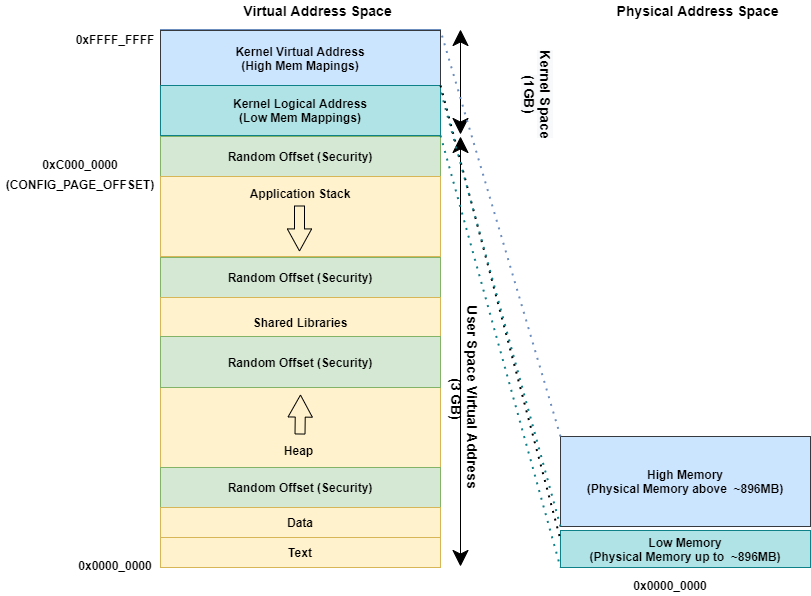
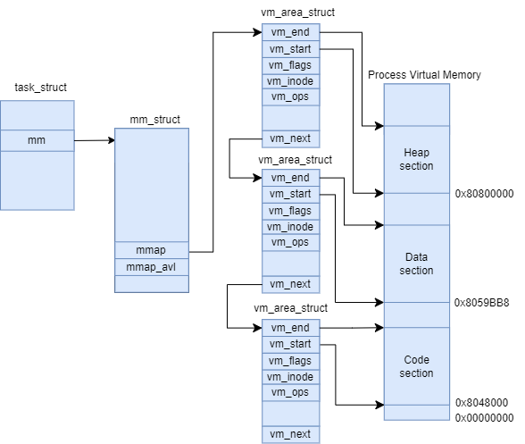
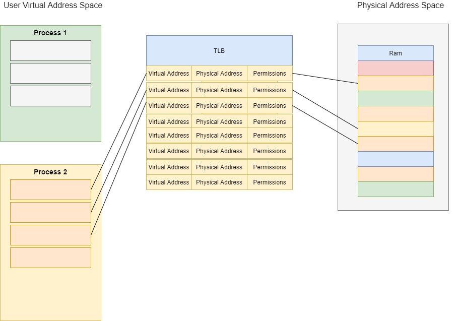
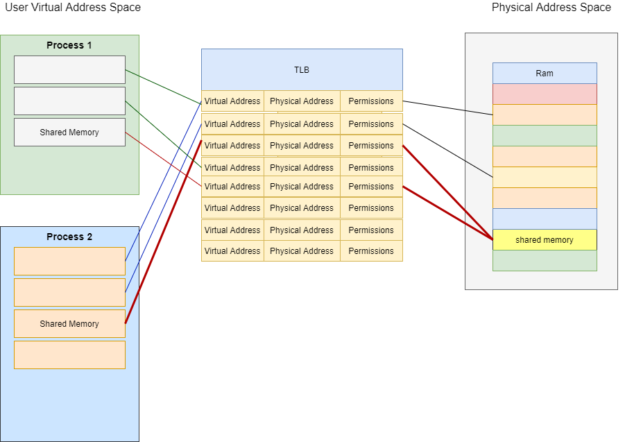
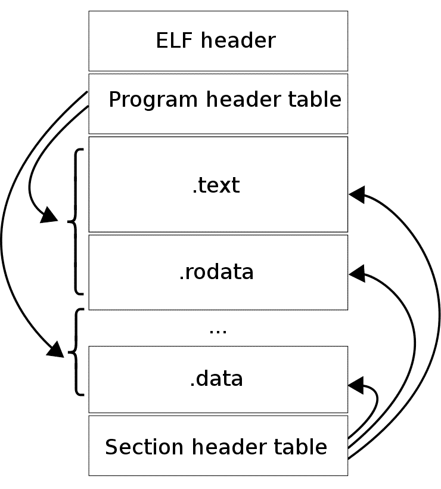
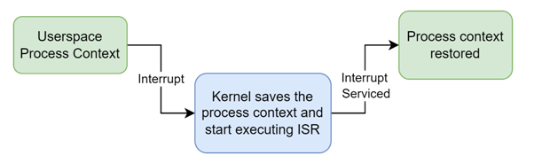
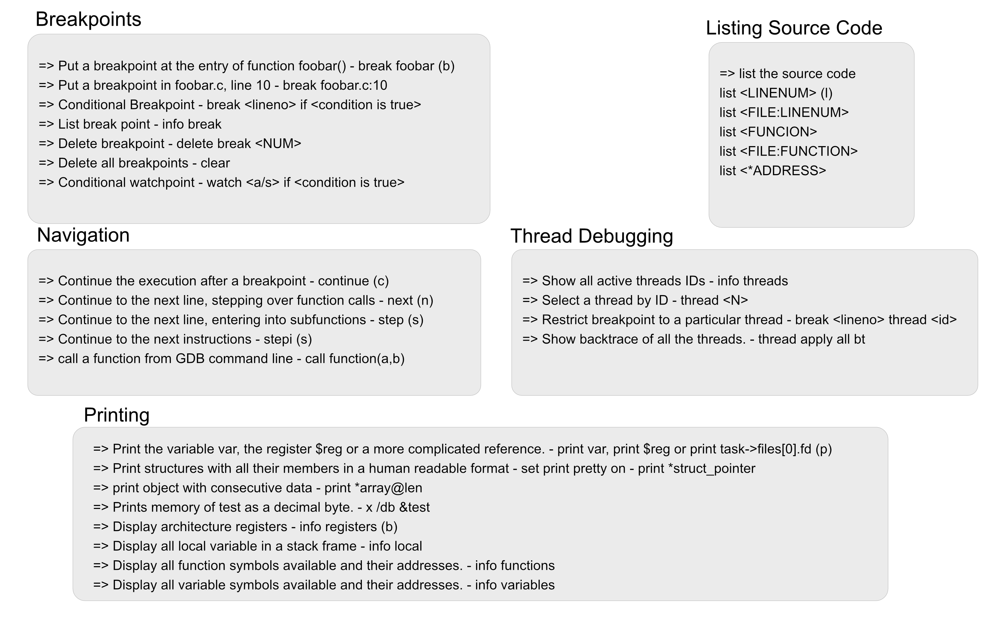
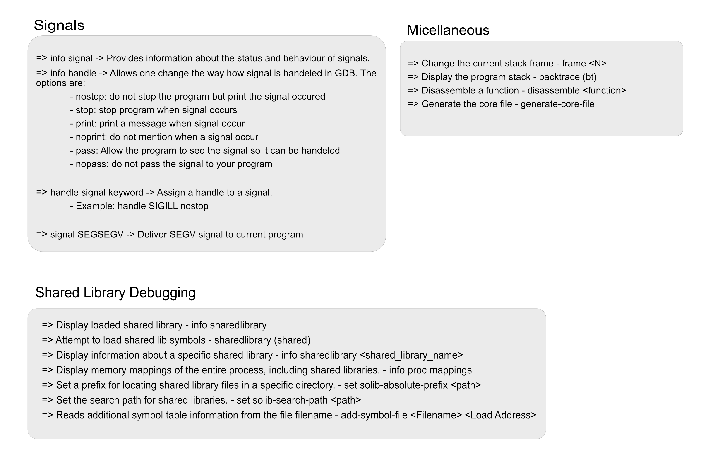
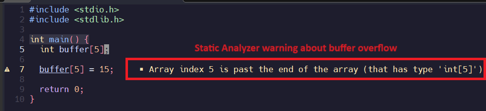

<style>
  section { background-image: url('../../Resources/png/background.png'); background-size: contain; font-family: 'Times New Roman', serif !important; background-color: #fff; text-align: left; top: 20; font-size: 26px;}
  h1 {   font-size: 50px;   color: #09c;   position: absolute; padding: 20px;   top: 0;   left: 0;   right:  0;  text-align: center;}
  h2 {   font-size: 52px;   color: #09c;   position: absolute; padding: 20px;   top: 20;   left: 0;   right:  0;  text-align: center;} 
  h3 {   font-size: 52px;   color: #09c;   position: relative; padding: 0px;   top: 0;   left: 0;   right:  0;  text-align: center;} 
  h5 {   font-size: 20px;   color: #09c;   position: absolute; padding: 10px;   top: 5;  left: 0;   right:  0; } 

footer {
  text-align: center;
  position: absolute;
  padding: 4px;
  bottom: 0;
  left: 0;
  right:  0;
  z-index: 5; 
  color: #09c;
  background: none;
  font-size: 14px;
  text-align: center;
}

section.no-footer footer {
    display: none;
}

ul {
  text-align: left;
  margin-left: 1.5em;
}

li {
    text-align: left;
  }

.left-align {
  text-align: left;
}

.baseline-container {
  display: flex;
  justify-content: center;
  align-items: flex-end;
  height: 100vh;
}

.container {
  display: flex;
}

.column {
  flex: 1;
  text-align: center;
  padding: 1rem;
}


.image-container-baseline {
  margin-bottom: 0rem;
}

.code-block {
  font-size: 16px;
}

.image-container {
  display: flex;
  justify-content: center;
  align-items: center;
  height: 100%;
  margin-bottom: 2rem;
}

.logo-container {
  position: absolute;
  top: 43%;
  left: 50%;
  transform: translate(-50%, -50%);
  display: flex;
  justify-content: center;
  align-items: center;
  height: auto;
  width: auto;
}

.large-logo-container {
  position: relative;
  padding: 0px;
  top: 10%;
  left: 50%;
  transform: translate(-50%, -50%);
  display: flex;
  justify-content: center;
  align-items: center;
  height: auto;
  width: auto;
}

.presenter-picture {
  width: 200px;
  height: 200px;
  border-radius: 50%;
  overflow: hidden;
  margin: 0 auto 1rem;
  border: 3px solid #09c;
  box-shadow: 0 4px 6px rgba(0, 0, 0, 0.1);
  }

.presenter-picture img {
  width: 100%;
  height: 100%;
  object-fit: cover;
}

.presenter-name {
  font-family: "Arial", sans-serif;
  font-size: 30px;
  font-weight: bold;
  color: #222;
  margin-top: 1rem;
}

.introduction {
  font-family: "Verdana", sans-serif;
  font-size: 16px;
  color: #444;
  margin-top: 0.5rem;
}
  
.bottom-container {
  position: absolute;
  bottom: 0;
  left: 0;
  width: 100%;
  padding: 10px 20px 30px;
  background-color: transparent;
  font-family: "Verdana", sans-serif;
  font-size: 16px;
  line-height: 1.6;
  text-align: center;
}

.bottom-container span {
  display: inline-block;
}

.two-row-container {
  display: flex;
  flex-direction: column;
  height: 100%;
  margin-top: 6rem; 
  justify-content: left;
}

.row {
  font-size: 20px;
  line-height: 2;
  margin: 0;
  padding: 0;
}

.two-column-container {
  display: flex;
}

.presenter-into-container {
  display: flex;
  justify-content: space-between; 
  align-items: flex-start; 
  height: 100%; 
  padding: 2rem;
}

.code-block-small {
  font-size: 12px;
}

.contact-container {
  display: flex; 
  gap: 60px; 
  justify-content: center;
  align-items: center;
  margin-top: 10px; 
}

.contact-link {
  color: #09c; 
  font-size: 16px;
  text-decoration: none;
  font-weight: bold;
}

.contact-link:hover {
  text-decoration: underline; 
  color: #0056b3; 
}

.course-outline-container {
  display: flex;
  flex-direction: column;
  justify-content: flex-start;
  align-items: flex-start;
  padding: 10px;
  margin: 50px 10px 50px 10px;
  height: 200vh; 
  line-height: 1.5;
  background-color: transparent; 
  font-family: "Arial", sans-serif;
  color: #333;
  overflow-y: auto;
  overflow-x: hidden;
  box-sizing: border-box;
}

.course-title {
  font-size: 38px;
  font-weight: bold;
  margin-bottom: 20px;
  color: #0056b3;
  text-align: center;
  width: 100%;
}

.module-list {
  list-style-type: none;
  padding: 0;
  margin: 10;
  width: 100%;
}

.module-item {
  font-size: 30px;
  margin-bottom: 10px;
  display: flex;
  align-items: center;
}

.module-item span {
  font-weight: bold;
  color: #0056b3;
  margin-right: 10px;
}

.module-item p {
  margin: 0;
  font-weight: bold;
  color: #444;
}

</style>


<!-- _class: no-footer -->

<h1> <br>Linux Debug Training </h1>

<div class="logo-container">

</div>

<div class="bottom-container">

<span> **Presenters**: [John O'Sullivan](https://www.linkedin.com/in/john-o-15b17a34/) and [Manas Marawaha](https://www.linkedin.com/in/manasmarwah/) </span>

<span>© Copyright 2024, John O'Sullivan and Manas Marawaha
Licensed under [Creative Commons BY-SA 4.0](https://creativecommons.org/licenses/by-sa/4.0/)  (CC BY-SA 4.0)  </span>

<span> **Document source**: https://github.com/SpecialistLinuxTraining/linux-debug-training/tree/main/Slides </span>

</div>

---
<h1>Presenters Introduction</h1>

<br>
<div class="presenter-into-container">
  <div class="column">
    <div class="presenter-picture">
      
    </div>
    <div class="presenter-name">John O'Sullivan</div>
    <div class="introduction">
      <p>John O'Sullivan is a software architect with over 30 years of experience, specializing in the development and optimization of Linux-based embedded systems. He has extensive hands-on expertise in hardware-software integration and product development across a wide range of industries. </p>
    </div>
  <div class="contact-container">
    <a href="mailto:johnos3747@gmail.com" class="contact-link">
      Email
    </a>
    <a href="https://www.linkedin.com/in/john-o-15b17a34/" target="_blank" class="contact-link">
      LinkedIn
    </a>
  </div>
  </div>

  <div class="column">
    <div class="presenter-picture">
      
    </div>
    <div class="presenter-name">Manas Marawaha</div>
    <div class="introduction">
      <p>Manas Marawaha is a Principal Engineer with over 13 years of experience in embedded Linux software development. With a strong understanding of Linux internals, kernel programming, and device drivers, he brings extensive hands-on expertise in product development across audio, video, and networking domains.
</p>
    </div>
  <div class="contact-container">
    <a href="mailto:manas.marwah@gmail.com" class="contact-link">
      Email
    </a>
    <a href="https://www.linkedin.com/in/manasmarwah/" target="_blank" class="contact-link">
      LinkedIn
    </a>
  </div>
</div>

---
# License Information
<span>© Copyright 2024, John O'Sullivan and Manas Marawaha
Licensed under [Creative Commons BY-SA 4.0](https://creativecommons.org/licenses/by-sa/4.0/)  (CC BY-SA 4.0) 
https://creativecommons.org/licenses/by-sa/4.0/ </span>

<br>

**You are free to:**

- **Share** - copy and redistribute the material in any medium or format for any purpose, even commercially.

- **Adapt** - remix, transform, and build upon the material for any purpose, even commercially.

- The licensor cannot revoke these freedoms as long as you follow the license terms.

---
# License Information (Cont.)
**Under the following terms:**

- **Attribution** - You must give appropriate credit, provide a link to the license, and indicate if changes were made. You may do so in any reasonable manner, but not in any way that suggests the licensor endorses you or your use.

- **ShareAlike** - If you remix, transform, or build upon the material, you must distribute your contributions under the same license as the original.

- **No additional restrictions** - You may not apply legal terms or technological measures that legally restrict others from doing anything the license permits.

---
# Course Outline
<div class="course-outline-container">
<div class="course-title"> Linux Debug Training (Part-1)</div>
  <ul class="module-list">
    <li class="module-item">
      <span>Module 1:</span>
      <p>Linux Operating System Architecture</p>
    </li>
    <li class="module-item">
      <span>Module 2:</span>
      <p>Basic Linux Analysis and Observability Tools</p>
    </li>
    <li class="module-item">
      <span>Module 3:</span>
      <p>Application Debugging</p>
    </li>
    <li class="module-item">
      <span>Module 4:</span>
      <p>Memory Issues in Linux Applications</p>
    </li>
    <div class="course-title"> Linux Debug Training (Part-2)</div>
    <li class="module-item">
      <span>Module 5:</span>
      <p>Tracing in Linux</p>
    </li>
    <li class="module-item">
      <span>Module 6:</span>
      <p>Profiling in Linux</p>
    </li>
    <li class="module-item">
      <span>Module 7:</span>
      <p>Linux Kernel Debugging</p>
    </li>
  </ul>
</div>

---
<h1>Course information</h1>

- Example code demonstrated in the course is available on the [GitHub repository](https://github.com/SpecialistLinuxTraining/linux-debug-training/tree/main/Examples).

- For document sources, please refer to this [link](https://github.com/SpecialistLinuxTraining/linux-debug-training/tree/main/Slides).

- Most code demonstrations use Ubuntu OS 22.04. You can download and install Ubuntu 22.04 using this [link](https://releases.ubuntu.com/jammy/).

- Please review the [instructions](https://github.com/SpecialistLinuxTraining/linux-debug-training/blob/main/References/building_course_examples.md) for building the course examples before proceeding.

- We value your feedback and suggestions! Please share them via email at specialistlinuxtraining@gmail.com.

- For corrections on the training material, feel free to raise [issues](https://github.com/SpecialistLinuxTraining/linux-debug-training/issues) and [pull request](https://docs.github.com/en/pull-requests/collaborating-with-pull-requests/proposing-changes-to-your-work-with-pull-requests/creating-a-pull-request-from-a-fork) in the GitHub repository.

---
<!-- Module 1 - Linux Operating System Architecture -->


<h2> Module 1

Linux Operating System Architecture</h2>

---
# Linux OS Architecture

<div class="two-column-container">
  <div class="column">
  <br>
    <li style="text-align: left;">Linux OS architecture is divided into two main parts.</li>
    <li style="text-align: left; 1em; margin-left: 40px">User space</li>
    <li style="text-align: left; 1em; margin-left: 40px">Kernel space</li>
<li style="text-align: left; 1em;">User space is a protected virtual address space that hosts user application programs, system libraries and user level services.</li>
<li style="text-align: left; 1em;">Kernel space is a privileged mode reserved for kernel functionalities like reading and writing to the hardware, interrupt (IRQ) handling, managing memory and other low level services.</li>
  </div>
  <div class="column">
  <br>
    <div class="image-container">
          
    </div>
  </div>
</div>

---

# User Mode/Kernel Mode

- The difference between user mode and kernel mode comes from the privileges available in each mode of execution. 

- In kernel mode, the kernel is allowed to run all privileged operation such as interrupt handling, I/O, scheduling, process management. 

- In user mode, an application is only allowed to perform a set of basic operations.

- A user application can request services from the kernel through system calls; these system calls allow the user space program to request services and certain privileged operations. 

---
# 32-bit Linux Address Space

<br><br><br>
<div class="baseline-container">
      <div class="image-container-baseline">
          
      </div>
</div>

---

# 32-bit User Space Addressing

- In a 32 bit system each process has the access to the 3 GB virtual address space.

    - [task_struct](https://elixir.bootlin.com/linux/latest/source/include/linux/sched.h#L737) is a process descriptor and represents a process or a thread in the Linux kernel.The memory layout of a process, including its page tables and memory mapings are defined in [mm_struct](https://elixir.bootlin.com/linux/latest/source/include/linux/mm_types.h#L584).
- By default all user mappings are randomized to minimize the possibility of attack (Base of heap, stack, text, data etc.)
- Due to randomization multiple processes could have different address spaces. 
- The kernel ‘[norandmaps](https://www.kernel.org/doc/html/v4.14/admin-guide/kernel-parameters.html)’ command line option can be used to disable randomization.
    - This is the equivalent to:
     `echo 0 > /proc/sys/kernel/randomize_va_space`
---
# Virtual address mapping
<br>

<div class="baseline-container">
      <div class="image-container-baseline">
          
      </div>
</div>

---
# Virtual Memory Areas

- VMAs are the actual memory zones in a process which are setup by Kernel upon initialization of the process. 

    - [task_struct->mm-> chain of vm_area_struct](https://elixir.bootlin.com/linux/latest/source/include/linux/mm_types.h#L480)
- These zones are tagged by specific attribute (R/W/X).
- A segmentation fault can happen when a program tries to access non-existing VMA or existing VMA in a different way as defined by its attribute.
    - Execute data in non-executable segment

    - Write data in read only segment
- Per application maps is located in `/proc/{PID}/maps`.
---

# Kernel Logical Addressing

- Kernel Logical Addressing (KLA) - also called Low Mem -  is directly mapped to kernel space.

- [CONFIG_PAGE_OFFSET](https://elixir.bootlin.com/linux/latest/source/arch/x86/Kconfig#L1473) defines the offset for KLA. The logical address is calculated at a fixed offset from the physical address. 
    - Logical address 0xC0000000 (Page offset) => 0x00000000 Physical address

    - Conversion: The macros [__pa(x)](https://elixir.bootlin.com/linux/latest/source/arch/x86/include/asm/page.h#L41) and [__va(x)](https://elixir.bootlin.com/linux/latest/source/arch/x86/include/asm/page.h#L58) can be used to translate between physical and virtual addresses in each direction.
- The Kernel Logical Address range is in physically contiguous memory and suitable for allocating kernel per process stack space, memory for DMA and memory requested through kmalloc.

--- 

# Kernel Virtual Address

- Kernel Virtual Addresses (also called High Mem because it maps to memory beyond the 896 MB boundary), resides at the top of the Kernel Logical address space. High memory is a region of physical memory that is not directly mapped into the lower portion of a system's physical address space. Instead, it's accessed through various mechanisms, such as paging or memory-mapped I/O.

- These virtual address are suitable for large buffer allocation in the kernel, for example:
  - Memory mapped I/O (SOC IP Block)
  - Insmod
  - Ioremap, kmap
  - vmalloc
- Kernel Virtual Addresses are not physically contiguous, so these are not suitable for some operations like DMA.


---
# 64-bit Linux Address Space
<br>

<div class="baseline-container">
      <div class="image-container-baseline">
          
      </div>
</div>

---
# 64-bit User Space Address

- In a 64 bit system each process has access to 128 TB of virtual address space.

- The basic layout of memory sections such as heap, stack, text, data, shared libraries are same as in 32-bit system.
- The primary difference in user space layout between 32-bit and 64-bit addressing spaces is the significantly larger addressable range in 64-bit architectures. 
- This larger space provides more flexibility for memory allocation, mapping, and shared libraries, and it allows for more efficient memory management and utilization in modern systems.
- For x86 64 bit systems the kernel/user space split is at: 0x8000000000000000. For ARM64 it is at 0xFFFF880000000000.

---
# 64-bit User Space Address Example
<br>

The following dump represents the 64-bit user space virtual address map of [memory example](https://github.com/SpecialistLinuxTraining/linux-debug-training/tree/main/Examples/memory).

```
manas@sandbox:~/work$ cat /proc/324/maps

**<Address Start>-<AddressEnd>**
        |          |     **<mode>** 
        |          |       |    **<offset>** 
        |          |       |       |  **<Major ID:Minor ID>**
        |          |       |       |      |  **<inode id>**               **<file path>**
5645ad827000-5645ad828000 r--p 00000000 08:20 438673                     /home/manas/work/memory --> **Read Only, Private Segment (Contains Globals, Constants etc)**
5645ad828000-5645ad829000 r-xp 00001000 08:20 438673                     /home/manas/work/memory --> **Executable Code segment**
5645ad829000-5645ad82a000 r--p 00002000 08:20 438673                     /home/manas/work/memory
5645ad82a000-5645ad82b000 r--p 00002000 08:20 438673                     /home/manas/work/memory
5645ad82b000-5645ad82c000 rw-p 00003000 08:20 438673                     /home/manas/work/memory
5645af7e8000-5645af809000 rw-p 00000000 00:00 0                          [heap]                 --> **Heap section of process**
7f9014ef0000-7f9014ef3000 rw-p 00000000 00:00 0
7f9014ef3000-7f9014f1b000 r--p 00000000 08:20 6488                       /usr/lib/x86_64-linux-gnu/libc.so.6 -> **libc [Shared Lib] read only section**
7f9014f1b000-7f90150b0000 r-xp 00028000 08:20 6488                       /usr/lib/x86_64-linux-gnu/libc.so.6 -> **Libc executable section**
7f90150b0000-7f9015108000 r--p 001bd000 08:20 6488                       /usr/lib/x86_64-linux-gnu/libc.so.6
7f9015108000-7f901510c000 r--p 00214000 08:20 6488                       /usr/lib/x86_64-linux-gnu/libc.so.6
7f901510c000-7f901510e000 rw-p 00218000 08:20 6488                       /usr/lib/x86_64-linux-gnu/libc.so.6
7f901510e000-7f901511b000 rw-p 00000000 00:00 0
7f9015121000-7f9015123000 rw-p 00000000 00:00 0
7f9015123000-7f9015125000 r--p 00000000 08:20 6292                       /usr/lib/x86_64-linux-gnu/ld-linux-x86-64.so.2
7f9015125000-7f901514f000 r-xp 00002000 08:20 6292                       /usr/lib/x86_64-linux-gnu/ld-linux-x86-64.so.2
7f901514f000-7f901515a000 r--p 0002c000 08:20 6292                       /usr/lib/x86_64-linux-gnu/ld-linux-x86-64.so.2
7f901515b000-7f901515d000 r--p 00037000 08:20 6292                       /usr/lib/x86_64-linux-gnu/ld-linux-x86-64.so.2
7f901515d000-7f901515f000 rw-p 00039000 08:20 6292                       /usr/lib/x86_64-linux-gnu/ld-linux-x86-64.so.2
7ffde39a8000-7ffde39c9000 rw-p 00000000 00:00 0                          [stack]                  --> **Stack section of the process**
7ffde39d2000-7ffde39d6000 r--p 00000000 00:00 0                          [vvar]                   --> "Virtual VDSO Variable"
7ffde39d6000-7ffde39d8000 r-xp 00000000 00:00 0                          [vdso]                   --> "virtual Dynamic Shared Object".
                                                                          This is a small shared library which is exported by the kernel and mapped into user space.
```

---
# 64-bit Kernel Space Address
<br>

```
                                                            
                            Kernel-space virtual memory, shared between all processes
                                  48-bit virtual address (4 Level page table)
_______________________________________________________________________________________________________________________
                  |            |                  |         |
 ffff800000000000 | -128    TB | ffff87ffffffffff |    8 TB | ... guard hole, also reserved for hypervisor
 ffff880000000000 | -120    TB | ffff887fffffffff |  0.5 TB | LDT remap for PTI
 ffff888000000000 | -119.5  TB | ffffc87fffffffff |   64 TB | direct mapping of all physical memory (page_offset_base)
 ffffc88000000000 |  -55.5  TB | ffffc8ffffffffff |  0.5 TB | ... unused hole
 ffffc90000000000 |  -55    TB | ffffe8ffffffffff |   32 TB | vmalloc/ioremap space (vmalloc_base)
 ffffe90000000000 |  -23    TB | ffffe9ffffffffff |    1 TB | ... unused hole
 ffffea0000000000 |  -22    TB | ffffeaffffffffff |    1 TB | virtual memory map (vmemmap_base)
 ffffeb0000000000 |  -21    TB | ffffebffffffffff |    1 TB | ... unused hole
 ffffec0000000000 |  -20    TB | fffffbffffffffff |   16 TB | KASAN shadow memory
                  |            |                  |         |
 fffffc0000000000 |   -4    TB | fffffdffffffffff |    2 TB | ... unused hole
                  |            |                  |         | vaddr_end for KASLR
 fffffe0000000000 |   -2    TB | fffffe7fffffffff |  0.5 TB | cpu_entry_area mapping
 fffffe8000000000 |   -1.5  TB | fffffeffffffffff |  0.5 TB | ... unused hole
 ffffff0000000000 |   -1    TB | ffffff7fffffffff |  0.5 TB | %esp fixup stacks
 ffffff8000000000 | -512    GB | ffffffeeffffffff |  444 GB | ... unused hole
 ffffffef00000000 |  -68    GB | fffffffeffffffff |   64 GB | EFI region mapping space
 ffffffff00000000 |   -4    GB | ffffffff7fffffff |    2 GB | ... unused hole
 ffffffff80000000 |   -2    GB | ffffffff9fffffff |  512 MB | kernel text mapping, mapped to physical address 0
 ffffffff80000000 |-2048    MB |                  |         |
 ffffffffa0000000 |-1536    MB | fffffffffeffffff | 1520 MB | module mapping space
 ffffffffff000000 |  -16    MB |                  |         |
    FIXADDR_START | ~-11    MB | ffffffffff5fffff | ~0.5 MB | kernel-internal fixmap range, variable size and offset
 ffffffffff600000 |  -10    MB | ffffffffff600fff |    4 kB | legacy vsyscall ABI
 ffffffffffe00000 |   -2    MB | ffffffffffffffff |    2 MB | ... unused hole
__________________|____________|__________________|_________|___________________________________________________________

* https://www.kernel.org/doc/Documentation/x86/x86_64/mm.txt
```
---
# 64-bit Kernel Space Address
<br><br>

- **Direct Mapping of All Physical Memory (page_offset_base)**:
A region in the kernel space where the entire physical memory is directly mapped for efficient access, allowing kernel code to directly access physical addresses.

- **vmalloc/ioremap Space (vmalloc_base)**:
This region is used for dynamically allocated kernel data structures and for mapping memory-mapped I/O (MMIO) regions from device drivers.

- **Virtual Memory Map (vmemmap_base)**:
A mapping of the physical memory's page frames into kernel virtual space, used to access and manage physical memory. It allows the kernel to reference physical memory addresses as kernel virtual addresses.

- **cpu_entry_area Mapping**:
This area holds per-CPU data structures and is mapped for each CPU, providing a separate area for certain CPU-specific operations and data.

---
# 64-bit Kernel Space Address
<br>

- **%esp Fixup Stacks**:
Stacks used to handle exceptions during context switches and when the kernel starts execution. These stacks are used to ensure proper handling of CPU state during such operations.

- **Kernel Text Mapping, Mapped to Physical Address 0**:
The virtual memory mapping of the kernel's text section (code), which is mapped to the physical address 0 to enable direct access to kernel instructions.

- **Module Mapping Space**:
A region reserved for dynamically loaded kernel modules, allowing the kernel to load and manage modules separately from its main code.

- **Kernel-Internal Fixmap Range, Variable Size and Offset**:
A region with variable size and offset used for mapping kernel-internal data structures and hardware register addresses, ensuring efficient access.

---

# Summary of Virtual Addressing in Linux
<br>
<br>

- __User Virtual Addresses__: These are addresses used by user-level processes. They are an abstraction that allows each process to have its own dedicated virtual memory space which is mapped to physical memory by an MMU.

- __Kernel Logical Addresses__: Kernel logical addresses are a mapping from kernel-space virtual addresses to physical address (Low Mem on 32 bit systems). They use a constant offset that provides a linear, one-to-one mapping to a physical addresses. This memory, allocated with functions like kmalloc, is contiguous and cannot be swapped out. Because of this these allocations are suitable for operations like DMA.
- __Kernel Virtual Addresses__: Kernal virtual addresses map to the High Mem part of physical memory (memory beyond 896MB) on 32 bit systems. These are not physically contiguous but they are virtually contiguous. Memory is allocated with vmalloc and this area is suitable for insmod.
- __Note:__ When dealing with addresses in Linux we are __always__ dealing with virtual addresses.
---
# Memory Management/ MMU (part 1)

<div class="baseline-container">
      <div class="image-container-baseline">
          
      </div>
</div>

- An MMU facilitates the translation from virtual to physical addresses with the help of a Translation Lookaside Buffer (TLB).

---
# Memory Management/ MMU (part 2)

- A user space process runs in a virtual address space.

- The MMU facilitates the translation from virtual to physical addresses. 
- The Base unit of MMU is a ‘[page](https://elixir.bootlin.com/linux/latest/source/arch/x86/include/asm/page.h#L19)’ which is fixed in size and that size depends on the underlying architecture.
- The MMU hardware uses mappings in a page table (PT) for address translation. 
- In a multilevel page table, it is more efficient to have first and second level PTs in memory while other levels can reside on the disk. 

---

# Page Fault Handling (part 1)

<div class="baseline-container">
      <div class="image-container-topline">
          
      </div>
</div>

---
# Page Fault Handling (part 2)

- If a user application tries to access a virtual memory address which is not mapped to a physical address, the MMU triggers a page fault. 

- The Kernel on receiving the page fault interrupt performs following operations. 
  - Puts the user space process to sleep. 

  - Finds the mapping for offending address in the PT.
  - Selects and removes existing TLB entry and copies the frame from disk to RAM.
  - Creates a TLB entry for the page containing the address.
  - Finally it wakes up the user space process. 

---

# User Processes Mappings (part 1)
- Each process in user virtual address space has its own mapping, and this mapping is changed during a context switch.

- The memory map for a user process will have many mappings.
- Each mapping can cover multiple page frames in physical memory.
- The same virtual address can be mapped to different physical addresses for different processes.
- Because the TLB is a limited resource, far more mappings can be made that exist in the TLB at any one time, so the kernel must keep track of all mappings and it stores this is page tables in struct_mm and vm_area_struct.
- A mapping to a virtually contiguous space does not have to be physically contiguous for user space processes and this makes allocation easier.

---

# User Processes Mappings (part 2)
<div class="baseline-container">
      <div class="image-container-baseline">
          
      </div>
</div>

<br>

---

# User Processes Mappings (part 3)
<div class="baseline-container">
      <div class="image-container-baseline">
          
      </div>
</div>

<br>

---

# Shared memory in user space 

<div class="baseline-container">
      <div class="image-container-baseline">
          
      </div>
</div>


- Shared memory in user space refers to a technique used in operating systems to allow multiple processes to access a region of memory that is shared between them.
- MMU maps the same physical frame into two or more processes.
- The shared memory will have different virtual addresses in each process, but they will be mapped to the same physical memory location.  
- [mmap()](https://man7.org/linux/man-pages/man2/mmap.2.html) allows us to request specific virtual address to map the shared region. 
- Refer to the [Shared Memory code example](https://github.com/SpecialistLinuxTraining/linux-debug-training/tree/main/Examples/sharedmemory).

---
# Processes and Threads (part 1)

- A process is an instance of a running program that has its own memory space and system resources, such as file descriptors, network sockets, and environment variables.

- Each process is assigned a unique process ID (PID) and information related to a process can be accessed from `/proc/{PID}` file.
- The Kernel keep tracks of all the user space processes through a task vector which is an array of [task_struct](https://elixir.bootlin.com/linux/latest/source/include/linux/sched.h#L737) pointer.
  - The ‘[current](https://elixir.bootlin.com/linux/latest/source/arch/x86/include/asm/current.h#L39)’ pointer points to currently running process.
  - This can be accessed through [get_current()](https://elixir.bootlin.com/linux/latest/source/arch/x86/include/asm/current.h#L44) function.
 - Refer to the [Process Observer Example](https://github.com/SpecialistLinuxTraining/linux-debug-training/tree/main/Examples/ProcessAndThreads/ProcessObserver).
  
 
---
# Processes and Threads (part 2)
<br>
<br>
<br>

<div class="baseline-container">
      <div class="image-container-baseline">
           
      </div>
</div>

- A thread is a lightweight execution unit within a process.
- Threads share the same memory space and system resources as their parent process, but they have their own registers, stack and program counter.
- Threads can run concurrently and independently within the same process, allowing for parallel execution of code.
- A process is created using the [fork()](https://man7.org/linux/man-pages/man2/fork.2.html) system call whereas a thread is created using the [pthread_create()](https://man7.org/linux/man-pages/man3/pthread_create.3.html) function. Both of these use the [clone()](https://man7.org/linux/man-pages/man2/clone.2.html) system call internally. 
- Information related to threads in a process can be found in `/proc/{PID}/task`.
- Refer to the [Process and Threads](https://github.com/SpecialistLinuxTraining/linux-debug-training/tree/main/Examples/ProcessAndThreads) tutorial for an example.

<br>

---

# ELF - Executable Format

- ELF is a standard binary format, supported on various platforms including Linux.

- The same format is used by application binaries, shared libraries, Kernel modules, Kernel (vmlinux) and core dump files.
- The ELF file contains an ELF header along with program related segments
    - .text section: Code
    - .data section: Data
    - .rodata section: Read-only Data
    - .debug_info section: debug information 
- The kernel uses the run time information from the program header to create the process and map the segments into memory.

---
# ELF Format
<div class="baseline-container">
      <div class="image-container-baseline">
          
      </div>
</div>

---

# Shared Libraries (part 1)

- A Shared library (.so) file is a collections of pre-compiled code that can be shared among multiple programs at runtime. It binds with the application at runtime. 

- The kernel loads the application binary into user space virtual program space as defined in ELF file and parses the .interp section to find the dynamic linker.
    - ld-linux.so is the dynamic linker/loader for the Linux operating system. It is responsible for resolving dependencies between shared libraries and executable files at runtime.
---
<!-- .slide: style="text-align: left;" -->
# Shared Libraries (part 2)

Shared Libraries are searched in the following path:
<li style="text-align: left; 1em; margin-left: 40px">rpath (built into the binary)</li>
<li style="text-align: left; 1em; margin-left: 40px">LD_LIBRARY_PATH (an environment variable)</li>
<li style="text-align: left; 1em; margin-left: 40px">runpath</li>
<li style="text-align: left; 1em; margin-left: 40px">Directories listed in the file /etc/ld.so.conf</li>
<li style="text-align: left; 1em; margin-left: 40px">Default system libs (/lib, /usr/lib)</li>
 
---

<!-- .slide: class="left-align" -->
# Shared Library Example

- [Shared Library Example](https://github.com/SpecialistLinuxTraining/linux-debug-training/tree/main/Examples/helloworldsharedlibrary)

- [Executable using the shared library](https://github.com/SpecialistLinuxTraining/linux-debug-training/tree/main/Examples/linkingsharedlibrary)

- For more detailed information on Shared Libraries and how they are linked to an executable please refer to this [article](https://medium.com/@johnos3747/shared-libraries-in-c-programming-ab149e80be22).
---

# Scheduling (part 1)

- The scheduler is a core component of the Linux Kernel responsible for allocating CPU time to processes.

- It is responsible for deciding which process or thread gets to run on a CPU core at any given time.
- It does this by assigning a priority to each process based on various factors such as the amount of time it has already used, the amount of memory it is using, and its scheduling policy. 

--- 

# Scheduling (part 2)

- The scheduler in the Linux Kernel can be called by various events that require a change in the execution context.

    - Time quantum expiration: The process time slice expires.

    - Process blocking: A process becomes blocked waiting for an event, such as I/O completion, a signal, or a lock acquisition. This causes the scheduler to select another process to run.
    - Process termination: A process completes or is terminated.
    - Interrupts: A software or hardware interrupt occurs which causes the scheduler to run and possibly select a different process to run.
    - Fork and exec: When a process is forked or a new program is executed the scheduler may be called to select a new process based on priority.

---

# Scheduling (part 3)

- A process can also voluntarily yield the CPU by calling a scheduling function like [sched_yield()](https://man7.org/linux/man-pages/man2/sched_yield.2.html).

- A program can set its own scheduling policy with the [sched_setscheduler()](https://man7.org/linux/man-pages/man2/sched_setscheduler.2.html) call.
- We can query and set CPU scheduling paramaters with tools like [schedtool](https://manpages.ubuntu.com/manpages/lunar/en/man8/schedtool.8.html).
- We can set the CPU affinity of a process with [taskset](https://man7.org/linux/man-pages/man1/taskset.1.html).
- Refer to the [Scheduling](https://github.com/SpecialistLinuxTraining/linux-debug-training/tree/main/Examples/scheduling) tutorial.
---

# Context Switching (part 1)

- Context switching is a mechanism used by the operating system to switch between different execution contexts in order to allow multiple processes or threads to run concurrently on a single CPU. 

- The context of a process includes its CPU registers, program counter, stack pointer, and other relevant information.
- The scheduler selects next process from runqueue and updates its scheduling information.
- The current execution context of running process is saved on kernel stack (located in KLA).

---

# Context Switching (part 2)

<div class="baseline-container">
      <div class="image-container-baseline">
           
      </div>
</div>

- The scheduler restores execution context of selected process from task_struct data structure.
- The selected process's scheduling information is updated, such as priority and virtual runtime.
- The control is returned to restored process, allowing it to continue execution from where it left off.

---

# Scheduling Algorithms (part 1)

- The scheduler uses various scheduling policies and algorithms to make scheduling decisions based on the state of the system. 

- Completely Fair Scheduler (CFS): Uses a red-black tree to maintain a sorted list of processes, assigns virtual runtime to each process to calculate priority.
- Real-time scheduling: Provides strict timing guarantees, includes FIFO and Round Robin scheduling

--- 

# Scheduling Algorithms (part 2)

- Deadline scheduling: Provides soft real-time guarantees by ensuring processes meet their deadline

- Multi-Level Feedback Queue (MLFQ) scheduling: Divides runqueue into multiple priority queues, promotes or demotes processes between queues based on CPU usage
- Round Robin (RR): This scheduler assigns a time quantum to each process, and each process is scheduled to run for its allotted time quantum. Once the time quantum is exhausted, the process is preempted and moved to the back of the run queue.

--- 

# System Calls

- A system call is an interface which allows user space to request kernel services. 
    - [read](https://man7.org/linux/man-pages/man2/read.2.html), [write](https://man7.org/linux/man-pages/man2/write.2.html), [lseek](https://man7.org/linux/man-pages/man2/lseek.2.html) are some of the common system calls.

- On X86 systems a special instruction (0x80) is executed from the system call to generate an exception and switch the execution mode from the user mode to the kernel mode. 
- On Arm, executing a SVC (Supervisor Call) instruction generates an Supervisor Call exception, to fullfil a similar function.

- System calls are vectored and identified by their numbers (__NR_<SYSCall>).
    - Example:  __NR__read, defined as 63 in [unistd.h](https://elixir.bootlin.com/linux/latest/source/arch/arm64/include/asm/unistd32.h). 

---
# System call trace of [memory example](https://github.com/SpecialistLinuxTraining/linux-debug-training/tree/main/Examples/memory).
<br>
<br>
<br>
<div class="code-block-small">

```
manas@sandbox:~/work$ strace ./memory
execve("./memory", ["./memory"], 0x7fff4b71fb60 /* 25 vars */) = 0
brk(NULL)                               = 0x55b563f57000
arch_prctl(0x3001 /* ARCH_??? */, 0x7ffdf84bf1b0) = -1 EINVAL (Invalid argument)
mmap(NULL, 8192, PROT_READ|PROT_WRITE, MAP_PRIVATE|MAP_ANONYMOUS, -1, 0) = 0x7f0b12010000
access("/etc/ld.so.preload", R_OK)      = -1 ENOENT (No such file or directory)
openat(AT_FDCWD, "/etc/ld.so.cache", O_RDONLY|O_CLOEXEC) = 3
newfstatat(3, "", {st_mode=S_IFREG|0644, st_size=24535, ...}, AT_EMPTY_PATH) = 0
mmap(NULL, 24535, PROT_READ, MAP_PRIVATE, 3, 0) = 0x7f0b1200a000
close(3)                                = 0
openat(AT_FDCWD, "/lib/x86_64-linux-gnu/libc.so.6", O_RDONLY|O_CLOEXEC) = 3
read(3, "\177ELF\2\1\1\3\0\0\0\0\0\0\0\0\3\0>\0\1\0\0\0P\237\2\0\0\0\0\0"..., 832) = 832
pread64(3, "\6\0\0\0\4\0\0\0@\0\0\0\0\0\0\0@\0\0\0\0\0\0\0@\0\0\0\0\0\0\0"..., 784, 64) = 784
pread64(3, "\4\0\0\0 \0\0\0\5\0\0\0GNU\0\2\0\0\300\4\0\0\0\3\0\0\0\0\0\0\0"..., 48, 848) = 48
pread64(3, "\4\0\0\0\24\0\0\0\3\0\0\0GNU\0i8\235HZ\227\223\333\350s\360\352,\223\340."..., 68, 896) = 68
newfstatat(3, "", {st_mode=S_IFREG|0644, st_size=2216304, ...}, AT_EMPTY_PATH) = 0
pread64(3, "\6\0\0\0\4\0\0\0@\0\0\0\0\0\0\0@\0\0\0\0\0\0\0@\0\0\0\0\0\0\0"..., 784, 64) = 784
mmap(NULL, 2260560, PROT_READ, MAP_PRIVATE|MAP_DENYWRITE, 3, 0) = 0x7f0b11de2000
mmap(0x7f0b11e0a000, 1658880, PROT_READ|PROT_EXEC, MAP_PRIVATE|MAP_FIXED|MAP_DENYWRITE, 3, 0x28000) = 0x7f0b11e0a000
mmap(0x7f0b11f9f000, 360448, PROT_READ, MAP_PRIVATE|MAP_FIXED|MAP_DENYWRITE, 3, 0x1bd000) = 0x7f0b11f9f000
mmap(0x7f0b11ff7000, 24576, PROT_READ|PROT_WRITE, MAP_PRIVATE|MAP_FIXED|MAP_DENYWRITE, 3, 0x214000) = 0x7f0b11ff7000
mmap(0x7f0b11ffd000, 52816, PROT_READ|PROT_WRITE, MAP_PRIVATE|MAP_FIXED|MAP_ANONYMOUS, -1, 0) = 0x7f0b11ffd000
close(3)                                = 0
mmap(NULL, 12288, PROT_READ|PROT_WRITE, MAP_PRIVATE|MAP_ANONYMOUS, -1, 0) = 0x7f0b11ddf000
arch_prctl(ARCH_SET_FS, 0x7f0b11ddf740) = 0
set_tid_address(0x7f0b11ddfa10)         = 25953
set_robust_list(0x7f0b11ddfa20, 24)     = 0
rseq(0x7f0b11de00e0, 0x20, 0, 0x53053053) = 0
mprotect(0x7f0b11ff7000, 16384, PROT_READ) = 0
mprotect(0x55b562e42000, 4096, PROT_READ) = 0
mprotect(0x7f0b1204a000, 8192, PROT_READ) = 0
prlimit64(0, RLIMIT_STACK, NULL, {rlim_cur=8192*1024, rlim_max=RLIM64_INFINITY}) = 0
munmap(0x7f0b1200a000, 24535)           = 0
newfstatat(1, "", {st_mode=S_IFCHR|0620, st_rdev=makedev(0x88, 0x9), ...}, AT_EMPTY_PATH) = 0
getrandom("\x4d\xe1\x24\xc2\x9b\x00\xc1\x30", 8, GRND_NONBLOCK) = 8
brk(NULL)                               = 0x55b563f57000
brk(0x55b563f78000)                     = 0x55b563f78000
write(1, "The address of the main function"..., 51The address of the main function is 0x55b562e40169
) = 51
write(1, "The address of the first functio"..., 52The address of the first function is 0x55b562e40292
) = 52
write(1, "The address of the second functi"..., 53The address of the second function is 0x55b562e402c6
) = 53
write(1, "The address of the first local v"..., 58The address of the first local variable is 0x7ffdf84bf250
) = 58
write(1, "The address of the second local "..., 59The address of the second local variable is 0x7ffdf84bf254
) = 59
write(1, "The address of the first global "..., 59The address of the first global variable is 0x55b562e43010
) = 59
write(1, "The address of the second global"..., 60The address of the second global variable is 0x55b562e43014
) = 60
```
</div>

---

# Exception

- Exceptions are events that occur within the processor itself that require the attention of the operating system or kernel.

- Examples of software exceptions include invalid memory access, divide-by-zero errors, syscall execution,and other errors that occur as a direct result of the currently executing instruction.
- When an exception occurs, the processor stops executing the current task and transfers control to the kernel, which can then handle the exception appropriately.

---

# Interrupts

- Interrupts are external events that can happen anytime, like data received from a network card or a key pressed on the keyboard.

- Interrupts are asynchronous and can happen anytime, irrespective of what the processor is doing.
- When an interrupt happens, the processor stops the current task and hands over control to the kernel to execute the corresponding ISR.
- The kernel handles interrupts by saving the current task's state, services the interrupt, and then returns to the interrupted task.
- Linux provides information on interrupts through `/proc/interrupts` interface.

---


# Interrupt Context

<div class="two-row-container">
  <div class="row">
    <li>The interrupt handler runs in "interrupt context", which is a restricted execution context.</li>  
    <li>In interrupt context, certain operations like blocking or sleeping are not allowed because these operations could lead to deadlocks or other issues.</li>
   <li>Interrupt handlers usually run quickly and perform only the essential operations necessary to service the interrupt.</li>
   <li>Nested IRQs are not supported.</li>
  </div>
  <div class="row">
      <div class="image-container">
          
    </div>

  </div>
</div>

---

# Deferred Interrupts

- Deferred interrupt handling is a technique used to handle interrupts that cannot be serviced immediately by the interrupt handler.

- It allows the processor to return to executing the interrupted task as quickly as possible while still ensuring that the interrupt is eventually serviced.
- The mechanisms provided in the kernel to handle deferred interrupt handling include:
    - Work Queues
    - Softirqs
    - Tasklets

---

# Kernel Thread

- Kernel threads in the Linux kernel are lightweight processes that operate independently of user space processes.

- Kernel threads can be created using [kthread_create()](https://elixir.bootlin.com/linux/latest/source/include/linux/kthread.h#L27), which clones the thread from kthread process.
    - task_struct->mm = NULL
- Kernel threads can perform blocking I/O operations without affecting other processes or threads.
- Examples of kernel threads in the Linux kernel include kworker, ksoftirqd, and kswapd.

---

# Work Queue

<br>
<br>
<div class="image-container">
  
</div>

- Work queues in Linux kernel execute non-time-critical tasks asynchronously via a dedicated kernel thread called a worker thread.
    - They run in process context and blocking calls (sleep) are allowed.
    - Interrupts are enabled in workqueues.
- A work item, on the other hand, is a unit of work that is submitted to a work queue.     
- Work items are represented by a [struct work_struct](https://elixir.bootlin.com/linux/latest/source/include/linux/workqueue.h#L97) and contain a callback function pointer.
- Execution of work items is queued and managed by the kernel thread.

---

# Soft IRQs

- SoftIRQ (software interrupt) is a mechanism in the Linux kernel used for handling deferred interrupt processing.

- SoftIRQs run in interrupt context and sleep is not allowed.
- Interrupts are enabled while running softIRQ.
- SoftIRQ are statically defined at compile time and cannot be changed dynamically. 
- [NR_SOFTIRQS](https://elixir.bootlin.com/linux/latest/source/include/linux/interrupt.h#L561) is a constant in the Linux kernel that defines the total number of software interrupts (softirqs) available in the system.
- Soft IRQs are reserved for most time critical task such as networking and block devices.

---

# Tasklets
<br>

- Tasklets are a type of SoftIRQ handler used in the Linux kernel for handling __non-time-critical__ tasks. They run in a Soft IRQ context. 

- Tasklets are implemented on top of SoftIRQs.
- [HI_SOFTIRQ](https://elixir.bootlin.com/linux/latest/source/include/linux/interrupt.h#L550): HI_SOFTIRQ is a high-priority softirq in the Linux kernel that runs on every CPU when it is scheduled. It is designed for high-priority work (like tasklets) that needs to be done as soon as possible.
- When a tasklet is scheduled, it is executed in the [TASKLET_SOFTIRQ](https://elixir.bootlin.com/linux/latest/source/include/linux/interrupt.h#L556) context, which is a type of softirq designed specifically for handling tasklets.
- Tasklets can be dynamically allocated and initialized at runtime using the [tasklet_init()](https://elixir.bootlin.com/linux/latest/source/kernel/softirq.c#L838) function.
- Tasklets of the __same type__ are always serialized: in other words, the __same type__ of tasklet cannot be executed by two CPUs at the same time. However, tasklets of __different types__ can be executed concurrently on several CPUs.

---

# References

- Introduction to memory management in Linux, Matt porter, Konsulko Group

  - Video: https://www.konsulko.com/portfolio-item/introduction-to-memory-management-in-linux-matt-porter-video
  - Slides: https://www.konsulko.com/portfolio-item/intro-to-memory-management
- Processes in Linux: https://tldp.org/LDP/tlk/kernel/processes.html
- Linux memory management: https://tldp.org/LDP/tlk/mm/memory.html
- Debugging Shared Libraries
  - https://medium.com/@johnos3747/shared-libraries-in-c-programming-ab149e80be22
  - https://amir.rachum.com/shared-libraries/

---
<!-- Module 2 - Basic Linux Analysis and Observability Tools -->

<h2>
Module 2

Basic Linux Analysis and Observability Tools</h2>

---

# Pseudo file system
- Also known as a virtual filesystem.

- It provides an interface for accessing kernel data structure and system information.
- Some common example of pseudo file systems in Linux includes:
  - /proc
  - /sys
  - /dev
  - /tmp
  - debugfs
---
# /proc Filesystem
- It provides an virtual interface to access process and system related information.

- Each process is represented as a directory under /proc, with a unique process ID (PID).
- Within each process directory, there are various files containing information about the process, such as command-line arguments, environment variables, and status.
- /proc exposes system-wide information, including CPU and memory usage, loaded modules, interrupts, and file system statistics.
- /proc is used by system utilities, diagnostic tools, and monitoring applications to gather information about the system's current state.
---
# /proc Filesystem
Important files and directories in /proc

- `/proc/cpuinfo`: CPU information
- `/proc/meminfo`: Memory information
- `/proc/loadavg`: Average system load
- `/proc/version`: Linux kernel version.
- `/proc/filesystems`: Filesystems supported by the kernel.
- `/proc/cmdline`: Kernel Command-line arguments.
- `/proc/<PID>/` : Process information.
  - `/proc/<pid>/status` process information
  - `/proc/<pid>/maps` process memory mappings
- Please refer to [man proc(5)](https://man7.org/linux/man-pages/man5/proc.5.html) for the list of files and description. 
---
# /sys Filesystem
- /sys filesystem provides a view of the system's hardware, devices, drivers, and kernel modules.

- It is organized hierarchically, with each device and driver represented as a directory.
- It exposes information about devices, such as their attributes, status, and configuration parameters.
- Refer to [man sysfs(5)](https://man7.org/linux/man-pages/man5/sysfs.5.html) for the list of files and description. 

---
# /dev Filesystem
- The dev filesystem also known as the device file system, is a pseudo file system in Linux that provides a way to access devices as if they were regular files.

- It acts as an interface between user-space applications and kernel device drivers.
- It allows processes to interact with devices using standard file operations such as reading, writing, and seeking.
- The /dev file system is typically managed by a combination of the udev daemon and the devtmpfs file system. 
- Please refer to [man udev(7)](https://man7.org/linux/man-pages/man5/sysfs.5.html) for information on udev.

---
# Debug Filesystem
- DebugFS provides a mechanism for kernel developers to expose debugging and tracing information to user-space.

- Typically mounted on the /sys/kernel/debug mount point.
  - Pre-requisite: [CONFIG_DEBUG_FS=y](https://elixir.bootlin.com/linux/latest/K/ident/CONFIG_DEBUG_FS)
  - `mount -t debugfs none /sys/kernel/debug`
- Commonly used by perf, ftrace (tracefs), dynamic debugging, kernel debuggers
  - Dynamic debug: `/sys/kernel/debug/dynamic_debug`
  - Ftrace: `/sys/kernel/tracing`
---
# Linux Monitoring Tools
Linux Provides several monitoring tools available that can help monitor system performance, resource utilization, network activity, and various other aspects.
<br>
**Commonly used Linux monitoring tools:**
- Process Monitoring: ps, top, htop, pstree.
- Memory Monitoring: free, vmstat, pmap.
- Disk i/o Monitoring: iostat, iotop
- Scheduler: mpstat
- Networking: netstat, tcpdump, ethtool
---

# Linux Performance Observability Tools
<div class="baseline-container">
      <div class="image-container-baseline">
          
          <figcaption>Image credits: https://www.brendangregg.com/linuxperf.html</figcaption>
      </div>
</div>

---
# Memory representation

- VSS (Virtual Set Size): Total virtual memory usage of a process, including shared and private memory.

- RSS (Resident Set Size): Total physical memory held in physical RAM including shared library.
- USS (Unique Set Size): Physical memory held in physical RAM excluding shared library.
- PSS (Proportional Set Size): Estimate of physical memory of process including proportionate shared memory. PSS divides the shared memory equally among the processes sharing it.
- VSS >= RSS >= PSS >= USS

---
<h2>Process Tools</h2>

---

# Process status (ps) command
- `ps` is a command-line utility used to display active processes and their attributes [(man ps(1))](https://man7.org/linux/man-pages/man1/ps.1.html).

- It is one of the most commonly used commands and is essential for process management and troubleshooting.
- ps displays process IDs (PIDs), parent process IDs (PPIDs), CPU, memory usage, process status etc.
```
manas@manas-sandbox:~$ ps aux
USER       PID %CPU %MEM    VSZ   RSS TTY      STAT START   TIME COMMAND
root         1  0.0  0.1 225508  9252 ?        Ss   08:02   0:01 /sbin/init splash
root         2  0.0  0.0      0     0 ?        S    08:02   0:00 [kthreadd]
root         8  0.0  0.0      0     0 ?        I<   08:02   0:00 [mm_percpu_wq]
root         9  0.0  0.0      0     0 ?        S    08:02   0:00 [ksoftirqd/0]
root       937  0.0  0.1 360600  9568 ?        Ssl  08:02   0:00 /usr/sbin/ModemManager --filter-policy=strict
manas     2213  0.0  0.0 281244  7704 ?        Sl   08:52   0:00 /usr/bin/gnome-keyring-daemon --daemonize --login
manas     2246  0.0  0.1 551960 14172 tty2     Sl+  08:52   0:00 /usr/lib/gnome-session/gnome-session-binary --session=ubuntu
manas     2895  1.7  2.3 1277124 185528 tty2   SLl+ 08:53   0:02 /usr/bin/gnome-software --gapplication-service
root      2923  0.2  0.9 681036 73732 ?        Ssl  08:53   0:00 /usr/lib/fwupd/fwupd
manas     2989  2.3  2.1 998600 175284 tty2    SNl+ 08:53   0:04 /usr/bin/python3 /usr/bin/update-manager --no-update --no-focus-on-map
manas     3078  0.0  0.4 797220 34280 tty2     Sl+  08:54   0:00 /usr/lib/deja-dup/deja-dup-monitor
```
---
# Table of processes (Top) command

- `top` is a command-line utility that provides real-time monitoring of system processes, CPU usage, and memory usage. [(man top(1))](https://man7.org/linux/man-pages/man1/top.1.html)

```
manas@manas-sandbox:~$ top -d1
top - 09:26:33 up  1:24,  2 users,  load average: 0.07, 0.06, 0.02
Tasks: 324 total,   1 running, 259 sleeping,   0 stopped,   0 zombie
%Cpu(s):  0.1 us,  0.1 sy,  0.0 ni, 99.8 id,  0.0 wa,  0.0 hi,  0.0 si,  0.0 st
KiB Mem :  8063456 total,  4599568 free,  1324504 used,  2139384 buff/cache
KiB Swap:  2097148 total,  2097148 free,        0 used.  6362964 avail Mem

  PID USER      PR  NI    VIRT    RES    SHR S  %CPU %MEM     TIME+ COMMAND
 3252 manas     20   0   44372   4108   3324 R   6.2  0.1   0:00.01 top
    1 root      20   0  225508   9252   6596 S   0.0  0.1   0:01.73 systemd
    2 root      20   0       0      0      0 S   0.0  0.0   0:00.00 kthreadd
...
   40 root     -51   0       0      0      0 S   0.0  0.0   0:00.00 idle_inject/5
   41 root      rt   0       0      0      0 S   0.0  0.0   0:00.09 migration/5

```
---
# Process tree (pstree)

- `pstree` is a command-line utility that displays a tree-like representation of running processes, showing their parent-child relationships [(man pstree(1))](https://man7.org/linux/man-pages/man1/pstree.1.html).

- The tree is rooted at PID (if mentioned) or it is rooted at `init` if PID is omitted.

```
manas@manas-sandbox:~$ pstree -p 3072
sshd(3072)───bash(3077)───sudo(3273)───sudo(3290)───su(3291)───bash(3292)───pstree(3460)

```

---
<h2>Memory Tools</h2>

---
# free
- `free` is a command-line utility that provides information about system memory usage, including total, used, and free memory [(man free(1))](https://man7.org/linux/man-pages/man1/free.1.html).

  - Uses `/proc/meminfo` file to get the memory information.

```
manas@manas-sandbox:~$ free -h
               total        used        free      shared  buff/cache   available
Mem:            15Gi       684Mi        13Gi       614Mi       1.5Gi        13Gi
Swap:             0B          0B          0B
```
---
# Virtual Memory Stats (vmstat)
- `vmstat` is a command-line utility used to display virtual memory statistics including information about system memory, processes, paging, block I/O, CPU usage, and more [(man vmstat(8))](https://man7.org/linux/man-pages/man8/vmstat.8.html).

```
manas@manas-sandbox:~$ vmstat 1 6
procs -----------memory---------- ---swap-- -----io---- -system-- ------cpu-----
 r  b   swpd   free   buff  cache   si   so    bi    bo   in   cs us sy id wa st
 0  0   2328 5286684 269072 1901760    0    0     0     5    4    5  1  0 99  0  0
 0  0   2328 5286740 269072 1901760    0    0     0     0   11   79  0  0 100  0  0
 0  0   2328 5286740 269072 1901760    0    0     0     0   13   91  0  0 100  0  0
 0  0   2328 5286740 269072 1901760    0    0     0     0    9   71  0  0 100  0  0
 0  0   2328 5286740 269072 1901760    0    0     0     0    9   71  0  0 100  0  0
 0  0   2328 5286740 269072 1901760    0    0     0     0   14   95  0  0 100  0  0

```
---
# Process map (pmap)
<br>

- `pmap` is a command-line utility that provides detailed information about the memory mappings of a process [(man pmap(1))](https://man7.org/linux/man-pages/man1/pmap.1.html).
- Uses `/proc/{PID}/maps` file.

```
ubuntu@sandbox:~/work/Examples/memory$ pmap -x `pidof memory`
8219:   ./memory
Address           Kbytes     RSS   Dirty Mode  Mapping
000055b7d159c000       4       4       0 r---- memory [Read Only, Private Segment (Contains Constants etc)]
000055b7d159d000       4       4       0 r-x-- memory [Executable Code segment]
000055b7d15a0000       4       4       4 rw--- memory
000055b7d1d6a000     132       4       4 rw---   [ anon ] [Heap section of process]
00007f5e59400000     160     160       0 r---- libc.so.6 [libc (Shared Lib) read only section]
00007f5e59428000    1620    1036       0 r-x-- libc.so.6 [Libc executable section]
00007f5e59619000       8       8       8 rw--- libc.so.6
00007f5e5961b000      52      20      20 rw---   [ anon ]
00007f5e596ba000       8       8       0 r---- ld-linux-x86-64.so.2
00007f5e596bc000     168     168       0 r-x-- ld-linux-x86-64.so.2
00007f5e596f4000       8       8       8 rw--- ld-linux-x86-64.so.2
00007ffe1782b000     132      16      16 rw---   [ stack ] [Stack section of the process]
00007ffe179a5000       8       4       0 r-x--   [ anon ]
ffffffffff600000       4       0       0 --x--   [ anon ]
---------------- ------- ------- ------- 
total kB            2776    1592     100
            2776K
```
---
<h2>CPU and I/O Related</h2>

---
# I/O Statistics (iostat)
- Monitor and report I/O statistics of disk, disk controller, and filesystem performance [(man iostat(1))](https://man7.org/linux/man-pages/man1/iostat.1.html).

- Useful to understand system wide I/O load using metrics like disk utilization, I/O rates, throughput, and response times.
```
manas@sandbox:~$ iostat
Linux 5.19.0-42-generic (manas-sandbox)    20/06/23        _x86_64_        (8 CPU)

avg-cpu:  %user   %nice %system %iowait  %steal   %idle
           0.16    0.03    0.22    0.04    0.00   99.55

Device             tps    kB_read/s    kB_wrtn/s    kB_dscd/s    kB_read    kB_wrtn    kB_dscd
loop0             0.01         0.01         0.00         0.00         17          0          0
loop1             0.02         0.13         0.00         0.00        346          0          0
loop2             0.02         0.13         0.00         0.00        364          0          0
loop3             0.02         0.39         0.00         0.00       1095          0          0
nvme0n1          10.56       336.19       152.87         0.00     926703     421397          0
```

---
# iotop
- `iotop` is used to monitor real time I/O statistics on a per-process basis [(man iotop(8))](https://man7.org/linux/man-pages/man8/iotop.8.html).

- Helps identify processes generating high I/O load and causing performance issues.
- Metrics includes total I/O, read and write rates, and I/O priorities.
```
Total DISK READ:         0.00 B/s | Total DISK WRITE:         0.00 B/s
Current DISK READ:       0.00 B/s | Current DISK WRITE:       0.00 B/s
    TID  PRIO  USER     DISK READ  DISK WRITE  SWAPIN     IO>    COMMAND
      1 be/4 root        0.00 B/s    0.00 B/s  ?unavailable?  init splash
      2 be/4 root        0.00 B/s    0.00 B/s  ?unavailable?  [kthreadd]
      3 be/0 root        0.00 B/s    0.00 B/s  ?unavailable?  [rcu_gp]
      4 be/0 root        0.00 B/s    0.00 B/s  ?unavailable?  [rcu_par_gp]
      5 be/0 root        0.00 B/s    0.00 B/s  ?unavailable?  [slub_flushwq]
      ...
```
---
# Multi Processor Statistic (mpstat)

- Helps in monitoring individual CPU core usage using metrics like user, system, and idle time, as well as other statistics like interrupts and context switches [(man mpstat(1))](https://man7.org/linux/man-pages/man1/mpstat.1.html).

- Useful in identifying CPU bottlenecks, load imbalances, and overall CPU performance.
```
manas@sandbox:~$ mpstat -P ALL
Linux 5.19.0-42-generic (manas-sandbox)    20/06/23        _x86_64_        (8 CPU)

08:14:27     CPU    %usr   %nice    %sys %iowait    %irq   %soft  %steal  %guest  %gnice   %idle
08:14:27     all    0.23    0.01    0.23    0.03    0.00    0.00    0.00    0.00    0.00   99.50
08:14:27       0    0.31    0.01    0.41    0.02    0.00    0.01    0.00    0.00    0.00   99.24
08:14:27       1    0.36    0.01    0.21    0.02    0.00    0.01    0.00    0.00    0.00   99.39
08:14:27       2    0.20    0.04    0.27    0.04    0.00    0.01    0.00    0.00    0.00   99.44
08:14:27       3    0.21    0.01    0.21    0.03    0.00    0.01    0.00    0.00    0.00   99.54
08:14:27       4    0.18    0.02    0.15    0.02    0.00    0.00    0.00    0.00    0.00   99.63
08:14:27       5    0.26    0.01    0.27    0.02    0.00    0.00    0.00    0.00    0.00   99.44
```
---
<h2>Network Related</h2>

---
# Network statistics (netstat)
- Netstat is used to display network connections and routing tables. [(man netstat(8))](https://linux.die.net/man/8/netstat).

  - Active network connections, listening ports, and established connections.
  - Statistics related to network protocols, such as TCP, UDP, and ICMP.
  - Multicast group information.
- Utilize `/proc/net` interfaces to provide the network information. 
- Helpful in troubleshooting network connectivity issues, monitoring network activity, and analyzing network performance.
---
# ethtool
- Focuses on querying and controlling network interface settings and statistics [(man ethtool(8))](https://man7.org/linux/man-pages/man8/ethtool.8.html).

- Provides detailed information about Ethernet devices, such as link status, speed, duplex mode, and driver information.
- Gathers statistics on network interface performance, such as packet counts and error statistics.
- Allows configuration of features like Wake-on-LAN, offloading capabilities, and flow control settings.
---
# tcpdump
- It is a packet capture tool used to capture and analyze network traffic [(man tcpdump(1))](https://www.tcpdump.org/manpages/tcpdump.1.html).

- It can filter the packets based on various criteria such as:
  - hostname filter: `tcpdump host 192.168.1.100`
  - Port filter: `tcpdump port 80`
  - Protocol filter: `tcpdump icmp`
  - Source filter: `tcpdump src 192.168.1.100`
  - Destination filer: `tcpdump dst 192.168.1.100`
  - Protocol flag filter: `tcpdump 'tcp[13] & 1 != 0` (captures TCP packets with the SYN flag set)
  - Logical operators: `tcpdump host 192.168.1.100 and port 80`

---
# References

- Proc filesystem
  - https://docs.kernel.org/filesystems/proc.html
- Sys filesystem
  - https://docs.kernel.org/filesystems/sysfs.html
- Dev filesystem
  - https://tldp.org/LDP/Linux-Filesystem-Hierarchy/html/dev.html
- Debug filesystem
  - https://docs.kernel.org/filesystems/debugfs.html

- Brendan Gregg's post about Linux performance and observability tools.
  - https://www.brendangregg.com/linuxperf.html

- TCPDUMP tutorial
  - https://danielmiessler.com/p/tcpdump/

---
<!-- Module 3 - Application Debugging< -->
<h2>Module 3

Application Debugging</h2>

---
# binutils

- binutils are a collection of tools that we can use to work with object files, program binaries and libraries.
- The most commonly used binutil tools are mentioned below.

  - readelf
  - objdump
  - objcopy
  - nm
  - addr2line
---
# readelf

- [readelf](https://man7.org/linux/man-pages/man1/readelf.1.html) is a command-line utility that displays information about the contents of binary files, such as object files, shared libraries, and executables.

- readelf is typically used to examine the contents and organization of binary files (specifically [ELF](https://en.wikipedia.org/wiki/Executable_and_Linkable_Format) files).
- It can display information such as the sections and segments in the file, the symbols defined in the file, the dynamic relocations and dependencies of the file, program header information and version information.

- Please refer to this comprehensive [explanation](https://medium.com/@johnos3747/understanding-program-memory-layout-in-linux-systems-a13412c8727b) of how a process and its associated resources are mapped into memory. 

---

# readelf example

<br>
<br>
<div class="code-block">

```
readelf -l /bin/ls
Elf file type is DYN (Position-Independent Executable file)
Entry point 0x6ab0
There are 13 program headers, starting at offset 64
Program Headers:
  Type           Offset             VirtAddr           PhysAddr
                 FileSiz            MemSiz              Flags  Align
  PHDR           0x0000000000000040 0x0000000000000040 0x0000000000000040
                 0x00000000000002d8 0x00000000000002d8  R      0x8
  INTERP         0x0000000000000318 0x0000000000000318 0x0000000000000318
                 0x000000000000001c 0x000000000000001c  R      0x1
  LOAD           0x0000000000000000 0x0000000000000000 0x0000000000000000
                 0x0000000000003428 0x0000000000003428  R      0x1000
  LOAD           0x0000000000004000 0x0000000000004000 0x0000000000004000
                 0x0000000000013146 0x0000000000013146  R E    0x1000
  LOAD           0x0000000000018000 0x0000000000018000 0x0000000000018000
                 0x0000000000007458 0x0000000000007458  R      0x1000
  LOAD           0x0000000000020000 0x0000000000021000 0x0000000000021000
                 0x0000000000001278 0x0000000000002540  RW     0x1000
  DYNAMIC        0x0000000000020a98 0x0000000000021a98 0x0000000000021a98
                 0x00000000000001c0 0x00000000000001c0  RW     0x8
  NOTE           0x0000000000000338 0x0000000000000338 0x0000000000000338
                 0x0000000000000030 0x0000000000000030  R      0x8
  NOTE           0x0000000000000368 0x0000000000000368 0x0000000000000368
                 0x0000000000000044 0x0000000000000044  R      0x4
  GNU_PROPERTY   0x0000000000000338 0x0000000000000338 0x0000000000000338
                 0x0000000000000030 0x0000000000000030  R      0x8
  GNU_EH_FRAME   0x000000000001cdcc 0x000000000001cdcc 0x000000000001cdcc
                 0x000000000000056c 0x000000000000056c  R      0x4
  GNU_STACK      0x0000000000000000 0x0000000000000000 0x0000000000000000
                 0x0000000000000000 0x0000000000000000  RW     0x10
  GNU_RELRO      0x0000000000020000 0x0000000000021000 0x0000000000021000
                 0x0000000000001000 0x0000000000001000  R      0x1
...
```

__Note__: Position Independent Executable Code is an executable binary file format that is designed to be loaded at any memory address without modification. This property is particularly useful for security features such as Address Space Layout Randomization (ASLR).
</div>

---
# objdump
- [objdump](https://man7.org/linux/man-pages/man1/objdump.1.html) provides detailed information about content and structure of object files, executable file and shared libraries. 

  - Displays disassembled machine code instructions, assembly instructions, addresses and opcode.

  - Displays symbol table (functions, variables).
  - Shows the relocation and linking information.
```
manas@sandbox:~/work$ objdump -f memory
memory:     file format elf64-x86-64
architecture: i386:x86-64, flags 0x00000150:
HAS_SYMS, DYNAMIC, D_PAGED
start address 0x0000000000001080
```
---
# nm and addr2line
- [nm](https://linux.die.net/man/1/nm) is used to list the symbols from object files, executables, and shared libraries and their associated memory addresses.
```
manas@sandbox:~/work$ nm memory | grep first_function
0000000000001292 T first_function
```
- [addr2line](https://linux.die.net/man/1/addr2line) translates addresses into file names and line numbers in source code files.
```
manas@sandbox:~/work$ addr2line -f -e memory 0000000000001292
first_function
/home/manas/work/memory.c:30
```
- These tools are primarily used to debug Kernel OOPS. 
---
# ldd
- [ldd](https://man7.org/linux/man-pages/man1/ldd.1.html) is used to display the shared library dependencies of an executable or shared library
```
manas@sandbox:~/work$ ldd /bin/ls
        linux-vdso.so.1 (0x00007ffeea151000)
        libselinux.so.1 => /lib/x86_64-linux-gnu/libselinux.so.1 (0x00007f38f92fe000)
        libc.so.6 => /lib/x86_64-linux-gnu/libc.so.6 (0x00007f38f90d6000)
        libpcre2-8.so.0 => /lib/x86_64-linux-gnu/libpcre2-8.so.0 (0x00007f38f903f000)
        /lib64/ld-linux-x86-64.so.2 (0x00007f38f9363000)
```
---
# GNU Debugger (GDB)
- [GDB](https://www.sourceware.org/gdb/) is a GNU debugger that supports languages like Ada, C/C++, Assembly, D, Fortran, Go, and Rust.

- It is mainly used to debug:
  - a process by starting it with GDB.
  - core dumps.
- GDB utilizes the debug information present in the ELF file.
- [DWARF](https://dwarfstd.org/) is the debugging file format used in Linux, which allows us to embed debug information in an ELF file.
- [LLVM LLDB](https://lldb.llvm.org/) is an alternative to GDB.

---
# Debugging file format

<br>

```
manas@manas-sandbox:~$ gcc -g -o helloworld helloworld.c

manas@manas-sandbox:~$ objdump -h helloworld
...
 27 .debug_aranges 00000030  0000000000000000  0000000000000000  00003045  2**0
                  CONTENTS, READONLY, DEBUGGING, OCTETS
 28 .debug_info   0000017b  0000000000000000  0000000000000000  00003075  2**0
                  CONTENTS, READONLY, DEBUGGING, OCTETS
 29 .debug_abbrev 000000de  0000000000000000  0000000000000000  000031f0  2**0
                  CONTENTS, READONLY, DEBUGGING, OCTETS
 30 .debug_line   0000008d  0000000000000000  0000000000000000  000032ce  2**0
                  CONTENTS, READONLY, DEBUGGING, OCTETS
 31 .debug_str    00000165  0000000000000000  0000000000000000  0000335b  2**0
                  CONTENTS, READONLY, DEBUGGING, OCTETS
 32 .debug_line_str 00000038  0000000000000000  0000000000000000  000034c0  2**0
                  CONTENTS, READONLY, DEBUGGING, OCTETS
```
Debug sections are separated from the .text section in the executable, allowing a non-debug binary to run on the target system while using the same ELF for debugging tools on the host system.

---
# GDB Debugging Options

- We can use the following command to check if debug symbols are present in the binary: `readelf --debug-dump=decodedline <application binary>`

- We can look at the debug sections of the ELF section with `readelf -w <application binary>`.
- Compilation options available for adding debugging symbols.
    - g0: Provides no debug information.
    - g1: Produces minimal information, enough for producing back traces, but no information on variables or line numbers.
    - g2: Default debug level (same as -g). Produces symbols and line numbers required for debugging.
    - g3: Provides extra debug information, including macro definitions.
    - ggdb3: This is like g3, but generates debug information that has been tailored specifically for the GDB debugger.

---
# Debugging & Optimization options

<br>
<br>

In order to accurately trace source code in GDB, we should disable code optimization. Following are some recommendations:
- Using `-O0` compiler optimization flag.
- Enable only GDB compatible optimization flag `-Og`.
- Use `-g` Debug flag.
- We can annotate a specific function with the [compiler attribute](https://gcc.gnu.org/onlinedocs/gcc-4.5.3/gcc/Function-Attributes.html) `__attribute__((optimize("O0")))`.
- Removing the __Static__ qualifier from a function can prevent the compiler from inlining the function for the purpose of optimization.
- We can use the __volatile__ keyword to ensure that a variable is not optimized out.
- We can also set these equivalents in CMake using the CMake Flags directive. Please refer to the [optimization](https://github.com/SpecialistLinuxTraining/linux-debug-training/tree/main/Examples/optimization) example.
```
- # Set Debug configuration flags
set(CMAKE_CXX_FLAGS_DEBUG "${CMAKE_CXX_FLAGS_DEBUG} -O0 -g -Wall")
```
---
# GDB command line options

- Execute program with GDB.
  `gdb <program_binary_to_debug>`

- SYSROOT: Directory containing supporting files such as header files, static libraries, shared libraries etc. In GDB sysroot should point the to the location where GDB can find debug info. 
`set sysroot <Toolchain sysroot>`

- Attach GDB to running processes using the program PID.
  `gdb -p <pid_of_program_binary_to_debug>`

- When using GDB to start a program, the program needs to be run with.
`(gdb) run`

---
# GDB command line options


#### Breakpoints

- A breakpoint is a debugging feature that allows a programmer to pause the execution of a program at a specific point.

- Software breakpoint: A Trap instruction is added in the software where a break point is defined. `b <line number>` or `b <function name>`
- Temporary breakpoint: Stop once and remove the break point automatically. `tbreak <lineno>`
- Hardware breakpoint: For flash based execution, software breakpoint is not ideal. Use hardware breakpoints (CPU architecture-dependent). `hbreak <lineno>`

---

# GDB command line options

#### Watchpoints
- Watchpoints break the program when a selected variable's value changes.
  - watch  ```<symbol>```, watch the specified symbol.

  - watch -l ```<address>```, example: `watch -l *(int *) 0x555555558014`.
  - info watchpoints, list current watchpoints
  - To disable a watchpoint:  disable```<watchpoint_number>```.
  - To delete a watchpoint:  delete ```<watchpoint_number>```.
  - rwatch ```<symbol>```, Stops if the address or symbol is read.
  - awatch ```<symbol>```, Stops if the address or symbol is accessed (similar to watch).
  
---
# GDB command line options
<br>

#### File command

- GDB provides an option of loading the program and files through `file <filename>` command from GDB prompt.

- This can be useful in many instances, for example, to load a core dump, or a symbols file or another binary that your program interacts with.
  - Load the program using file command.
  - Provide the arguments using `set args` command.
  - Check the argument using `show args` command.
  - run it using `run` command.
- If GDB is attached to a running process using `gdb -p <PID>`, we can load the executable (with -g compiled) and symbol table using file command to debug the attached process.

---
<!-- .slide: style="background-image: url('../../Resources/png/background_plain.png'); background-size: contain;" -->
# GDB command cheat-sheet
<br>
<br>

<div class="baseline-container">
      <div class="image-container-baseline">
           
      </div>
</div>

---
# GDB command cheat-sheet (Continued)

<div class="baseline-container">
      <div class="image-container-baseline">
           
      </div>
</div>

---
# Remote debugging
<br>
<br>
<br>

- Remote debugging lets developers debug code on a remote system from their local machine.
- Used when development and target systems are physically separated (e.g., embedded or remote servers).
- Application runs under a GDB server on target is debugged using a GDB debugger on host PC over ethernet or serial port.
- [DWARF](https://dwarfstd.org/) specification enables debugging on an embedded target through a host PC.
- GDB server uses [ptrace()](https://man7.org/linux/man-pages/man2/ptrace.2.html) to control application execution.
<div class="baseline-container">
      <div class="image-container-baseline">
          
      </div>
</div>        
        
---
# Remote debugging
<br>
<br>

#### Target side
- Execute the program using GDB server
Over Network: `gdbserver localhost:[PORT] [executable] [args]`
Over Serial: `gdbserver /dev/ttyS0 [executable] [args]`


#### Host side
- Execute application with GDB `gdb-multiarch -tui [executable]`
- Connect to remote gdb server
```
gdb> target extended-remote [IP]:[PORT] (Networking)
gdb> target remote /dev/ttyUSB0 (Serial)
```
- Point to shared libraries using SYSROOT `gdb> set sysroot [SYSROOT PATH]`

---
# Remote debugging with VSCode 

- Please refer to this [link](https://medium.com/@johnos3747/embedded-debugging-with-vscode-4b928ba1e323) for instructions on configuring VSCode for debugging.

#### Target side
- Execute the program using GDB server on the target
`gdbserver 192.168.1.178:2000 hello_world`


    <div class="image-container">
        
    </div>
- gdbserver starts listening on port 2000 for a connection from the host side.

---
# Remote debugging with VSCode

<br>
<br>
<br>

#### Host side


  <div class="image-container">
      
  </div>

- We configure VSCode by adding a debug configuration in Run->Add Configuration.

<div class="code-block-medium">

```json
{
  "version": "0.2.0",
  "configurations": [
    {
      "type": "gdb",
      "request": "attach",
      "name": "Attach to gdbserver",
      "executable": "/debug/hello_world",
      "target": "192.168.1.178:2000",
      "remote": true,
      "cwd": "${workspaceRoot}",
      "gdbpath": "/usr/bin/gdb-multiarch",
      "autorun": [
        "set sysroot /media/username/buildroot/buildroot-2023.02.8/output/staging"
      ]
    }
  ]
}
```
</div>

---
# Extending GDB with python 

- Python code can be run directly inside the GDB process. This provides a powerful scripting environment for debugging.

- Standard Python libraries can be imported and these can be used to further manipulate the debug environment.


```
gdb main
GNU gdb (Ubuntu 12.1-0ubuntu1~22.04) 12.1
Copyright (C) 2022 Free Software Foundation, Inc.
License GPLv3+: GNU GPL version 3 or later <http://gnu.org/licenses/gpl.html>
...
For help, type "help".
Type "apropos word" to search for commands related to "word"...
Reading symbols from main...
(gdb) python
>import os
>print(f"The PID of this process is {os.getpid()}")
>end
The PID of this process is 696028
(gdb) 
```
---
# Extending GDB with python (continued)

- Python has a gdb module which is specifically designed to aid debugging. We can import this into gdb with:

```python
python import gdb
```  
- The execute command allows us launch the application under python control

```
gdb PythonGDBExample 
GNU gdb (Ubuntu 12.1-0ubuntu1~22.04) 12.1
...

For help, type "help".
Type "apropos word" to search for commands related to "word"...
Reading symbols from PythonGDBExample...
(gdb) python import gdb
(gdb) python gdb.execute('start')
Temporary breakpoint 1 at 0x1171: file /home/johnos/LinuxProgramming/GeneralLinuxDebugging/Examples/PythonAndGDB/PythonGDBExample.c, line 7.
[Thread debugging using libthread_db enabled]
Using host libthread_db library "/lib/x86_64-linux-gnu/libthread_db.so.1".

Temporary breakpoint 1, main () at /home/johnos/LinuxProgramming/GeneralLinuxDebugging/Examples/PythonAndGDB/PythonGDBExample.c:7
7	    print_python_gdb_example("Example");
(gdb) 

```
---
# Extending GDB with python (continued)
<br>
<br>

- The python gdb module also allows us set a breakpoint.

```
(gdb) python bp = gdb.Breakpoint('PythonGDBExample.c:12')
Breakpoint 2 at 0x555555555193: file ../Examples/PythonAndGDB/PythonGDBExample.c, line 12.
```
- We can enable or disable this breakpoint programmatically

```
(gdb) python bp.enabled = False
<gdb.Breakpoint object at 0x7fbec3f4efa0>
(gdb) python print(bp.enabled)
False
(gdb) 
```
- The gdb module allows us dynamically manipulate the debug environment. Refer to the [Python GDB](https://github.com/SpecialistLinuxTraining/linux-debug-training/tree/main/Examples/PythonAndGDB) example.

```
(gdb) python bp.enabled = True
(gdb) run
Breakpoint 2, print_python_gdb_example (message=0x555555556008 "Example") at ../Examples/PythonAndGDB/PythonGDBExample.c:12
12	    printf("\nWelcome to the Use of Python in GDB %s!\n", message);
(gdb) 
```
---

# Extending GDB with python (Resources)

You can find additional information and examples here: 
- https://sourceware.org/gdb/current/onlinedocs/gdb.html/Python-API.html
- https://interrupt.memfault.com/blog/automate-debugging-with-gdb-python-api
- https://undo.io/resources/gdb-watchpoint/how-write-user-defined-gdb-commands-python
- https://www.lse.epita.fr/lse-winter-day-2013/slides/gdb-python.pdf

---
# Shared Library Debugging (1)
<br>

- We will use [shared library](https://github.com/SpecialistLinuxTraining/linux-debug-training/tree/main/Examples/SharedLibGDB) example to demonstrate shared library debugging using GDB. 
- For the purpose of debugging, the library has a explicit segfault condition.
- We can use the `LD_TRACE_LOADED_OBJECTS` environment variable to trace the dynamically loaded objects (equivalent to ldd command).
```
manas@sandbox:~/work/SharedLibGDB$ LD_TRACE_LOADED_OBJECTS=1 LD_LIBRARY_PATH=. ./main
        linux-vdso.so.1 (0x00007ffc5216f000)
        libmylib.so => ./libmylib.so (0x00007fe8f9117000)
        libc.so.6 => /lib/x86_64-linux-gnu/libc.so.6 (0x00007fe8f8edc000)
        /lib64/ld-linux-x86-64.so.2 (0x00007fe8f911e000)
```
- As GDB points out, we are using non-debug version of application and library.
```
manas@sandbox:~/work/SharedLibGDB$ gdb main
...
(No debugging symbols found in main)
....
```
---
# Shared Library Debugging (2)
<br>
<br>

- Point the LD_LIBRARY_PATH env variable to current directory. 
```
(gdb) set env LD_LIBRARY_PATH=.
```
- Set up break point at main and execute the program.
```
(gdb) b main
Breakpoint 1 at 0x1171
(gdb) r
Starting program: /home/manas/work/SharedLibGDB/main
...
Breakpoint 1, 0x0000555555555171 in main ()
```
- Display loaded shared libraries along with its mapping. 
```
(gdb) info shared
From                To                  Syms Read   Shared Object Library
0x00007ffff7fc5090  0x00007ffff7fee335  Yes         /lib64/ld-linux-x86-64.so.2
0x00007ffff7fb7040  0x00007ffff7fb7113  Yes (*)     ./libmylib.so
0x00007ffff7da3700  0x00007ffff7f35abd  Yes         /lib/x86_64-linux-gnu/libc.so.6
(*): Shared library is missing debugging information.
```
---
# Shared Library Debugging (3)

<br>

- Load the debug version of shared library at the same start address where non-debug version of library is loaded. 
```
(gdb) add-symbol-file /home/manas/work/SharedLibGDB/symbols/libmylib.so.debug 0x00007ffff7fb7040
add symbol table from file "/home/manas/work/SharedLibGDB/symbols/libmylib.so.debug" at
        .text_addr = 0x7ffff7fb7040
(y or n) y
Reading symbols from /home/manas/work/SharedLibGDB/symbols/libmylib.so.debug..
```
- The program crashes due to a segfault in the shared library. Because GDB has access to debugging symbols, it can point out the crash location in the code. 
```
(gdb) c
Continuing.
Starting program...
Program received signal SIGSEGV, Segmentation fault.
0x00007ffff7fb710d in causeSegfault () at mylib.c:7
7         *ptr = 'A'; // This will cause a segfault
(gdb) bt
#0  0x00007ffff7fb710d in causeSegfault () at mylib.c:7
#1  0x000055555555518a in main ()
```
---
# LD_PRELOAD

- [LD_PRELOAD](https://linux.die.net/man/8/ld.so) is an environment variable in Linux that allows you to specify shared libraries that should be loaded before all other libraries when a program starts.

- Preload libraries can override or intercept calls to specific functions in other libraries or programs.
- Useful for adding custom behavior, debugging, or profiling without modifying the original code.
- LD_PRELOAD can be used to inject debugging code into a program to trace its behavior or troubleshoot issues.

```
LD_PRELOAD=/usr/lib/x86_64-linux-gnu/libSegFault.so ./<PROGRAM BINARY>
```
---
# libsegfault
<br>

- libsegfault.so is a debugging library provided by glibc.

- It automatically dumps the backtrace and memory map when a program crashes with SEGFAULT.
- The library is activated at runtime via preload, without function overriding.
- It registers a signal handler before program execution, which prints the backtrace when a signal is delivered.
- libsegault.so looks at SEGFAULT_SIGNALS environment variable for the list of accepted signal (default SIGSEGV).
- The library is part of glibc-tools package. The location of the library varies depending on your Linux distribution.


```
SEGFAULT_SIGNALS=all LD_PRELOAD=/usr/lib/x86_64-linux-gnu/libSegFault.so ./<PROGRAM BINARY>
```

---
# Crash Report

<br>
<br>

```
manas@sandbox:~/work/segfault$ LD_PRELOAD=/usr/lib/x86_64-linux-gnu/libSegFault.so ./segfault
*** signal 11
Register dump:
 RAX: 0000000000000000   RBX: 0000000000000000   RCX: 000055922a34adc0
 RDX: 00007ffdc719ae98   RSI: 00007ffdc719ae88   RDI: 0000000000000001
 RBP: 00007ffdc719ad60   R8 : 00007fbd84c60f10   R9 : 00007fbd84c90040
 R10: 00007fbd84c8a908   R11: 00007fbd84ca5680   R12: 00007ffdc719ae88
 R13: 000055922a348182   R14: 000055922a34adc0   R15: 00007fbd84cc4040
 RSP: 00007ffdc719ad50
 RIP: 000055922a348161   EFLAGS: 00010206
 CS: 0033   FS: 0000   GS: 0000
 Trap: 0000000e   Error: 00000004   OldMask: 00000000   CR2: 00000000
 FPUCW: 0000037f   FPUSW: 00000000   TAG: 00000000
 RIP: 00000000   RDP: 00000000
 ST(0) 0000 0000000000000000   ST(1) 0000 0000000000000000
 ST(2) 0000 0000000000000000   ST(3) 0000 0000000000000000
 ST(4) 0000 0000000000000000   ST(5) 0000 0000000000000000
 ST(6) 0000 0000000000000000   ST(7) 0000 0000000000000000
 mxcsr: 1f80
 XMM0:  00000000000000000000000000000000 XMM1:  00000000000000000000000000000000
 XMM2:  00000000000000000000000000000000 XMM3:  00000000000000000000000000000000
 XMM4:  00000000000000000000000000000000 XMM5:  00000000000000000000000000000000
 XMM6:  00000000000000000000000000000000 XMM7:  00000000000000000000000000000000
 XMM8:  00000000000000000000000000000000 XMM9:  00000000000000000000000000000000
 XMM10: 00000000000000000000000000000000 XMM11: 00000000000000000000000000000000
 XMM12: 00000000000000000000000000000000 XMM13: 00000000000000000000000000000000
 XMM14: 00000000000000000000000000000000 XMM15: 00000000000000000000000000000000
Backtrace:
./segfault(causeSegmentationFault+0x18)[0x55922a348161]
./segfault(main+0x12)[0x55922a348194]
/lib/x86_64-linux-gnu/libc.so.6(+0x29d90)[0x7fbd84a6fd90]
/lib/x86_64-linux-gnu/libc.so.6(__libc_start_main+0x80)[0x7fbd84a6fe40]
./segfault(_start+0x25)[0x55922a348085]
Memory map:
55922a347000-55922a348000 r--p 00000000 08:20 968310                     /home/manas/work/segfault/segfault
55922a348000-55922a349000 r-xp 00001000 08:20 968310                     /home/manas/work/segfault/segfault
55922a349000-55922a34a000 r--p 00002000 08:20 968310                     /home/manas/work/segfault/segfault
55922a34a000-55922a34b000 r--p 00002000 08:20 968310                     /home/manas/work/segfault/segfault
55922a34b000-55922a34c000 rw-p 00003000 08:20 968310                     /home/manas/work/segfault/segfault
55922c234000-55922c255000 rw-p 00000000 00:00 0                          [heap]
7fbd84a23000-7fbd84a26000 r--p 00000000 08:20 6556                       /usr/lib/x86_64-linux-gnu/libgcc_s.so.1
.....
7fbd84c61000-7fbd84c6e000 rw-p 00000000 00:00 0
7fbd84c81000-7fbd84c82000 r--p 00000000 08:20 989591                     /usr/lib/x86_64-linux-gnu/libSegFault.so
7fbd84c82000-7fbd84c85000 r-xp 00001000 08:20 989591                     /usr/lib/x86_64-linux-gnu/libSegFault.so
7fbd84c85000-7fbd84c86000 r--p 00004000 08:20 989591                     /usr/lib/x86_64-linux-gnu/libSegFault.so
7fbd84c86000-7fbd84c87000 r--p 00005000 08:20 989591                     /usr/lib/x86_64-linux-gnu/libSegFault.so
7fbd84c87000-7fbd84c88000 rw-p 00006000 08:20 989591                     /usr/lib/x86_64-linux-gnu/libSegFault.so
Segmentation fault
```
---
# Backtrace analysis
<br>

- The given backtrace is from [segfault](https://github.com/SpecialistLinuxTraining/linux-debug-training/tree/main/Examples/segfault) example.  

- Using nm we can get the absolute address of _causeSegmentationFault()_ call.
```
manas@sandbox:~/work/segfault$ nm segfault
...
0000000000001149 T causeSegmentationFault
...
```
- Adding 0x1149 + 0x18 (offset in backtrace) gives us an absolute address (0x1161) of crash location in the binary.
- Using addr2line we can point to the code which is causing the crash. 
```
manas@sandbox:~/work/segfault$ addr2line -e segfault  0x1161
/home/manas/work/segfault/segfault.c:7
```
---

# Core dump
- Kernel has the ability to save a program's memory snapshot in a core file when it encounters a critical error (segmentation fault) or crashes during execution.

- Core dumps are essential for post-mortem debugging, containing memory snapshots, variable values, call stack, and CPU registers at the time of the crash.
- To enable core dumps set RLIMIT_CORE to unlimited.
`ulimit -c unlimited`
- Naming convention of coredump file can be modified by writing to:
```
echo "/corefile/%e-%p" > /proc/sys/kernel/core_pattern

/corefile -> Directory to dump core file
%e -> Executable name
%p -> Process ID
```
---
# Core Dump analysis with GDB
- Execute the [segmentation fault](https://github.com/SpecialistLinuxTraining/linux-debug-training/tree/main/Examples/segfault) example, which will generate a core dump file upon encountering a SIGSEGV signal.
```
manas@sandbox:~/work/segfault$ ./segfault
Segmentation fault (core dumped)
manas@sandbox:~/work/segfault$ ls /home/manas/work/corefile/
segfault-2771
```
- Investigate the core dump using GDB. 

```
manas@sandbox:~/work/segfault$ gdb segfault -c /home/manas/work/corefile/segfault-2771

Reading symbols from segfault...
Core was generated by `./segfault'.
Program terminated with signal SIGSEGV, Segmentation fault.
#0  0x0000562441f39161 in causeSegmentationFault () at /home/manas/work/segfault/segfault.c:7
7         int value = *ptr;
(gdb) bt
#0  0x0000562441f39161 in causeSegmentationFault () at /home/manas/work/segfault/segfault.c:7
#1  0x0000562441f39194 in main () at /home/manas/work/segfault/segfault.c:15
```
---
# References
<br>
<br>

- Debugging Embedded Devices using GDB, Chris Simmonds
  - Slides: https://elinux.org/images/0/01/Debugging-with-gdb-csimmonds-elce-2020.pdf
  - Video: https://www.youtube.com/watch?v=JGhAgd2a_Ck
- Debugging Embedded Devices Using GDB, Mike Anderson
  - https://www.youtube.com/watch?v=FnfuxDVFcWE
- Brendan Gregg's GDB tutorial: https://www.brendangregg.com/blog/2016-08-09/gdb-example-ncurses.html
- Extending GDB using python: https://sourceware.org/gdb/current/onlinedocs/gdb.html/Python.html
- Debugging shared library
  - https://medium.com/@johnos3747/shared-libraries-in-c-programming-ab149e80be22
  - https://amir.rachum.com/shared-libraries/
- Enable coredump on Ubuntu OS
  - https://www.baeldung.com/linux/core-dumps-path-set

---
<!-- Module 4 - Memory Issues in Linux Applications -->

<h2>Module 4

Memory Issues in Linux Applications</h2>

---
# Memory management
- Memory management is crucial in programming as it ensures efficient use of system resources, stability, and performance.

- Application programming mostly involves allocation and deallocation of memory resources.

- Proper memory management ensures optimal utilization and helps prevent common memory issues.
---
# Impact of memory issue in application

<br>
<br>


- **Performance Degradation**: Inefficient memory usage can slow down applications, leading to sluggish user experiences.

- **System Instability and Crashes**: Memory-related errors, like segmentation faults, can cause application crashes or even system-wide instability.

- **Security Vulnerabilities**: Memory vulnerabilities, such as buffer overflows, can be exploited by attackers to compromise system security.

- Common Memory issue
  - Segmentation faults (segfaults)
  - Memory leaks
  - Buffer overflow
  - Use after free (dangling pointer dereference)


- To address concerns stemming from the memory-unsafe nature of C/C++, CISA [recommends](https://www.cisa.gov/news-events/news/urgent-need-memory-safety-software-products) developers transition to memory-safe programming languages like Rust.

---
# Segmentation faults (segfaults)
- A segmentation fault can happen when a program tries to access a non-existing virtual memory segment or existing virtual memory segment in a different way as defined by its attribute.

  - Execute data in non-executable segment.
  - Write data in read only segment.
- As a consequence, the kernel delivers the SIGSEGV signal to the offending process, and it usually results in the termination of the process.
```
int *example_ptr = NULL; //Point example pointer to NULL (Invalid Memory)
*example_ptr = 5; //(Trying to store '5' in invalid memory location)
```
- Refer [segfault](https://github.com/SpecialistLinuxTraining/linux-debug-training/tree/main/Examples/segfault) example.
---

# Memory Leaks
<br>
<br>

- A memory leak is a condition that occurs when a program fails to release memory that is no longer needed.

- Memory leaks gradually consume available memory resources over time, potentially causing performance degradation and eventual program crashes.

- Common causes of memory leaks include not deallocating dynamically allocated memory, losing references to memory blocks, and failing to release resources properly.

```
int main() {
    // Allocate memory for an integer array
    int *arr = (int *)malloc(5 * sizeof(int));
    // Initialize the array
    for (int i = 0; i < 5; i++) {
        arr[i] = i;
    }
    // No explicit free() call to deallocate the memory.
    return 0;
}
```
---
# Buffer overflow
<br>

- A buffer overflow is a type of software vulnerability that occurs when a program writes more data to a buffer (a temporary storage area) than it can hold, causing the excess data to overflow into adjacent memory locations.

- Two common types of buffer overflows are stack-based and heap-based, depending on where the buffer is located in memory.

- It can lead to memory corruption, program crashes, or unauthorized access to a system, making it a significant security risk.
```
// Create an integer array with a size of 5 elements
int buffer[5]

// Writing to the 6th location of buffer will result in a buffer overflow.
buffer[5] = 15;

// Print the content of 'buffer[5]' (this may produce unexpected output)
printf("Buffer[%d]: %d\n", 5, buffer[5]);
```

---
# Memory Debugging Tools
- Detecting and resolving memory issues is crucial for software development and system management.

- Various powerful tools are available to identify, diagnose, and address memory-related problems.

- This section explores these tools and techniques to enhance application and system stability and performance.

---
# Static analysis tools (clang analyzer)
<br>
<br>

- A static analyzer is a software analysis tool that examines source code or compiled code without executing it.

- A static analyzer performs a comprehensive examination of code, including analysis of code patterns, control flow, and data flow, to identify potential issues, including memory-related problems and vulnerabilities.

- Static analyzers help catch memory issues early in the development process, reducing the likelihood of costly and disruptive issues later.

<div class="baseline-container">
      <div class="image-container-baseline">
          
      </div>
</div>

---
# Valgrind
<br>

- [Valgrind](https://valgrind.org/) is an instrumentation framework for building dynamic analysis tools.

- It includes a suite of tools for memory debugging, memory leak detection, and profiling.
  - **Memcheck**: Memory error detector (default tool)
  - **Cachegrind**: Cache profiler
  - **Callgrind**: Call graph profiler
  - **Helgrind**: Thread error detector
  - **Massif**: Heap profiler
<br>
- Valgrind operates by running the program in a virtual machine ("valgrind environment") that monitors and analyzes memory and CPU usage.
- Because of the instrumentation added by Valgrind, the execution speed significantly slows down, making it suitable only for a debugging environment. 

---
# Valgrind memcheck tool

<br>

[Memcheck](https://valgrind.org/info/tools.html#memcheck) is the default and most widely used tool in Valgrind. All reads and writes of memory are checked, and calls to malloc/new/free/delete are intercepted. It detects various memory-related errors such as:

 - Memory leaks: Identifying memory blocks that were allocated but not freed.

 - Uninitialized memory use: Detecting the use of uninitialized values.

- Invalid memory access: Finding out-of-bounds array access and invalid pointer dereferencing. 

- Bad frees of heap blocks (double frees, mismatched frees).
- Overlapping source and destination pointers in memcpy and related functions.

`manas@sandbox:~$ valgrind --tool=memcheck --leak-check=full <program>`

---
# Valgrind memcheck report

<br>
<br>

```
manas@sandbox:~/work/Examples/memory_leak$ valgrind --tool=memcheck --leak-check=full -s ./mem_leak
==23087== Memcheck, a memory error detector
==23087== Copyright (C) 2002-2017, and GNU GPL'd, by Julian Seward et al.
==23087== Using Valgrind-3.18.1 and LibVEX; rerun with -h for copyright info
==23087== Command: ./mem_leak
==23087==
Dynamic array allocated with 5 elements
==23087==
==23087== HEAP SUMMARY:
==23087==     in use at exit: 20 bytes in 1 blocks
==23087==   total heap usage: 2 allocs, 1 frees, 1,044 bytes allocated
==23087==
==23087== 20 bytes in 1 blocks are definitely lost in loss record 1 of 1
==23087==    at 0x4848899: malloc (in /usr/libexec/valgrind/vgpreload_memcheck-amd64-linux.so)
==23087==    by 0x10917E: main (main.c:5)
==23087==
==23087== LEAK SUMMARY:
==23087==    definitely lost: 20 bytes in 1 blocks
==23087==    indirectly lost: 0 bytes in 0 blocks
==23087==      possibly lost: 0 bytes in 0 blocks
==23087==    still reachable: 0 bytes in 0 blocks
==23087==         suppressed: 0 bytes in 0 blocks
==23087==
==23087== ERROR SUMMARY: 1 errors from 1 contexts (suppressed: 0 from 0)
```
The snapshot of this memcheck report is taken from the [memory leak](https://github.com/SpecialistLinuxTraining/linux-debug-training/tree/main/Examples/memory_leak) example.

---

# Valgrind with GDB
<br>
<br>
Valgrind uses a synthetic CPU, not the host CPU, making direct debugging impossible. GDB interacts with Valgrind's gdbserver for full debugging within Valgrind.

- If you want to debug a program with GDB when using the Memcheck tool, start Valgrind like this:

  `valgrind --vgdb=yes --vgdb-error=0 prog`

- Start GDB in another shell.
`gdb prog`

- Attach the GDB with valgrind gdbserver.
`(gdb) target remote | vgdb`

You can now debug your program e.g. by inserting a breakpoint and then using the GDB continue command.

Reference: https://valgrind.org/docs/manual/manual-core-adv.html.

---
# Sanitizer

- The [Sanitizer suite](https://github.com/google/sanitizers) is a set of runtime analysis tools that helps find common programming mistakes. It can detect issues like memory errors, undefined behaviors, race conditions, and similar bugs.

- Each sanitizer relies on **compiler instrumentation** and **shadow memory** or similar techniques to find issues related to memory, threading, and undefined behaviors in code.

- A range of sanitizers are available for analysing both user-space code and kernel code.

- Major compilers, such as GCC and Clang, provide support for various sanitizers.
  - GCC: https://gcc.gnu.org/onlinedocs/gcc/Instrumentation-Options.html
  - Clang: https://clang.llvm.org/docs/UsersManual.html#id47

---
# Address Sanitizer (ASan)
<br>

- [AddressSanitizer](https://github.com/google/sanitizers/wiki/AddressSanitizer) (ASan) is a runtime memory error detector for C/C++. 

- While compiling the program ASan inserts runtime checks into the code to detect memory errors.

- ASan helps identify memory-related issues such as:
  - Use after free (dangling pointer dereference)
  - Heap buffer overflow
  - Stack buffer overflow
  - Global buffer overflow
  - Use after return
  - Use after scope
  - Initialization order bugs
  - Memory leaks

---
# Address Sanitizer usage
<br>
<br>

- Compile the code with `-fsanitize=address` flag. 

```
gcc -fsanitize=address -fno-omit-frame-pointer -g -O1 -o memleak main.c
```
- When a memory error is detected during runtime, ASan will print an error message and a stack trace, indicating where the issue occurred.
```
manas@sandbox:~/work/Examples/memory_leak$ ./memleak
Dynamic array allocated with 5 elements
=================================================================
==23352==ERROR: LeakSanitizer: detected memory leaks

Direct leak of 20 byte(s) in 1 object(s) allocated from:
    #0 0x7f0835dd5867 in __interceptor_malloc ../../../../src/libsanitizer/asan/asan_malloc_linux.cpp:145
    #1 0x56461c79f1fe in main (/home/manas/work/Examples/memory_leak/memleak+0x11fe)
    #2 0x7f0835b22d8f in __libc_start_call_main ../sysdeps/nptl/libc_start_call_main.h:58
SUMMARY: AddressSanitizer: 20 byte(s) leaked in 1 allocation(s).
```
- Use ASan during development and testing and disable it in production builds for optimal performance.

---
# Memory Sanitizer (MSan)

<br>

- [MemorySanitizer](https://github.com/google/sanitizers/wiki/memorysanitizer) (MSan) is a runtime uninitialized memory reads detector for C/C++ programs.

- MSan tracks memory initialization using shadow memory, where each byte is mapped to indicate if it is initialized or uninitialized.

- Compiler instrumentation inserts checks before memory accesses to detect and report the following cases.
  - Uninitialized value was used in a conditional branch.
  - Uninitialized pointer was used for memory accesses.
  - Uninitialized value was passed or returned from a function call.
  - Uninitialized data was passed into some libc calls.

- MSan support is only present in Clang compiler. 
```
clang -fsanitize=memory -fsanitize-memory-track-origins -fPIE -pie -fno-omit-frame-pointer -g -O2 <Program File>
``` 

---
# Thread Sanitizer (TSan)

- [ThreadSanitizer](https://github.com/google/sanitizers/wiki/threadsanitizercppmanual) is a tool that detects data races in C/C++ program using pthread library. 

- A data race occurs when two threads access the same variable concurrently and at least one of the accesses is write.

- Use `-fsanitize=thread` to add compiler instrumentation for TSan.

```
gcc -fsanitize=thread -fno-omit-frame-pointer -g -O1 -o memleak main.c
```

- Upon finding a data race condition, TSan will print the error report. 
---
# Undefined Behavior Sanitizer (UBSan)

<br>

- [UBSAN](https://clang.llvm.org/docs/UndefinedBehaviorSanitizer.html) is a runtime error detection tool that identifies undefined behavior.
  - Signed integer overflow.
  - Invalid Shift operations for example, shifting by a negative or too large number.
  - Dereferencing misaligned or null pointers.
  - Type mismatch or invalid casts between different types.
  - Refer to the exhaustive list of undefined behaviors in this [document](https://clang.llvm.org/docs/UndefinedBehaviorSanitizer.html#ubsan-checks).

- UBSAN instruments the code at compile-time by adding checks to detect undefined behavior at runtime.

- Enable it by using `-fsanitize=undefined` compiler option. Refer to the [GCC](https://gcc.gnu.org/onlinedocs/gcc/Instrumentation-Options.html) or [Clang](https://clang.llvm.org/docs/UndefinedBehaviorSanitizer.html) documentation to choose from different "undefined behavior" compiler option.

- When an issue is detected, it logs a detailed message with the type of undefined behavior, source code location, and a backtrace.

---
# libefence
<br>

- [libefence](https://linux.die.net/man/3/libefence) is a lightweight library that helps to catch buffer overflow in dynamically allocated buffer and use-after-free memory errors.

- libefence allocates extra memory pages around dynamic memory blocks, marking them as unreadable. It triggers a segmentation fault if the program accesses memory beyond its allocated bounds.

- It can either be linked statically in the program or preloaded using `LD_PRELOAD` environment variable.
```
manas@sandbox:~/work/Examples/memory_leak$ sudo apt-get install electric-fence
manas@sandbox:~/work/Examples/memory_leak$ ulimit -c unlimited
manas@sandbox:~/work/Examples/memory_leak$ LD_PRELOAD=libefence.so.0.0 ./mem_leak
  Electric Fence 2.2 Copyright (C) 1987-1999 Bruce Perens <bruce@perens.com>
Dynamic array allocated with 5 elements
Segmentation fault (core dumped)
```
- A coredump is generated upon a segfault. This coredump can be opened with GDB, pinpointing the exact location of the error.

---
# Best Practices for Memory Management
<br>
<br>

**Allocate Memory Dynamically When Needed**: Only allocate memory dynamically (e.g., using malloc or new) when necessary. Use stack memory for small, short-lived variables.

**Deallocate Memory Properly**: Always release dynamically allocated memory using free or delete when you're done with it to prevent memory leaks.

**Avoid Manual Memory Management**: Use higher-level abstractions and smart pointers (in C++), whenever possible, to manage memory automatically. This reduces the risk of memory leaks and other errors.

**Check for Null Pointers**: Before dereferencing a pointer, ensure it's not null (i.e., check for null pointer exceptions) to avoid crashes.

**Bounds Checking**: When working with arrays, use library functions or language features to check bounds (e.g., in C++ use std::vector, in C use strncpy, snprintf, etc.).


---
# Best Practices for Memory Management

<br>

**Avoid Memory Leaks**: Regularly inspect and analyze your code for memory leaks using tools like Valgrind or AddressSanitizer.

**Understand Ownership**: Clearly define ownership of objects and memory. Understand who is responsible for allocating and deallocating memory and follow ownership patterns consistently. 

**Defensive Programming**: Practice defensive programming by validating input parameters, checking return values from memory allocation functions, and handling errors gracefully.

**Code Reviews**: Conduct code reviews to catch memory management issues early, as they can be challenging to debug once they occur.

**Move to memory-safe programming**: Consider prioritizing memory-safe programming languages like Rust over C and C++ for all future development efforts. 

---

# References

- Refer to these [instructions](https://www.baeldung.com/linux/core-dumps-path-set) for enabling coredump.

- Clang Static Analyzer.
  -  https://clang-analyzer.llvm.org/

- Valgrind with GDB.

  - https://valgrind.org/docs/manual/manual-core-adv.html.

- Address Sanitizer flags.
  - https://github.com/google/sanitizers/wiki/addresssanitizerflags

---


<div class="logo-container">
  
</div>

<h1> <br>Linux Debug Training </h1>

<div class="bottom-container">

<span> **Feedback**: specialistlinuxtraining@gmail.com </span>

<span>© Copyright 2024, John O'Sullivan and Manas Marawaha
Licensed under [Creative Commons BY-SA 4.0](https://creativecommons.org/licenses/by-sa/4.0/)  (CC BY-SA 4.0)  </span>

</div>
  